Dưới đây là bản **chốt tổng thể dự án**, đã cập nhật toàn bộ thay đổi mới: kiến trúc 5 layer, workflow, GraphRAG, lựa chọn **Graphiti + Neo4j**, schema cố định, vai trò của Supabase, LangChain/LangGraph, Temporal, UI và MCP.

# Personal Task Board

## 1. Tóm tắt dự án

**Personal Task Board** là một hệ thống Personal Intelligence giúp một người tổng hợp toàn bộ công việc và cam kết cá nhân đang nằm rải rác trong:
- Microsoft Teams ở nhiều tenant
- Outlook ở nhiều tenant
- Jira
- Shortcut
- Confluence
- Slack trong tương lai
- Những lời hứa hoặc yêu cầu chưa từng được tạo ticket
Hệ thống trả lời được:

- Tôi đang nợ việc gì?
- Tôi đang nợ ai?
- Tôi đã hứa từ khi nào?
- Việc nào cần làm hôm nay?
- Việc nào có nguy cơ bị quên?
- Ai đang chờ phản hồi của tôi?
- Task trong Teams có liên quan đến Jira hoặc Shortcut nào?
- Quyết định hoặc lesson learned nào liên quan đến task này?

Đây không phải công cụ thay thế Jira hoặc Shortcut.
Hệ thống là một lớp Personal Intelligence nằm phía trên các công cụ hiện tại, hợp nhất ticket chính thức và cam kết trong hội thoại thành một khung nhìn duy nhất.

# 2. Vấn đề cần giải quyết

## 2.1 Công việc nằm rải rác ở nhiều hệ thống

Một người có thể đồng thời có:
- 27 Shortcut stories
- Jira tickets trong nhiều dự án
- Teams message ở tenant nội bộ
- Teams message ở tenant khách hàng
- Outlook ở hai tenant
- Confluence comment hoặc daily target
- Cam kết bằng lời trong chat
Không hệ thống nào trả lời đầy đủ:

> Hôm nay tôi cần làm gì?

## 2.2 Task chưa chắc tồn tại dưới dạng ticket

Các cam kết thường chỉ là:

- Để em kiểm tra.
- Em sẽ xử lý.
- I'll take a look.
- On it.
- Let me confirm.
- OK anh.

Chúng không có:
- Ticket ID
- Deadline rõ ràng
- Trạng thái
- Reminder
- Người theo dõi
- Bằng chứng hoàn thành

## 2.3 Sai attribution là rủi ro lớn nhất

Teams có thể nhúng quote vào nội dung:

```
Huy, 14:18
Can you check the deployment issue?

Để em check nhé.
```

Parser phải xác định:

```
Request:
Huy → Cuong
Commitment:
Cuong → Task
```

Nếu gán nhầm lời hứa cho người khác, người dùng sẽ mất niềm tin vào toàn bộ hệ thống.

## 2.4 Precision quan trọng hơn recall

Hệ thống ưu tiên:

> 5 cam kết chính xác

hơn:

> 20 cam kết gần đúng

Mọi task được tạo từ hội thoại phải có:
- Evidence
- Source
- Author
- Timestamp
- Confidence
- Extraction version

# 3. Mục tiêu và phạm vi

## Trong phạm vi

- Tự động thu thập dữ liệu từ nhiều nguồn
- Quét lịch sử tối thiểu 30 ngày
- Nhận diện request và commitment theo cả hai chiều
- Hợp nhất ticket và chat commitment
- Theo dõi task chưa hoàn thành
- Lưu decision, lesson learned và project context
- Tạo Today Plan
- Truy cập qua Web UI
- Truy cập qua MCP từ coding agent
- Giữ lịch sử, không hard-delete dữ liệu

## Ngoài phạm vi

- Thay thế Jira hoặc Shortcut
- Đọc task của người khác
- Tự động gửi email hoặc message
- Tự động đóng ticket dựa trên suy luận
- Theo dõi mức tập trung
- Tự thực thi hoàn toàn task coding trong V1
- Slack-first implementation

# 4. Kiến trúc 5 layer

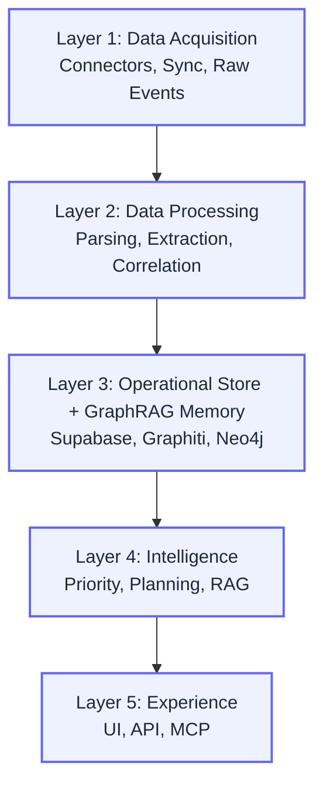

## Cách hiểu ngắn gọn

| Layer | Vai trò |
| --- | --- |
| Layer 1 | Lấy dữ liệu |
| Layer 2 | Hiểu dữ liệu |
| Layer 3 | Lưu trạng thái và trí nhớ |
| Layer 4 | Phân tích, ưu tiên và lên kế hoạch |
| Layer 5 | Cho người hoặc agent sử dụng |

# 5. Architecture tổng thể

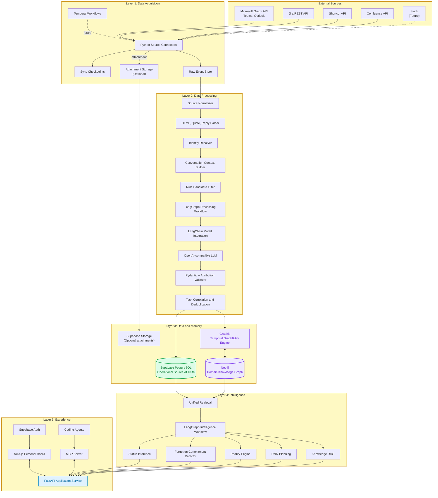

# 6. Tech stack đã chốt

| Layer | Module | Tech stack | Trách nhiệm |
| --- | --- | --- | --- |
| Layer 1 | Connectors | Python | Viết connector riêng cho từng nguồn |
| Layer 1 | Microsoft integration | Microsoft Graph API | Teams, Outlook và metadata Microsoft |
| Layer 1 | Ticket integration | Jira REST API, Shortcut API | Lấy ticket, story, comment và status |
| Layer 1 | Knowledge integration | Confluence API | Trang, comment và project knowledge |
| Layer 1 | Durable orchestration | Temporal | Initial sync, incremental sync, retry, backfill |
| Layer 1 | Raw storage | Supabase PostgreSQL | Lưu raw event và source metadata |
| Layer 1 | File storage | Supabase Storage, optional | Lưu attachment nếu cần xử lý |
| Layer 2 | Deterministic parsing | Python, BeautifulSoup/lxml | Tách HTML, quote, reply và actual content |
| Layer 2 | Identity resolution | Rules, RapidFuzz | Map nhiều account về một canonical person |
| Layer 2 | LLM integration | LangChain | Prompt, tool, structured output, model adapter |
| Layer 2 | AI workflow | LangGraph | Điều phối extraction, validation và correlation |
| Layer 2 | Model API | OpenAI-compatible endpoint | Không cố định model provider |
| Layer 2 | Schema validation | Pydantic | Validate structured output |
| Layer 3 | Operational database | Supabase PostgreSQL | Source of truth cho task và trạng thái |
| Layer 3 | Authentication | Supabase Auth | Xác thực và phân quyền workspace |
| Layer 3 | Attachment storage | Supabase Storage, optional | File, PDF, DOCX hoặc attachment |
| Layer 3 | Temporal GraphRAG | Graphiti | Entity, relation, temporal memory và hybrid retrieval |
| Layer 3 | Graph database | Neo4j | Lưu knowledge graph theo ontology cố định |
| Layer 4 | Intelligence workflow | LangGraph | Status, forgotten detection, priority và planning |
| Layer 4 | AI components | LangChain | Retrieval, model call và tool integration |
| Layer 4 | Deterministic engines | Python | Score, aging, deadline và risk calculation |
| Layer 5 | Backend API | FastAPI | Business API chung |
| Layer 5 | Web UI | Next.js, TailwindCSS, shadcn/ui | Personal Task Board |
| Layer 5 | Agent interface | MCP Server | Cho coding agent sử dụng capability |
| Cross-layer | Observability | OpenTelemetry, Grafana/Loki; LangSmith optional | Trace workflow, model call và lỗi |
| Deployment | Runtime | Docker | Đóng gói service |
| Deployment | Orchestration | Docker Compose V1, Kubernetes future | Triển khai hệ thống |

**Temporal** phù hợp cho initial sync và incremental sync vì workflow có thể khôi phục sau lỗi và tiếp tục từ trạng thái gần nhất, kể cả khi chạy trong thời gian dài.
**LangGraph** phù hợp với processing và intelligence workflows vì hỗ trợ kết hợp bước deterministic và LLM-driven trong cùng graph, cùng durable execution và human-in-the-loop.
**Supabase** cung cấp PostgreSQL, Auth, Storage và Row Level Security trong cùng một nền tảng; pgvector vẫn có thể được bật nếu V1 cần semantic index ngoài Graphiti.
**Graphiti** được chọn làm temporal GraphRAG engine vì có khả năng xử lý conversation và business data thành temporal context graph, đồng thời retrieval kết hợp vector, full-text và graph traversal.

# 7. Thay đổi mới so với kiến trúc ban đầu

## Đã bỏ

- MinIO
- S3 storage riêng
- Azure AD làm product auth
- Cognee
- Microsoft GraphRAG
- Agent framework PydanticAI
- Kafka cho V1
- Kubernetes cho V1
- MCP ở Intelligence Layer

## Đã thay đổi

| Trước | Sau |
| --- | --- |
| PydanticAI | LangChain + LangGraph |
| PostgreSQL riêng | Supabase PostgreSQL |
| Azure AD product authentication | Supabase Auth |
| Custom GraphRAG pipeline | Graphiti + Neo4j |
| MCP thuộc Layer 4 | MCP thuộc Layer 5 Experience |
| Graph schema tự do | Domain ontology cố định |

## Vẫn giữ

- Temporal cho durable ingestion
- FastAPI làm Application Service
- Next.js làm UI
- Neo4j làm graph database
- OpenAI-compatible model interface
- Supabase làm operational source of truth

# 8. Vai trò chính xác của từng graph

| Công nghệ | Graph thể hiện điều gì? | Có phải business knowledge không? |
| --- | --- | --- |
| Temporal | Workflow chạy qua thời gian | Không |
| LangGraph | Chương trình hoặc agent chạy qua node nào | Không |
| Graphiti | Xây dựng và truy xuất temporal context graph | Có |
| Neo4j | Lưu entity và relationship nghiệp vụ | Có |

Cách nhớ:

| Công nghệ | Câu hỏi chính |
| --- | --- |
| Temporal | Workflow có tiếp tục được sau lỗi không? |
| LangGraph | AI xử lý qua những bước nào? |
| Graphiti | Thông tin được chuyển thành temporal knowledge thế nào? |
| Neo4j | Entity nào liên quan với entity nào? |

# 9. Quyền sở hữu dữ liệu

## Supabase là operational source of truth

Supabase quản lý:

- `raw_events`
- `source_connections`
- `sync_checkpoints`
- `people`
- `source_identities`
- `unified_tasks`
- `task_sources`
- `commitments`
- `evidence`
- `task_status_history`
- `priority_scores`
- `review_queue`
- `dismissed_items`
- `user_corrections`
- `workspace_settings`

Nếu Supabase nói:

> Task status = Open

thì đó là trạng thái chính thức của sản phẩm.

## Graphiti + Neo4j là context memory

Graphiti và Neo4j quản lý:

- Temporal facts
- Relationships
- Project context
- Customer context
- Commitments theo timeline
- Decision relationships
- Lessons learned
- Dependencies
- Historical context
- Semantic và graph retrieval

Nếu Graphiti suy luận:

> Task có khả năng hoàn thành

thì đó chỉ là evidence hoặc suggestion. Nó không được trực tiếp đổi trạng thái chính thức trong Supabase.

# 10. Neo4j ontology cố định

Neo4j là schema-flexible về mặt kỹ thuật, nhưng dự án sẽ cố định schema ở Application Layer.

## Node types

- `Person`
- `SourceIdentity`
- `Task`
- `Project`
- `Customer`
- `Tenant`
- `SourceItem`
- `Decision`
- `Lesson`
- `Document`
- `Incident`

## Relationship types

- `HAS_IDENTITY`
- `OWNS`
- `REQUESTED`
- `COMMITTED_TO`
- `BELONGS_TO`
- `TRACKED_BY`
- `SUPPORTED_BY`
- `BLOCKED_BY`
- `WAITING_FOR`
- `AFFECTS`
- `DERIVED_FROM`
- `SUPERSEDES`
- `RELATED_TO`

## Edge compatibility

| Relationship | Source | Target |
| --- | --- | --- |
| HAS_IDENTITY | Person | SourceIdentity |
| OWNS | Person | Task |
| REQUESTED | Person | Task |
| COMMITTED_TO | Person | Task |
| BELONGS_TO | Task | Project |
| TRACKED_BY | Task | SourceItem |
| SUPPORTED_BY | Task | SourceItem |
| BLOCKED_BY | Task | Task hoặc SourceItem |
| AFFECTS | Decision | Project hoặc Task |
| DERIVED_FROM | Lesson | Incident |

**Graphiti** hỗ trợ custom entity và custom edge types bằng Pydantic model, cho phép định hướng extraction theo domain thay vì để LLM tạo graph tự do.

## Ba lớp bảo vệ schema

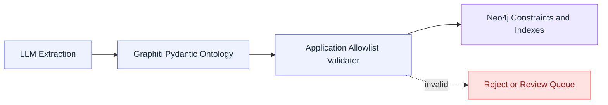

### Lớp 1: Pydantic ontology

Hướng dẫn model:

- Được extract entity nào?
- Được tạo relationship nào?
- Edge có property nào?

### Lớp 2: Application validator

Kiểm tra:

- Label có trong allowlist không?
- Edge type có hợp lệ không?
- Source và target có đúng loại không?
- Edge có evidence không?
- Confidence có đủ cao không?

### Lớp 3: Neo4j constraints

Bảo vệ:

- Canonical IDs
- External IDs
- Workspace isolation
- Source item idempotency
- Uniqueness
- Indexes

Không dùng display name hoặc task title làm unique key.

# 11. Phân loại relationship

## Deterministic relationship

Tạo bằng metadata hoặc code, không dùng LLM:

```
Person --HAS_IDENTITY--> SourceIdentity
Task --TRACKED_BY--> JiraTicket
Task --SUPPORTED_BY--> TeamsMessage
Task --BELONGS_TO--> Project
SourceItem --FROM_TENANT--> Tenant
```

## AI-extracted relationship

Được Graphiti hoặc LLM đề xuất:

```
Person --COMMITTED_TO--> Task
Person --REQUESTED--> Task
Task --BLOCKED_BY--> Task
Decision --AFFECTS--> Project
```

Bắt buộc có:

- `confidence`
- `evidence_id`
- `extraction_version`
- `created_at`
- `valid_at`
- `invalid_at`
- `review_status`

## Derived relationship

Được suy ra bởi Intelligence Layer:

```
Task --POTENTIALLY_DUPLICATES--> Task
Task --LIKELY_COMPLETED_BY--> Message
Customer --WAITING_FOR--> Person
```

Đây không phải fact chắc chắn. Cần gắn:

- `derived = true`
- `confidence`
- `rule_version`

# 12. Workflow A: Initial Sync

Khi kết nối một source mới, hệ thống quét tối thiểu 30 ngày, có thể chọn 90 ngày cho lần đầu.

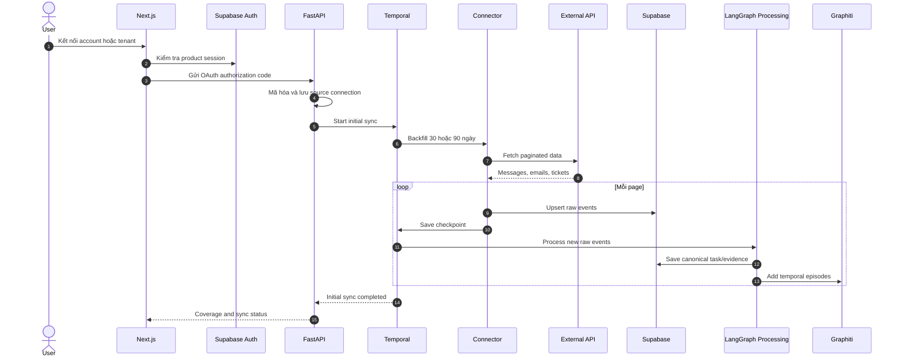

## Kết quả coverage

| Source | Trạng thái |
| --- | --- |
| Teams FPT Tenant | Synced đến 08:00, 17/09/2026 |
| Outlook FPT Tenant | Synced đến 07:58, 17/09/2026 |
| Teams Customer Tenant | Permission missing |
| Shortcut | Healthy |
| Jira | Not connected |

Một source chưa đồng bộ phải được hiển thị rõ, không được tạo cảm giác hệ thống đã phủ đủ.

# 13. Workflow B: Incremental Sync

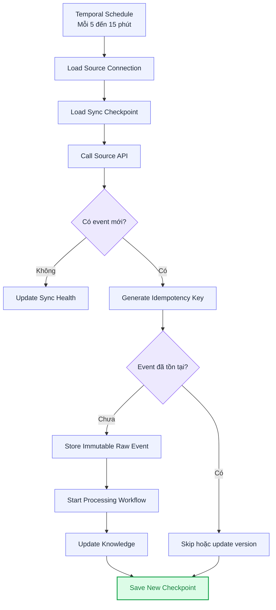

Temporal quản lý:
- Pagination
- API rate limit
- Retry
- Workflow resume
- Backfill
- Checkpoint
- Partial failure
- Dead-letter hoặc manual retry

# 14. Workflow C: Xử lý một Teams message

## Mock input

```
Huy, 14:18
Can you check why deployment failed?

Để em check nhé.
```

## Processing flow

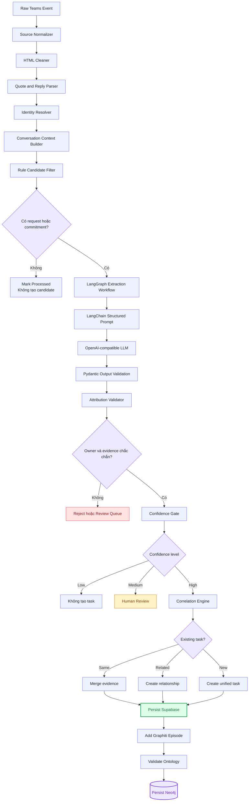

## Parser output

```json
{
  "quoted_author": "person_huy",
  "quoted_content": "Can you check why deployment failed?",
  "actual_author": "person_cuong",
  "actual_content": "Để em check nhé."
}
```

## Extraction output

```json
{
  "item_type": "commitment",
  "title": "Investigate deployment failure",
  "owner_id": "person_cuong",
  "requester_id": "person_huy",
  "project_id": "customer_project_a",
  "confidence": 0.96,
  "evidence_ids": [
    "teams_event_request_908",
    "teams_event_commitment_909"
  ]
}
```

# 15. Workflow D: Correlation với Jira hoặc Shortcut

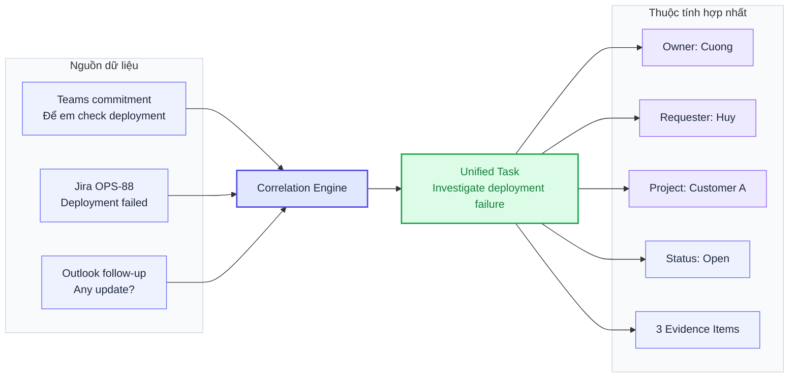

Correlation dùng theo thứ tự:
- External ID chính xác
- Thread hoặc message link
- Project và requester
- Keyword similarity
- Semantic similarity
- Graph relationship
- LLM verification nếu cần
Chỉ auto-merge khi confidence rất cao. Các trường hợp chưa chắc chắn phải dùng:

> Potentially related

thay vì merge vĩnh viễn.

# 16. Workflow E: Graphiti và Neo4j

Sau khi canonical task được xác nhận:

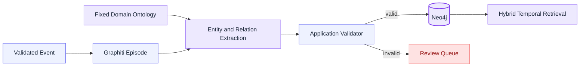

Ví dụ graph:

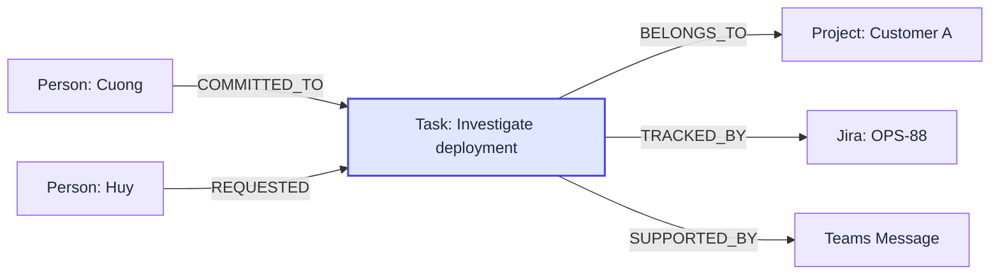

Graphiti giữ temporal context, trong đó facts có thể thay đổi theo thời gian. Khi fact mới làm fact cũ không còn hiệu lực, lịch sử vẫn được giữ thay vì bị xóa. 

# 17. Workflow F: Tạo Today Board

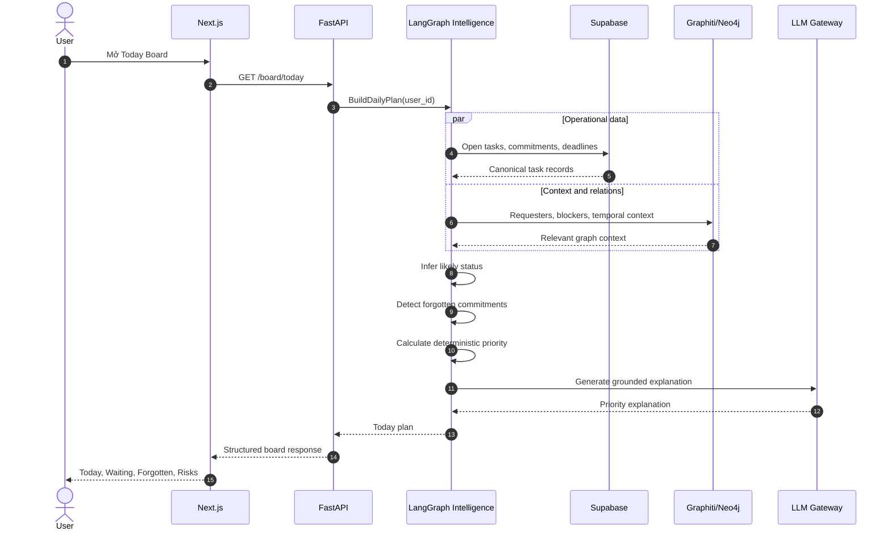

## Priority Engine

Priority score được tính bằng code:

```
priority_score =
    Deadline proximity
  + Customer impact
  + Production impact
  + Explicit commitment
  + Requester waiting time
  + People blocked
  + Stale age
  - Attribution uncertainty
  - Completion uncertainty
```

LLM chỉ dùng để:
- Tổng hợp context
- Giải thích priority
- Đề xuất kế hoạch
- Tóm tắt evidence
LLM không phải nguồn duy nhất quyết định score.

# 18. Workflow G: Coding Agent qua MCP

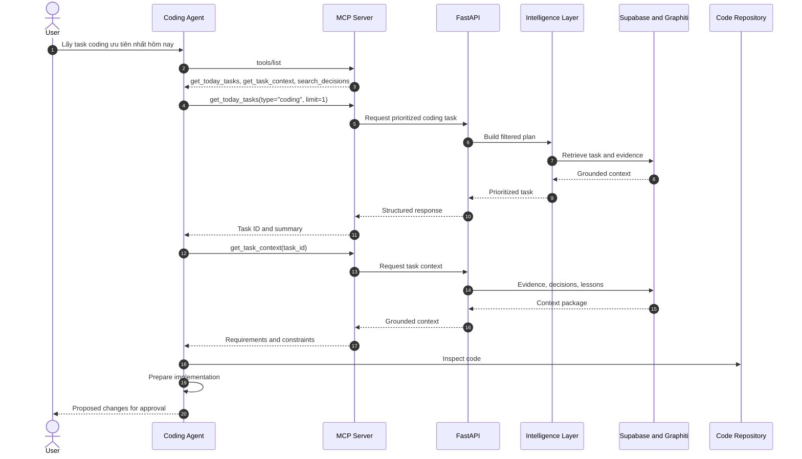

## MCP tools dự kiến

- `get_today_tasks`
- `get_task_context`
- `get_forgotten_commitments`
- `get_waiting_items`
- `search_decisions`
- `search_lessons_learned`
- `get_customer_context`
- `draft_task_plan`
- `suggest_task_completion`

MCP không được:
- Đọc database trực tiếp
- Bypass FastAPI
- Tự tính priority riêng
- Tự đóng task
- Tự gửi email
- Tự comment Jira
Kiến trúc đúng:

```
Next.js ──┐
          ├── FastAPI ── Application Services
MCP ──────┘                  │
                             ├── Intelligence
                             └── Data and Memory
```

# 19. Guardrails và rules

## Extraction rules

- Không có evidence → không tạo task
- Không chắc owner → review queue
- Confidence thấp → giữ raw event, không tạo task
- Không dùng LLM để parse quote nếu deterministic parser xử lý được
- Không dùng tên hiển thị làm canonical identity

## Task lifecycle rules

- Không tự động close task
- Không hard-delete
- Dismiss chỉ có nghĩa là không nhắc lại
- Likely Done không đồng nghĩa với Done
- User correction luôn thắng AI inference

## Graph rules

- Không cho phép label ngoài ontology
- Không cho phép edge type ngoài allowlist
- AI-generated edge phải có evidence
- AI-generated edge phải có confidence
- Derived edge phải có rule_version
- Temporal fact hết hiệu lực phải invalidate, không delete

## Action rules

- Được phép đọc và phân tích
- Được phép tạo draft
- Được phép đề xuất thay đổi
- Không tự gửi message
- Không tự gửi email
- Không tự cập nhật Jira/Shortcut nếu chưa có user approval

# 20. UI cuối cùng

## Today

- Top tasks theo priority
- Deadline
- Owner
- Requester
- Reason
- Evidence

## Commitments

- Tôi đã hứa gì?
- Hứa với ai?
- Từ khi nào?
- Có evidence hoàn thành chưa?

## Waiting

- Tôi đang chờ ai?
- Task nào đang bị block?
- Đã chờ bao lâu?

## Forgotten

- Commitment cũ
- Không có activity
- Không có completion evidence
- Requester có follow-up

## Risks

- Deadline gần
- Production impact
- Customer waiting
- Stale backlog
- Source sync bị lỗi

## Knowledge Search

- Dự án đã quyết định gì về authentication?
- Lần trước lỗi deployment tương tự đã xử lý thế nào?
- Customer A có constraint gì khi release?

## Coverage

- Source nào đang connected?
- Lần sync cuối?
- Có permission issue không?
- Có khoảng trống dữ liệu không?

# 21. Roadmap

## Phase 1: Foundation

- Supabase schema
- Supabase Auth
- Microsoft tenant connection
- Shortcut connector
- Raw event store
- Temporal initial sync
- Sync checkpoint
- Coverage UI

## Phase 2: Core value

- Teams quote parser
- Identity resolution
- Request extraction
- Commitment extraction
- Evidence model
- Confidence gate
- Human review queue

## Phase 3: Unified Task Board

- Jira và Shortcut correlation
- Unified task model
- Today Board
- Waiting
- Forgotten
- Risks

## Phase 4: Temporal GraphRAG

- Graphiti
- Neo4j ontology
- Neo4j migrations
- Temporal facts
- Decision memory
- Lessons learned
- Relationship retrieval

## Phase 5: Intelligence

- Priority Engine
- Status inference
- Daily Planner
- Morning Briefing
- Grounded explanation

## Phase 6: Agent access

- MCP Server
- Coding agent integration
- Task context package
- Decision retrieval
- Implementation planning

## Future work

- Execution Agent
- PR review
- Repository investigation
- Draft email
- Draft Jira comment
- Draft design document
- Controlled write-back

# 22. MVP đề xuất

MVP nên tập trung vào:

**Sources:**
- Teams FPT tenant
- Teams customer tenant
- Outlook
- Shortcut

**Capabilities:**
- Initial sync 30 ngày
- Incremental sync
- Quote parsing
- Identity mapping
- Commitment extraction
- Request extraction
- Evidence and confidence
- Unified task
- Today Board
- Forgotten Commitments
- Coverage status

Chưa cần trong MVP:

- Slack
- Attachment processing
- Full Confluence RAG
- Execution Agent
- Kubernetes
- Kafka
- Auto write-back
- Complex multi-agent system

# 23. Kiến trúc cuối cùng được chốt

```yaml
Layer 1 - Data Acquisition:
  language: Python
  orchestration: Temporal
  sources:
    - Microsoft Graph API
    - Jira REST API
    - Shortcut API
    - Confluence API
  raw_store: Supabase PostgreSQL
  attachment_store: Supabase Storage (optional)

Layer 2 - Data Processing:
  workflow: LangGraph
  llm_integration: LangChain
  model_interface: OpenAI-compatible API
  schema_validation: Pydantic
  parsing:
    - deterministic quote parser
    - HTML cleaner
    - identity resolver
    - candidate rules
  correlation:
    - deterministic matching
    - semantic matching
    - LLM verification

Layer 3 - Data and Memory:
  operational_source_of_truth: Supabase PostgreSQL
  authentication: Supabase Auth
  temporal_graphrag: Graphiti
  graph_database: Neo4j
  graph_schema:
    - fixed domain ontology
    - application allowlist
    - Neo4j constraints
  vector_store:
    primary: Graphiti hybrid retrieval
    optional: Supabase pgvector

Layer 4 - Intelligence:
  workflow: LangGraph
  components:
    - status inference
    - forgotten detection
    - deterministic priority engine
    - daily planner
    - knowledge RAG
  llm_usage:
    - explanation
    - summarization
    - grounded planning

Layer 5 - Experience:
  application_api: FastAPI
  web_ui:
    - Next.js
    - TailwindCSS
    - shadcn/ui
  authentication: Supabase Auth
  machine_interface: MCP Server
  consumers:
    - Browser
    - Copilot
    - Cursor
    - Claude Code
    - other coding agents
```

# Kết luận

Dự án được chốt là một **Personal Intelligence System gồm 5 layer**:

**Acquisition** → **Processing** → **Operational Store + Temporal GraphRAG** → **Intelligence** → **UI/MCP Experience**

Ba quyết định kiến trúc quan trọng nhất là:
- **Supabase là operational source of truth**, chịu trách nhiệm cho trạng thái task chính thức, evidence, review và user correction.
- **Graphiti + Neo4j là temporal GraphRAG memory**, chịu trách nhiệm cho entity, relationship, timeline và contextual retrieval.
- **Graph schema được cố định bằng ba lớp**, gồm Graphiti Pydantic ontology, application allowlist validator và Neo4j constraints.
Giá trị cốt lõi của sản phẩm nằm ở workflow:

**Conversation** → **Request hoặc Commitment** → **Evidence-backed Unified Task** → **Persistent Temporal Memory** → **Forgotten Detection** → **Today Plan** → **UI hoặc Coding Agent**

Nói ngắn gọn:
**Hệ thống biến mọi ticket, yêu cầu và lời hứa nằm rải rác thành một danh sách nghĩa vụ cá nhân duy nhất, có evidence, có lịch sử, có mức ưu tiên và có thể được sử dụng qua cả dashboard lẫn AI coding agent.**