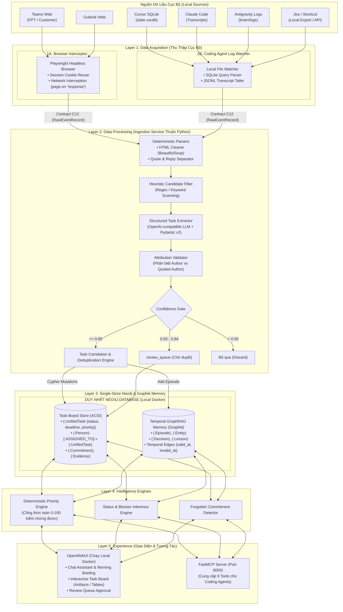

# Personal Task Board: Bản Đề Xuất & Thiết Kế Kiến Trúc (Local-First Lean Edition)

Bản tài liệu này là **thiết kế tổng thể được cập nhật chính thức** của dự án: Chuyển dịch toàn diện sang kiến trúc **Local-First, Tối Giản (Lean) & Bảo Mật Tuyệt Đối**, hợp nhất lưu trữ vào **Single-Store Neo4j**, sử dụng **OpenWebUI** làm giao diện chính và thay thế LangGraph bằng **Python Ingestion Service thuần**.

---

## 1. Tóm tắt dự án

**Personal Task Board** là một hệ thống **Personal Intelligence & Task Management** chạy cục bộ (Local-First) trên máy tính cá nhân của kỹ sư, giúp tự động thu thập, trích xuất và quản trị toàn bộ công việc, cam kết đang nằm rải rác trong:
- **Microsoft Teams & Outlook** (nhiều tenant/tài khoản khách hàng) thông qua cơ chế bắt gói tin trình duyệt (Playwright Network Interception).
- **Lịch sử hội thoại của các Coding Agents** (Cursor `state.vscdb`, Claude Code transcripts, Antigravity brain logs) lưu cục bộ.
- **Jira / Shortcut / Git commits**.
- Những lời hứa hoặc yêu cầu công việc phát sinh tự nhiên trong hội thoại mà chưa từng được tạo ticket.

Hệ thống trả lời chính xác các câu hỏi:
- Tôi đang nợ việc gì và nợ ai?
- Tôi đã cam kết từ khi nào, ngữ cảnh cuộc trò chuyện gốc là gì?
- Hôm nay tôi bắt buộc phải hoàn thành những việc gì (dựa trên điểm ưu tiên toán học)?
- Việc nào đã quá hạn hoặc có nguy cơ bị lãng quên?
- Các quyết định kiến trúc (Architecture Decisions) và bài học sửa lỗi (Lessons Learned) trong các phiên coding gần đây là gì?

---

## 2. Các Thay Đổi Kiến Trúc Đột Phá (So với Thiết Kế Cũ)

| Thành phần | Kiến trúc cũ | Kiến trúc mới (Lean Local-First) | Rationale & Lợi ích |
| :--- | :--- | :--- | :--- |
| **Hạ tầng & Triển khai** | Cloud-Centric (Supabase Cloud, Neo4j AuraDB) | **Local-First 100%** (Chạy trên máy User qua Docker) | Bảo mật tuyệt đối dữ liệu công việc; không tốn chi phí thuê cloud; hoạt động offline. |
| **Cơ sở dữ liệu** | **Dual-Storage**: Supabase Postgres + Neo4j Graphiti kèm Outbox Worker | **Single-Store: DUY NHẤT Neo4j** (Local Docker) | Xóa bỏ hoàn toàn PostgreSQL. Không lo lệch dữ liệu (desync), bỏ outbox worker, tiết kiệm RAM. |
| **Giao diện (Frontend)** | Tự viết Web UI bằng **Next.js + TailwindCSS** | **OpenWebUI** (Tận dụng Web UI, Chat, Artifacts, MCP) | Cắt giảm 100% công sức dựng giao diện; có sẵn streaming chat, model switcher và mobile web. |
| **AI Orchestration** | **LangGraph** (StateGraph phức tạp ở L2 & L4) | **Bỏ LangGraph**. Dùng **Python Ingestion Service** + **OpenWebUI Tools** | Xóa bỏ framework cồng kềnh; luồng xử lý nền tuần tự bằng Pydantic; hội thoại dùng native Tool calling. |
| **Thu thập dữ liệu (L1)** | Gọi API chính thức (MS Graph API) | **Layer 1A: Playwright Network Interception** | Bỏ qua rào cản xin quyền Azure AD Admin Consent; tận dụng session web có sẵn trên máy. |
| **Nguồn dữ liệu mới (L1B)** | Chưa có | **Layer 1B: Local Coding Agent Session Logs** | Đọc file SQLite/JSONL từ Cursor, Claude Code, Antigravity; bắt trọn tech decisions & bug fixes. |

---

## 3. Sơ đồ Kiến trúc 5 Tầng Tinh Gọn

---

## 4. Chi Tiết Các Tầng Kỹ Thuật (Tech Stack Chốt)

| Layer | Module | Công nghệ chốt | Vai trò & Trách nhiệm |
| :--- | :--- | :--- | :--- |
| **Layer 1A** | Browser Interceptor | Python + Playwright | Bắt trực tiếp JSON payload nội bộ của Teams/Outlook từ network responses; dùng lại session cookie đăng nhập. |
| **Layer 1B** | Coding Agent Ingestion | Python (`sqlite3`, `jsonlines`) | Đọc file SQLite của Cursor, logs JSONL của Claude Code và Antigravity; phân tích cam kết và quyết định kỹ thuật. |
| **Layer 2** | Ingestion & Parsing | Python, BeautifulSoup4, RapidFuzz | Làm sạch HTML, bóc tách quote/reply, chuẩn hóa danh tính người dùng (Canonical Person). |
| **Layer 2** | Structured Extraction | Pydantic v2 + OpenAI-compatible API | Trích xuất Task, cam kết có cấu trúc; kiểm tra Attribution Validator; lọc qua Confidence Gate. |
| **Layer 3** | Single Database | **Neo4j Community (Local Docker)** | **Database duy nhất**. Lưu trữ toàn bộ Node Task, Person, Evidence và quan hệ đồ thị tri thức. |
| **Layer 3** | Temporal GraphRAG | Graphiti-core | Xây dựng đồ thị tri thức ngữ nghĩa theo thời gian, quản lý Episodes, Decisions, Lessons Learned. |
| **Layer 4** | Intelligence Engines | Python | Chấm điểm ưu tiên tất định (0-100) theo công thức toán học; dò tìm task có nguy cơ bị bỏ quên. |
| **Layer 5** | Conversational UI | **OpenWebUI (Local Docker)** | Giao diện tương tác người dùng, hiển thị Today Board qua Artifacts, điều khiển duyệt task. |
| **Layer 5** | Machine Interface | FastMCP (Python) | Cung cấp 9 công cụ chuẩn MCP cho Cursor, Claude Code, Antigravity truy xuất Task Board. |

---

## 5. Vai Trò Duy Nhất Của Neo4j: Hợp Nhất Operational Store & GraphRAG

Trong thiết kế cũ, việc duy trì song song **PostgreSQL** và **Neo4j** gây ra sự phức tạp lớn về đồng bộ dữ liệu (Transactional Outbox). Trong thiết kế mới, **Neo4j đảm nhiệm cả 2 vai trò**:

### 5.1 Vai trò Operational Task Board (Tính đúng đắn 100%)
Các task được lưu dưới dạng Node `:UnifiedTask` có ràng buộc định danh duy nhất (`CONSTRAINT FOR (t:UnifiedTask) REQUIRE t.id IS UNIQUE`):
- Trạng thái công việc (`TODO`, `IN_PROGRESS`, `BLOCKED`, `DONE`) được cập nhật bằng **Cypher Mutations tất định**.
- Điểm ưu tiên `priority_score` được tính toán bằng Python và ghi trực tiếp vào node.
- Truy vấn lọc danh sách việc hôm nay, việc chờ duyệt thực thi với tốc độ mili-giây bằng Index.

### 5.2 Vai trò Temporal GraphRAG Memory (Graphiti)
- Lưu trữ ngữ cảnh hội thoại sâu sắc: `(Person)-[:COMMITTED_TO]->(Task)`, `(Decision)-[:AFFECTS]->(Project)`.
- Cho phép OpenWebUI và Coding Agents thực hiện **Hybrid Search** (kết hợp Cypher graph traversal + Fulltext index + Vector embedding).

---

## 6. Lộ Trình Phát Triển 6 Phase Tinh Gọn (Phase Roadmap)

1. **Phase 0: Shared Contracts & Mocks (ĐÃ HOÀN THÀNH)**
   - Khởi tạo Monorepo `uv workspace` và `pnpm-workspace`.
   - Xây dựng `packages/contracts` định nghĩa đầy đủ Pydantic v2 models cho C12, C23, C34, C45 và bộ mock fixtures.

2. **Phase 1: Neo4j Single-Store Setup & Schema Constraints (ĐANG HOÀN THIỆN)**
   - Cấu hình Neo4j Local Docker với APOC plugin.
   - Thiết lập Constraints & Indexes (`packages/database/neo4j/migrations/001_constraints.cypher`).
   - Tích hợp Tier 2 Pydantic Validator và Neo4j Client hỗ trợ connection pool.

3. **Phase 2: Layer 1B - Local Coding Agent Logs Ingestion**
   - Viết parser đọc SQLite `state.vscdb` của Cursor.
   - Viết parser đọc transcript JSONL của Claude Code và Antigravity IDE.
   - Chuẩn hóa đầu ra thành `RawEventRecord` (Contract C12).

4. **Phase 3: Layer 1A - Playwright Network Interceptor**
   - Viết Playwright script lắng nghe sự kiện mạng (`page.on('response')`) của Teams Web và Outlook Web.
   - Bắt gói tin JSON nội bộ, trích xuất tin nhắn chat mà không cần Azure AD API.

5. **Phase 4: Layer 2 - Pure Python Ingestion & Validation Pipeline**
   - Bộ bóc tách Quote/Reply ngăn chặn nhầm lẫn tác giả.
   - Bộ lọc Heuristic giảm thiểu 70% chi phí gọi LLM.
   - Structured Task Extractor với Attribution Validator và Confidence Gate.
   - Ghi dữ liệu trực tiếp vào Neo4j bằng Cypher.

6. **Phase 5: Layer 4 & Layer 5 - OpenWebUI Integration & FastMCP Server**
   - Cài đặt OpenWebUI Local Docker kết nối với mô hình LLM địa phương (Ollama) hoặc API key.
   - Tạo bộ Custom Tools / Functions trong OpenWebUI để truy vấn Task Board và Morning Briefing.
   - Dựng FastMCP Server cung cấp 9 MCP Tools chuẩn hóa cho các Coding Agent.

7. **Phase 6: End-to-End Local Verification**
   - Chạy thử nghiệm thực tế toàn trình trên máy cá nhân: Bắt chat Teams -> Đọc log Cursor -> Tự sinh Task trong Neo4j -> Mở OpenWebUI xem Morning Briefing.

---

## 7. Kết Luận

Kiến trúc **Local-First Lean Edition** giúp dự án:
1. **Tiết kiệm 60% thời gian phát triển**: Không cần code Next.js frontend, không cần cấu hình cụm LangGraph phức tạp, không cần duy trì 2 database.
2. **Bảo mật tối đa**: Dữ liệu công việc của công ty và khách hàng không bao giờ rời khỏi máy tính cá nhân.
3. **Vận hành tin cậy**: Quản lý trạng thái Task bằng Cypher tất định trên Neo4j, kết hợp sức mạnh trí nhớ ngữ nghĩa của Graphiti và giao diện hiện đại của OpenWebUI.