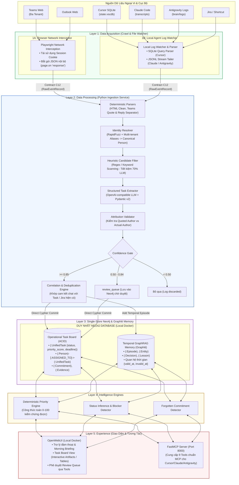

# Kiến Trúc Tổng Thể Hệ Thống (System Architecture Overview) - Lean Local-First Edition

## 1. Tầm Nhìn & Bản Chất Hệ Thống

**Personal Task Board** là một hệ thống **Personal Intelligence & Task Management** chạy cục bộ (**Local-First**) trên máy trạm của kỹ sư/tech lead. Hệ thống hoạt động ở tầng trên cùng, tổng hợp và giám sát toàn bộ các luồng công việc, cam kết phát sinh từ:
- **Microsoft Teams & Outlook**: Các tin nhắn phân bổ ở nhiều tenant (nội bộ công ty và đối tác khách hàng).
- **Lịch sử hội thoại Coding Agents**: Phiên làm việc với Cursor (`state.vscdb`), Claude Code (`transcripts`), Antigravity (`brain/logs`).
- **Jira / Shortcut**: Các ticket, story chính thức.
- **Cam kết ngầm (Implicit Commitments)**: Các câu hứa hẹn tự nhiên trong hội thoại (`"Để em check"`, `"Anh gửi em trước 5h nhé"`, `"On it"`).

### Triết Lý Thiết Kế Cốt Lõi
1. **Local-First & Bảo Mật Tuyệt Đối**: Dữ liệu hội thoại, mã nguồn và cam kết công việc không bao giờ rời khỏi máy tính cá nhân. Không phụ thuộc hạ tầng Cloud bên thứ ba.
2. **Precision > Recall**: Thà chỉ trích xuất 5 cam kết chính xác 100% kèm đầy đủ bằng chứng (`evidence`), còn hơn gợi ý 20 việc phỏng đoán sai lệch làm mất niềm tin của người dùng.
3. **Tối Giản & Trực Thực (Lean Architecture)**: Lược bỏ các framework cồng kềnh (Next.js, LangGraph, Supabase Cloud). Tận dụng tối đa sức mạnh của **OpenWebUI** cho giao diện, **Neo4j** cho lưu trữ đơn nhất (Single-Store), và **Python thuần** cho các tiến trình xử lý ngầm.

---

## 2. Kiến Trúc 5 Layer & Dòng Dữ Liệu Cục Bộ (End-to-End Data Flow)



---

## 3. Các Nguyên Tắc Bất Biến Cốt Lõi (Core Invariants)

Hệ thống tuân thủ 5 nguyên tắc kiến trúc bất biến sau:

| Nguyên tắc | Mô tả chi tiết | Vi phạm khi |
| :--- | :--- | :--- |
| **1. Single-Store Neo4j với Phân Định Rõ Ràng** | **Neo4j** là cơ sở dữ liệu duy nhất. Quản lý trạng thái Task (`TODO`, `IN_PROGRESS`, `DONE`) bằng **Cypher tất định**. Graphiti chỉ dùng để ghi nhớ ngữ cảnh và hỗ trợ tìm kiếm ngữ nghĩa (Context Memory). | Khi AI tự động đổi trạng thái `status = 'DONE'` bằng suy diễn ngữ nghĩa mà không qua câu lệnh Cypher rõ ràng hoặc không có xác nhận của người dùng. |
| **2. Tách Biệt Tuyệt Đối Quote & Reply** | Trong tin nhắn Teams, người dùng thường quote lại lời người khác. Bộ parser phải bóc tách: `quoted_author`, `quoted_content` vs `actual_author`, `actual_content` trước khi gửi cho LLM. | Khi người A hỏi: *"Bạn có làm cái này không?"*, người B trả lời: *"Để em làm"*, nhưng hệ thống trích xuất nhầm task gán cho người A. |
| **3. Fixed Domain Ontology 3 Lớp** | Đồ thị trong Neo4j được kiểm soát chặt chẽ qua 3 lớp: Pydantic Schema $\rightarrow$ Application Allowlist Validator $\rightarrow$ Neo4j Constraints & Indexes. | Khi LLM tự tạo Node label mới (ví dụ: `Subtask`, `BugReport`) hoặc Edge type mới không nằm trong Ontology đã đăng ký. |
| **4. Local-First & Append-Only** | Dữ liệu sự kiện thô (`raw_events`) là bất biến và lưu cục bộ. Sự kiện trong Graphiti khi hết hiệu lực được đánh dấu `invalid_at` chứ không xóa cứng (`DETACH DELETE`). | Dữ liệu công việc bị gửi lên máy chủ Cloud bên ngoài, hoặc các bản ghi lịch sử bị xóa vĩnh viễn. |
| **5. Read & Propose Only (Zero Autonomous Write-back)** | Hệ thống chỉ đọc và đưa ra đề xuất. Không bao giờ tự ý gửi tin nhắn Teams, email Outlook hay đóng ticket Jira nếu không có thao tác xác nhận từ người dùng. | Khi MCP tool tự ý gọi API bên ngoài để cập nhật dữ liệu mà chưa được sự đồng ý của User. |

---

## 4. Cấu Trúc Monorepo Tinh Gọn (Lean Layout)

Nhằm tối ưu hóa phát triển cục bộ và loại bỏ các thành phần thừa, cấu trúc thư mục được sắp xếp như sau:

```
Personal_Task_Board/
├── packages/
│   ├── contracts/                     # [Shared] Pydantic models, JSON Schemas, TypeScript DTOs, Mocks
│   │   ├── src/
│   │   │   ├── l1_acquisition/        # RawEventRecord, RawAgentSessionRecord, SourceConfig
│   │   │   ├── l2_processing/         # ParsedMessage, ExtractedCommitment, UnifiedTaskCandidate
│   │   │   ├── l3_storage/            # Neo4j Node/Edge DTOs, Fixed Ontology schemas
│   │   │   ├── l4_intelligence/       # PriorityScore, TodayPlan, AnomalyReport
│   │   │   └── l5_experience/         # OpenWebUI Tool DTOs, MCP tool specs
│   │   ├── mocks/                     # Fixtures & mock data generators
│   │   └── pyproject.toml / package.json
│   └── database/                      # [Shared] Neo4j Migrations, Constraints, Ontology & Client
│       ├── neo4j/
│       │   ├── migrations/            # 001_constraints.cypher (Unique constraints & indexes)
│       │   ├── seeds/                 # 001_dev_seed.cypher (Initial seed data)
│       │   └── queries/               # common_retrievals.cypher
│       ├── src/ptb_database/          # Neo4j client pool, Ontology definitions, Tier 2 Validator
│       └── pyproject.toml
├── services/
│   ├── acquisition/                   # [Layer 1] Data Ingestion Engine
│   │   ├── src/
│   │   │   ├── playwright/            # Teams Web & Outlook Web network interception scripts
│   │   │   └── watchers/              # Cursor SQLite, Claude Code & Antigravity log parsers
│   │   └── tests/
│   ├── processing/                    # [Layer 2 & 4] Python Ingestion & Intelligence Service
│   │   ├── src/
│   │   │   ├── parsers/               # HTML cleaner, Teams quote/reply parser
│   │   │   ├── identity/              # RapidFuzz identity resolver
│   │   │   ├── extractor/             # Pydantic structured output extractor
│   │   │   ├── validator/             # Attribution validator & confidence gating
│   │   │   ├── priority/              # Deterministic priority scoring formula (0-100)
│   │   │   └── planner/               # Morning briefing & today board generator
│   │   └── tests/
│   └── mcp/                           # [Layer 5] FastMCP Server
│       ├── src/
│       │   ├── tools/                 # 9 Standardized MCP tools connecting to Neo4j
│       │   └── server.py              # FastMCP application (port 8000)
│       └── tests/
├── docs/                              # Toàn bộ tài liệu kiến trúc & hướng dẫn
└── docker-compose.yml                 # Khởi chạy Neo4j Community (7687) + OpenWebUI (3000)
```

---

## 5. Chiến Lược Đồng Bộ Giữa Các Layer (Contract-First Isolation)

Mỗi Layer được cô lập hoàn toàn và đồng bộ thông qua các hợp đồng dữ liệu chuẩn:

1. **Phase 0 đóng băng Shared Contracts**: Gói `packages/contracts` cung cấp Pydantic v2 models (`ptb-contracts`) làm ranh giới vững chắc.
2. **Cô lập kiểm thử bằng Mock Fixtures**:
   - `Layer 2 (Processing)` kiểm thử bằng cách đọc mock JSON từ `packages/contracts/mocks/` mà không cần chạy Playwright hay mở trình duyệt thật.
   - `Layer 5 (OpenWebUI & MCP)` phát triển công cụ gọi dữ liệu dựa trên hợp đồng C34/C45 mà không cần chờ Layer 1 và 2 hoàn tất.
3. **Ranh giới giao tiếp rõ ràng**:
   - **L1 $\rightarrow$ L2**: Giao tiếp qua `RawEventRecord` (Contract C12) đẩy vào hàng đợi xử lý cục bộ.
   - **L2 $\rightarrow$ L3**: Ghi trực tiếp vào Neo4j bằng Cypher Transactions (không cần Outbox trung gian).
   - **L3/L4 $\rightarrow$ L5**: OpenWebUI và FastMCP truy vấn trực tiếp Neo4j thông qua các câu lệnh Cypher đã được tối ưu hóa chỉ mục.
