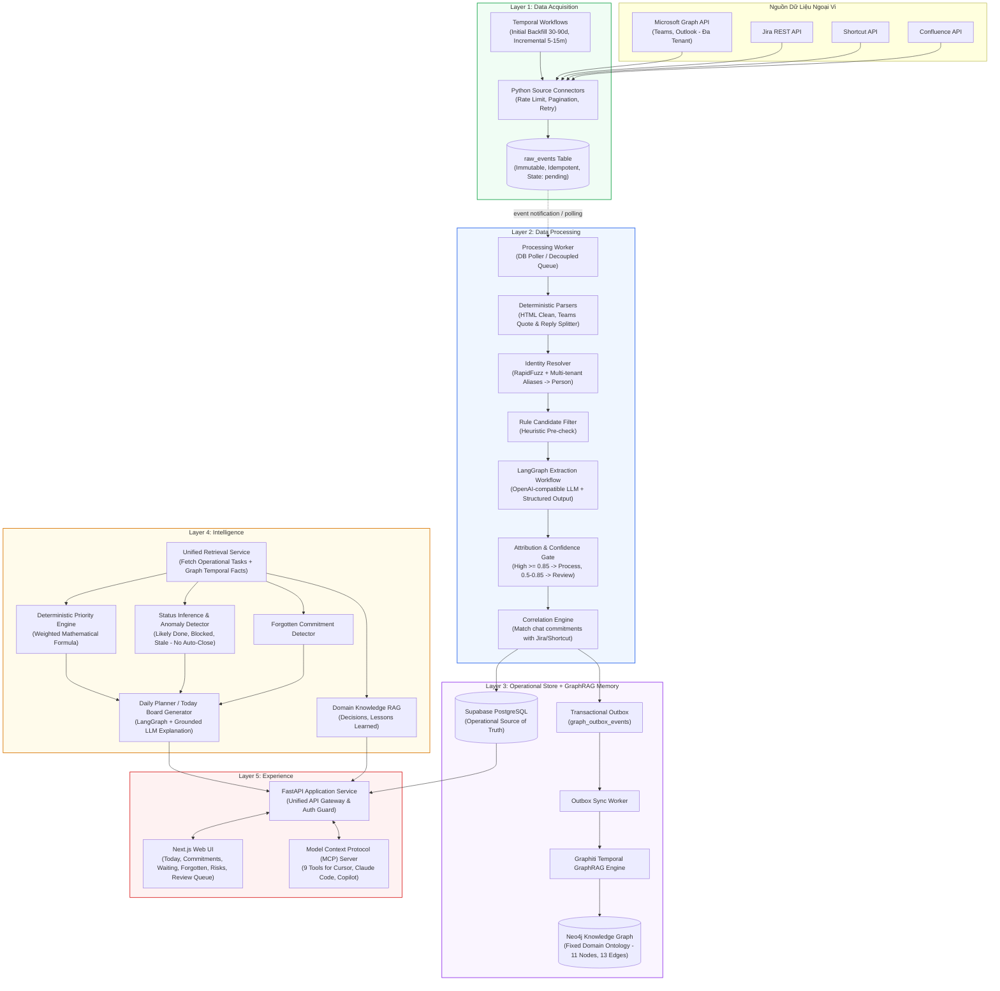

# Kiến Trúc Tổng Thể Hệ Thống (System Architecture Overview)

## 1. Tầm Nhìn & Bản Chất Hệ Thống

**Personal Task Board** không phải là một công cụ quản lý dự án (Project Management Tool) nhằm thay thế Jira, Shortcut hay Trello. Đây là một hệ thống **Personal Intelligence Layer** hoạt động ở tầng phía trên toàn bộ các công cụ giao tiếp và quản trị hiện tại của một kỹ sư/tech lead.

Hệ thống giải quyết bài toán:
- **Phân mảnh không gian làm việc**: Thông tin nằm rải rác ở Microsoft Teams (nội bộ FPT và đối tác khách hàng), Outlook, Jira, Shortcut, Confluence.
- **Cam kết ngầm (Implicit Commitments)**: Các cam kết trong hội thoại không bao giờ được tạo thành ticket (`"Để em check"`, `"Anh gửi em trước 5h nhé"`, `"On it"`).
- **Rủi ro sai lệch quy gán (Attribution Drift)**: Gán nhầm việc người khác hứa thành việc mình phải làm hoặc ngược lại.
- **Mục tiêu ưu tiên**: **Precision > Recall**. Thà chỉ trích xuất 5 cam kết chính xác 100% kèm đầy đủ bằng chứng (`evidence`), còn hơn gợi ý 20 việc phỏng đoán sai lệch làm xói mòn niềm tin người dùng.

---

## 2. Kiến Trúc 5 Layer & Dòng Dữ Liệu (End-to-End Data Flow)

Hệ thống được thiết kế theo 5 Layer độc lập về logic, giao tiếp với nhau thông qua **Shared Data Contracts** và được tách rời bởi các ranh giới bền vững (Database / Outbox / Service Gateway):



---

## 3. Các Nguyên Tắc Bất Biến (Core Invariants & Guardrails)

Hệ thống tuân thủ 5 nguyên tắc kiến trúc cốt lõi:

| Nguyên tắc | Mô tả chi tiết | Vi phạm khi |
| --- | --- | --- |
| **1. Source of Truth phân định rõ ràng** | **Supabase PostgreSQL** là nguồn chân lý duy nhất (Source of Truth) cho trạng thái hoạt động chính thức (`unified_tasks`, `commitments`, `evidence`, `review_queue`). **Neo4j + Graphiti** chỉ là bộ nhớ ngữ cảnh và quan hệ thời gian (Context Memory). | Khi AI tự động cập nhật `status = 'done'` trong Supabase dựa vào suy luận từ Graphiti mà không có sự xác nhận của người dùng. |
| **2. Tách biệt Quote & Reply** | Trong chat Teams, người gửi thường trích dẫn (quote) tin nhắn của người khác. Phải phân rã xác định chính xác: `quoted_author`, `quoted_content` vs `actual_author`, `actual_content` trước khi đưa vào LLM. | Khi người A hỏi: *"Bạn có làm cái này không?"*, người B trả lời: *"Để em làm"*, nhưng hệ thống gán task cho người A. |
| **3. Fixed Domain Ontology 3 lớp** | Schema trong Neo4j được kiểm soát chặt qua 3 lớp: Pydantic Model $\rightarrow$ Application Allowlist Validator $\rightarrow$ Neo4j Constraints & Indexes. | Khi LLM tự tạo Node label mới (ví dụ: `Subtask`, `BugReport`) hoặc edge mới không nằm trong allowlist đã đăng ký. |
| **4. Bất biến & Không xóa cứng (Append-Only / Soft Invalidation)** | Dữ liệu `raw_events` là bất biến. Facts trong Graphiti khi hết hiệu lực được đánh dấu `invalid_at` chứ không được xóa cứng (hard-delete). Trạng thái task lưu theo lịch sử (`task_status_history`). | Khi chạy lệnh `DELETE FROM raw_events` hoặc `DETACH DELETE` node trong Neo4j. |
| **5. Read & Propose Only (Zero Autonomous Write-back)** | Hệ thống chỉ đọc và đưa ra đề xuất (Drafting/Suggestions). Không bao giờ tự động gửi tin nhắn Teams, gửi email Outlook, hay đóng ticket Jira nếu không có hành động xác nhận từ người dùng. | Khi MCP tool tự động gọi Jira API để chuyển trạng thái ticket sang Closed. |

---

## 4. Cấu Trúc Monorepo Chuẩn Hóa

Nhằm đảm bảo **phát triển từng Layer tách biệt** nhưng **đồng bộ hóa tuyệt đối qua Contract**, dự án được tổ chức theo cấu trúc Monorepo:

```
Personal_Task_Board/
├── packages/
│   ├── contracts/                     # [Shared] Pydantic models, JSON Schemas, TypeScript DTOs, Mock Fixtures
│   │   ├── src/
│   │   │   ├── l1_acquisition/        # RawEvent, SourceConfig, Checkpoint contracts
│   │   │   ├── l2_processing/         # ParsedMessage, ExtractedCommitment, UnifiedTaskCandidate
│   │   │   ├── l3_storage/            # Supabase table DTOs, Neo4j Ontology schemas
│   │   │   ├── l4_intelligence/       # PriorityScore, TodayPlan, AnomalyReport contracts
│   │   │   └── l5_experience/         # FastAPI request/response DTOs, MCP tool specs
│   │   ├── mocks/                     # Mock data generators & static test fixtures
│   │   └── package.json / pyproject.toml
│   └── database/                      # [Shared] Migrations & Schema definitions
│       ├── supabase/
│       │   ├── migrations/            # SQL DDL migrations (tables, RLS, triggers, indexes)
│       │   └── seeds/                 # Seed data cho local development
│       └── neo4j/
│           ├── constraints/           # Cypher constraints & index creation scripts
│           └── ontology/              # Fixed ontology specifications
├── services/
│   ├── acquisition/                   # [Layer 1] Ingestion Service & Temporal Worker
│   │   ├── src/
│   │   │   ├── connectors/            # MS Graph, Jira, Shortcut, Confluence
│   │   │   ├── workflows/             # Temporal InitialSync & IncrementalSync workflows
│   │   │   └── activities/            # Temporal activities (fetch, store raw)
│   │   └── tests/
│   ├── processing/                    # [Layer 2] Processing & Extraction Worker
│   │   ├── src/
│   │   │   ├── parsers/               # HTML cleaner, Teams quote parser
│   │   │   ├── identity/              # RapidFuzz identity resolver
│   │   │   ├── langgraph/             # Extraction, Attribution, Correlation graph
│   │   │   └── worker.py              # DB consumer worker listening to raw_events
│   │   └── tests/
│   ├── intelligence/                  # [Layer 4] Reasoning & Planning Engine
│   │   ├── src/
│   │   │   ├── priority/              # Deterministic priority scoring engine
│   │   │   ├── inference/             # Status & anomaly inference
│   │   │   ├── planner/               # Daily planner & explanation generator
│   │   │   └── rag/                   # Knowledge retrieval service
│   │   └── tests/
│   └── api/                           # [Layer 5] FastAPI Application Gateway
│       ├── src/
│       │   ├── routers/               # /board, /tasks, /commitments, /coverage, /review
│       │   ├── services/              # Application services calling L3/L4
│       │   └── main.py
│       └── tests/
├── apps/
│   ├── web/                           # [Layer 5] Next.js 14+ Web Application
│   │   ├── src/
│   │   │   ├── app/                   # App Router pages (Today, Commitments, Waiting, etc.)
│   │   │   ├── components/            # shadcn/ui components & task cards
│   │   │   └── lib/                   # API client calling FastAPI
│   │   └── tests/
│   └── mcp/                           # [Layer 5] Model Context Protocol Server
│       ├── src/
│       │   ├── tools/                 # 9 standardized MCP tools
│       │   └── server.py              # stdio/SSE MCP server
│       └── tests/
├── docs/                              # Toàn bộ tài liệu kỹ thuật chi tiết
└── docker-compose.yml                 # Local stack (Supabase CLI, Neo4j, Temporal, Workers)
```

---

## 5. Chiến Lược Đồng Bộ & Độc Lập Giữa Các Layer (Contract-First Isolation)

Mỗi Layer có thể phát triển hoàn toàn độc lập nhờ cơ chế sau:

1. **Phase 0 đóng băng Shared Contracts**: Trước khi viết logic nghiệp vụ cho bất kỳ Layer nào, gói `packages/contracts` sẽ được xây dựng và xuất bản dưới dạng thư viện Python (`ptb-contracts`) và gói TypeScript (`@ptb/contracts`).
2. **Mock Data Generators & Fixtures**:
   - `Layer 2` có thể kiểm thử toàn bộ thuật toán Parsing và Extraction bằng cách nạp Mock Raw Events từ `packages/contracts/mocks/l1_raw_events.json` mà không cần chạy Temporal hay kết nối tài khoản Microsoft thật.
   - `Layer 4` có thể kiểm thử thuật toán Priority Engine và Daily Planner bằng cách nạp Mock Database & Graph Records mà không cần chờ Layer 2 hoàn thiện.
   - `Layer 5 (Web UI & MCP)` có thể xây dựng toàn bộ giao diện và tool execution dựa trên Mock FastAPI endpoints tuân thủ OpenAPI specs từ `packages/contracts`.
3. **Decoupled Asynchronous Boundaries**:
   - **L1 $\rightarrow$ L2**: Giao tiếp thông qua bảng `raw_events` trong Supabase với cờ trạng thái `processing_status = 'pending' | 'processed' | 'failed'`. L1 hoàn toàn không phụ thuộc vào trạng thái chạy của L2.
   - **L2 $\rightarrow$ L3**: Áp dụng mô hình **Transactional Outbox**. L2 ghi dữ liệu nghiệp vụ vào Supabase kèm theo một bản ghi trong bảng `graph_outbox_events`. Một background worker độc lập sẽ đọc outbox và nạp vào Neo4j/Graphiti. Nếu Neo4j tạm dừng bảo trì, hoạt động trích xuất task của L2 và dữ liệu trên Supabase không bao giờ bị nghẽn.
   - **L3/L4 $\rightarrow$ L5**: FastAPI là cổng kiểm soát duy nhất. Cả Web UI và MCP server đều không được kết nối trực tiếp vào PostgreSQL hay Neo4j.
