# Đặc Tả Hợp Đồng Dữ Liệu & Cơ Chế Đồng Bộ (Synchronization Contracts)

Tài liệu này định nghĩa toàn bộ **Data Contracts (DTO, Event Schemas, Interface Signatures)** giữa các Layer trong hệ thống **Personal Task Board**. Đây là tài liệu cốt lõi để các team/kỹ sư có thể phát triển độc lập từng Layer mà không bị phụ thuộc vào tiến độ của các Layer khác.

---

## 1. Bản Đồ Hợp Đồng Giữa Các Layer (Contract Mapping Matrix)

```mermaid
flowchart LR
    L1["Layer 1<br/>Acquisition"] -->|"Contract C12<br/>(RawEventRecord)"| L2["Layer 2<br/>Processing"]
    L2 -->|"Contract C23<br/>(UnifiedTask, Evidence,<br/>GraphOutboxEvent)"| L3["Layer 3<br/>Store & Memory"]
    L3 -->|"Contract C34<br/>(TaskWithContext,<br/>TemporalFactRecord)"| L4["Layer 4<br/>Intelligence"]
    L4 -->|"Contract C45<br/>(TodayBoardView,<br/>PriorityBreakdown)"| L5["Layer 5<br/>Experience"]
    L5 -->|"Contract C5Ext<br/>(OpenAPI Specs,<br/>MCP Tool Schemas)"| External["Next.js UI &<br/>Coding Agents"]

    style L1 fill:#F0FDF4,stroke:#16A34A
    style L2 fill:#EFF6FF,stroke:#2563EB
    style L3 fill:#FAF5FF,stroke:#9333EA
    style L4 fill:#FFFBEB,stroke:#D97706
    style L5 fill:#FEF2F2,stroke:#DC2626
```



---

## 2. Contract C12: Layer 1 $\rightarrow$ Layer 2 (Raw Ingestion Contract)

Layer 1 thu thập dữ liệu từ các nguồn ngoại vi và lưu vào bảng `raw_events` trong Supabase. Layer 2 worker sẽ đọc các bản ghi có trạng thái `pending`.

### 2.1 Pydantic Model: `RawEventRecord`

```python
from datetime import datetime
from enum import Enum
from typing import Any, Dict, Optional
from pydantic import BaseModel, Field, HttpUrl

class SourceType(str, Enum):
    MS_TEAMS = "ms_teams"
    MS_OUTLOOK = "ms_outlook"
    JIRA = "jira"
    SHORTCUT = "shortcut"
    CONFLUENCE = "confluence"

class ProcessingStatus(str, Enum):
    PENDING = "pending"
    PROCESSING = "processing"
    PROCESSED = "processed"
    FAILED = "failed"
    SKIPPED = "skipped"

class RawEventRecord(BaseModel):
    id: str = Field(description="UUID v4 của raw event trong Supabase")
    tenant_id: str = Field(description="Định danh tenant (e.g., 'fpt-corp', 'client-x', 'personal')")
    source_type: SourceType = Field(description="Loại nguồn dữ liệu")
    external_id: str = Field(description="ID gốc từ hệ thống ngoại vi (message ID, ticket ID)")
    parent_external_id: Optional[str] = Field(default=None, description="ID của thread hoặc parent ticket")
    idempotency_key: str = Field(description="Hash duy nhất: SHA256(tenant_id + source_type + external_id + version)")
    
    # Metadata trích xuất nhanh
    event_timestamp: datetime = Field(description="Thời gian phát sinh event tại nguồn")
    author_external_id: str = Field(description="ID người gửi tại nguồn (email, accountId, AAD ObjectId)")
    author_display_name: Optional[str] = Field(default=None, description="Tên hiển thị tại nguồn")
    conversation_or_project_id: str = Field(description="Channel ID, Chat ID, hoặc Project Key")
    deep_link: Optional[str] = Field(default=None, description="URL dẫn thẳng đến tin nhắn/ticket gốc")
    
    # Payload nguyên bản
    raw_payload: Dict[str, Any] = Field(description="Toàn bộ JSON response nhận từ Source API")
    
    # Trạng thái xử lý
    processing_status: ProcessingStatus = Field(default=ProcessingStatus.PENDING)
    retry_count: int = Field(default=0)
    last_error: Optional[str] = Field(default=None)
    created_at: datetime = Field(default_factory=datetime.utcnow)
```

### 2.2 Mock Fixture Mẫu: `mocks/l1_raw_teams_message.json`

```json
{
  "id": "raw-908-teams-fpt",
  "tenant_id": "tenant-fpt-internal",
  "source_type": "ms_teams",
  "external_id": "msg-teams-1726567080",
  "parent_external_id": "thread-deploy-001",
  "idempotency_key": "e3b0c44298fc1c149afbf4c8996fb92427ae41e4649b934ca495991b7852b855",
  "event_timestamp": "2026-09-17T14:18:00Z",
  "author_external_id": "huy.nguyen@fpt.com",
  "author_display_name": "Nguyen Van Huy",
  "conversation_or_project_id": "channel-devops-alerts",
  "deep_link": "https://teams.microsoft.com/l/message/19:channel-devops-alerts/msg-teams-1726567080",
  "raw_payload": {
    "body": {
      "contentType": "html",
      "content": "<div><blockquote itemscope='' itemtype='http://schema.skype.com/Reply' itemid='1726567000'><strong>Huy</strong>: Can you check why deployment failed?</blockquote><p>Để em check nhé.</p></div>"
    },
    "from": {
      "user": {
        "id": "cuong.dam@fpt.com",
        "displayName": "Dam Quang Cuong"
      }
    }
  },
  "processing_status": "pending",
  "retry_count": 0,
  "created_at": "2026-09-17T14:18:05Z"
}
```

---

## 3. Contract C23: Layer 2 $\rightarrow$ Layer 3 (Extraction & Storage Contract)

Sau khi xử lý qua Parsers và LangGraph, Layer 2 ghi các thực thể chuẩn hóa vào Supabase PostgreSQL và nạp bản ghi vào bảng `graph_outbox_events` (Transactional Outbox).

### 3.1 Pydantic Model: `UnifiedTaskCandidate` & `EvidenceRecord`

```python
from datetime import datetime
from enum import Enum
from typing import List, Optional
from pydantic import BaseModel, Field

class TaskStatus(str, Enum):
    OPEN = "open"
    IN_PROGRESS = "in_progress"
    LIKELY_DONE = "likely_done"
    DONE = "done"
    BLOCKED = "blocked"
    DISMISSED = "dismissed"

class EvidenceType(str, Enum):
    CHAT_COMMITMENT = "chat_commitment"
    CHAT_REQUEST = "chat_request"
    JIRA_TICKET = "jira_ticket"
    SHORTCUT_STORY = "shortcut_story"
    EMAIL_THREAD = "email_thread"
    COMPLETION_SIGNAL = "completion_signal"

class EvidenceRecord(BaseModel):
    id: str = Field(description="UUID v4 của evidence")
    raw_event_id: str = Field(description="Tham chiếu đến raw_events.id")
    evidence_type: EvidenceType
    source_type: str
    external_url: Optional[str]
    author_canonical_id: str = Field(description="ID người gửi theo bảng people")
    timestamp: datetime
    snippet: str = Field(description="Đoạn trích văn bản làm bằng chứng")
    confidence: float = Field(ge=0.0, le=1.0)
    extraction_version: str = Field(default="v1.0")

class UnifiedTaskCandidate(BaseModel):
    id: str = Field(description="UUID v4 của unified_task")
    title: str = Field(description="Tiêu đề task được chuẩn hóa")
    description: Optional[str] = None
    status: TaskStatus = Field(default=TaskStatus.OPEN)
    
    # Định danh người
    owner_canonical_id: str = Field(description="Người chịu trách nhiệm chính (canonical person ID)")
    requester_canonical_id: Optional[str] = Field(default=None, description="Người yêu cầu")
    
    # Dự án & Khách hàng
    project_key: Optional[str] = Field(default=None, description="e.g. 'OPS', 'CUSTOMER_A'")
    customer_id: Optional[str] = Field(default=None)
    
    # Thời hạn & Ưu tiên sơ bộ
    due_date: Optional[datetime] = None
    explicit_deadline: bool = Field(default=False, description="Deadline có được nêu rõ trong hội thoại/ticket không")
    
    # Độ tin cậy trích xuất
    extraction_confidence: float = Field(ge=0.0, le=1.0)
    review_status: str = Field(default="auto_approved", description="'auto_approved' | 'pending_review' | 'rejected'")
    
    # Danh sách bằng chứng liên kết
    evidences: List[EvidenceRecord] = Field(default_factory=list)
```

### 3.2 Outbox Event Schema: `GraphOutboxEventPayload`

```python
class GraphActionType(str, Enum):
    UPSERT_NODE = "upsert_node"
    UPSERT_EDGE = "upsert_edge"
    INVALIDATE_EDGE = "invalidate_edge"

class GraphOutboxEventPayload(BaseModel):
    outbox_id: str
    aggregate_type: str = Field(description="Task, Person, Project, Decision")
    aggregate_id: str = Field(description="ID thực thể trong Supabase")
    action: GraphActionType
    
    # Payload Neo4j
    node_label: Optional[str] = Field(default=None, description="Node label trong Fixed Ontology")
    node_properties: Optional[Dict[str, Any]] = None
    
    edge_type: Optional[str] = Field(default=None, description="Edge type trong Fixed Ontology")
    source_canonical_id: Optional[str] = None
    target_canonical_id: Optional[str] = None
    edge_properties: Optional[Dict[str, Any]] = None
    
    valid_at: datetime = Field(default_factory=datetime.utcnow)
    confidence: float = Field(default=1.0)
    evidence_id: Optional[str] = None
```

---

## 4. Contract C34: Layer 3 $\rightarrow$ Layer 4 (Store/Graph Context Retrieval)

Layer 4 (Intelligence) truy vấn trạng thái thực tế từ Supabase và mạng ngữ cảnh quan hệ từ Graphiti/Neo4j để phục vụ chấm điểm và lập kế hoạch.

### 4.1 Pydantic Model: `TaskWithContext`

```python
class GraphRelationInfo(BaseModel):
    relation_type: str = Field(description="OWNS, COMMITTED_TO, REQUESTED, BLOCKED_BY, AFFECTS")
    target_entity_type: str = Field(description="Person, Task, Project, Decision")
    target_entity_id: str
    target_title_or_name: str
    valid_since: datetime
    confidence: float

class TaskWithContext(BaseModel):
    # Dữ liệu hoạt động (Supabase Operational Truth)
    task: UnifiedTaskCandidate
    last_status_change_at: datetime
    days_in_current_status: int
    has_completion_evidence: bool = False
    
    # Ngữ cảnh quan hệ thời gian (Neo4j Temporal Context)
    relations: List[GraphRelationInfo] = Field(default_factory=list)
    blocking_tasks: List[str] = Field(default_factory=list, description="Danh sách Task ID đang block task này")
    dependent_people: List[str] = Field(default_factory=list, description="Danh sách người đang chờ kết quả task này")
    related_decisions: List[str] = Field(default_factory=list, description="Các quyết định kiến trúc/nghiệp vụ liên quan")
    past_lessons_learned: List[str] = Field(default_factory=list, description="Kinh nghiệm từ các sự cố/ticket tương tự")
```

---

## 5. Contract C45: Layer 4 $\rightarrow$ Layer 5 (Intelligence & Experience)

Layer 4 cung cấp dữ liệu tính toán và kế hoạch ngày cho FastAPI Application Service.

### 5.1 Pydantic Model: `TodayBoardView` & `PriorityBreakdown`

```python
class PriorityBreakdown(BaseModel):
    total_score: float = Field(description="Điểm ưu tiên tổng hợp (0 - 100)")
    deadline_score: float
    customer_impact_score: float
    production_impact_score: float
    commitment_weight: float
    waiting_penalty: float
    stale_age_score: float
    uncertainty_deduction: float
    llm_explanation: str = Field(description="Giải thích lý do ưu tiên ngắn gọn, chuẩn xác dựa trên context")

class TodayTaskItem(BaseModel):
    task_id: str
    title: str
    status: TaskStatus
    project_key: Optional[str]
    owner_name: str
    requester_name: Optional[str]
    due_date: Optional[datetime]
    priority: PriorityBreakdown
    primary_evidence_snippet: str
    deep_link: Optional[str]
    is_at_risk: bool = False
    risk_reason: Optional[str] = None

class ForgottenCommitmentItem(BaseModel):
    commitment_id: str
    task_id: str
    title: str
    promised_to_name: str
    promised_at: datetime
    days_stale: int
    last_conversation_snippet: str
    suggested_action: str = Field(description="e.g. 'Hỏi cập nhật từ Huy', 'Xác nhận hoàn thành'")

class WaitingOnItem(BaseModel):
    task_id: str
    title: str
    waiting_for_person_name: str
    blocked_since: datetime
    waiting_days: int
    reason: str

class TodayBoardView(BaseModel):
    generated_at: datetime
    user_id: str
    summary_headline: str = Field(description="Tóm tắt 1 dòng tình hình hôm nay")
    top_tasks: List[TodayTaskItem]
    waiting_on_others: List[WaitingOnItem]
    forgotten_commitments: List[ForgottenCommitmentItem]
    identified_risks: List[str]
```

---

## 6. Contract C5Ext: Layer 5 $\rightarrow$ Coding Agents (MCP Server Protocol)

MCP Server đóng gói các năng lực của Personal Task Board thành các Tool chuẩn JSON-RPC để các AI agent (Cursor, Claude Code, GitHub Copilot) sử dụng.

### 6.1 Danh Mục 9 MCP Tools & Input/Output Schemas

| Tool Name | Tham số đầu vào (Input Schema) | Kết quả trả về (Output Schema) | Mô tả & Giới hạn |
| --- | --- | --- | --- |
| `get_today_tasks` | `limit: int = 5`, `task_type: Optional[str]` | `List[TodayTaskItem]` | Trả về danh sách task ưu tiên nhất hôm nay kèm lý do tính toán. |
| `get_task_context` | `task_id: str` | `TaskWithContext` (evidences, decisions, blockers) | Cung cấp đầy đủ bằng chứng, người yêu cầu, quyết định liên quan để agent code. |
| `get_forgotten_commitments` | `days_stale: int = 3` | `List[ForgottenCommitmentItem]` | Liệt kê các cam kết bằng lời đã lâu chưa có tiến triển. |
| `get_waiting_items` | Không | `List[WaitingOnItem]` | Liệt kê các việc mình đang bị block bởi người khác. |
| `search_decisions` | `query: str`, `project: Optional[str]` | `List[DecisionRecord]` | Tìm kiếm các quyết định kỹ thuật / kiến trúc đã chốt trong quá khứ. |
| `search_lessons_learned` | `error_or_topic: str` | `List[LessonRecord]` | Tìm cách giải quyết cho các lỗi tương tự từng gặp. |
| `get_customer_context` | `customer_id: str` | `CustomerContextRecord` | Lấy các ràng buộc, lưu ý đặc biệt khi release/làm việc với khách hàng. |
| `draft_task_plan` | `task_id: str`, `approach: str` | `DraftPlanResult` | Tạo bản nháp kế hoạch xử lý task (Lưu ý: Không tự chạy code). |
| `suggest_task_completion` | `task_id: str`, `pr_url: str`, `notes: str` | `SuggestionResult` | Đề xuất đánh dấu hoàn thành kèm bằng chứng PR (Chờ user duyệt). |

### 6.2 Ví dụ Tool Schema: `get_task_context`

```json
{
  "name": "get_task_context",
  "description": "Lấy đầy đủ ngữ cảnh của một task bao gồm bằng chứng từ chat/email, ticket gốc, quyết định liên quan và blockers.",
  "inputSchema": {
    "type": "object",
    "properties": {
      "task_id": {
        "type": "string",
        "description": "UUID của task cần lấy context"
      }
    },
    "required": ["task_id"]
  }
}
```

---

## 7. Chiến Lược Kiểm Thử Hợp Đồng & Mocking (Contract Testing Strategy)

Nhằm đảm bảo tính độc lập khi phát triển song song:

1. **Bộ Mock Fixture Chuẩn Hóa**:
   - Thư mục `packages/contracts/mocks/` chứa các file JSON chuẩn cho từng tầng:
     - `l1_raw_events.json`: Danh sách 50 raw events mẫu từ Teams, Outlook, Jira, Shortcut.
     - `l2_parsed_tasks.json`: Danh sách các task và evidence đã trích xuất chuẩn xác.
     - `l3_graph_neighborhood.json`: Cấu trúc đồ thị mẫu với quan hệ `COMMITTED_TO`, `BLOCKED_BY`.
     - `l4_today_board.json`: Kết quả mẫu của Today Board.
2. **Kiểm Thử Hợp Đồng Tự Động (Contract Test Suite)**:
   - Sử dụng `pytest` với Pydantic validation:
     ```python
     def test_l1_to_l2_contract_compatibility():
         raw_json = load_fixture("mocks/l1_raw_teams_message.json")
         record = RawEventRecord.model_validate(raw_json)
         assert record.idempotency_key is not None
     ```
   - Trong ứng dụng TypeScript (`apps/web`): Sử dụng `zod` schema đồng bộ với Pydantic để validate response từ FastAPI.
