# Đặc Tả Hợp Đồng Dữ Liệu & Cơ Chế Đồng Bộ (Synchronization Contracts) - Lean Local-First Edition

Tài liệu này định nghĩa chi tiết toàn bộ **Data Contracts (DTO, Event Schemas, Interface Signatures)** giữa các Layer trong hệ thống **Personal Task Board**. Nhờ đóng băng các hợp đồng này từ **Phase 0**, mỗi Layer có thể được phát triển và kiểm thử hoàn toàn độc lập thông qua Mock Fixtures.

---

## 1. Bản Đồ Hợp Đồng Giữa Các Layer (Contract Mapping Matrix)

```mermaid
flowchart LR
    L1["Layer 1: Acquisition<br/>(Playwright & Agent Logs)"] -->|"Contract C12<br/>(RawEventRecord /<br/>RawAgentSessionRecord)"| L2["Layer 2: Processing<br/>(Python Ingestion Service)"]
    L2 -->|"Contract C23<br/>(Direct Cypher Mutations &<br/>Graphiti Episodes)"| L3["Layer 3: Single-Store<br/>(Neo4j Database)"]
    L3 -->|"Contract C34<br/>(TaskWithContext &<br/>GraphTraversalRecord)"| L4["Layer 4: Intelligence<br/>(Deterministic Engines)"]
    L4 -->|"Contract C45<br/>(TodayBoardView &<br/>OpenWebUI Tool DTOs)"| L5["Layer 5: Experience<br/>(OpenWebUI & FastMCP)"]
    L5 -->|"Contract C5Ext<br/>(9 MCP Tool Schemas)"| External["Coding Agents<br/>(Cursor, Claude, Antigravity)"]

    style L1 fill:#F0FDF4,stroke:#16A34A
    style L2 fill:#EFF6FF,stroke:#2563EB
    style L3 fill:#FAF5FF,stroke:#9333EA
    style L4 fill:#FFFBEB,stroke:#D97706
    style L5 fill:#FEF2F2,stroke:#DC2626
```



---

## 2. Contract C12: Layer 1 $\rightarrow$ Layer 2 (Raw Ingestion Contract)

Layer 1 thu thập dữ liệu qua Playwright Network Interceptor (Layer 1A) và Local Agent Log Watcher (Layer 1B).

### 2.1 Pydantic Model: `RawEventRecord` (Dành cho Teams / Outlook / Jira)

```python
from datetime import datetime, timezone
from enum import Enum
from typing import Any, Dict, Optional
from pydantic import BaseModel, Field

class SourceType(str, Enum):
    MS_TEAMS_WEB = "ms_teams_web"
    MS_OUTLOOK_WEB = "ms_outlook_web"
    JIRA = "jira"
    SHORTCUT = "shortcut"
    CODING_AGENT = "coding_agent"

class ProcessingStatus(str, Enum):
    PENDING = "pending"
    PROCESSING = "processing"
    PROCESSED = "processed"
    FAILED = "failed"
    SKIPPED = "skipped"

class RawEventRecord(BaseModel):
    id: str = Field(description="UUID v4 định danh raw event")
    tenant_id: str = Field(description="Định danh tenant (e.g. 'fpt-internal', 'client-x', 'local-user')")
    source_type: SourceType = Field(description="Nguồn gốc sự kiện")
    external_id: str = Field(description="ID gốc từ hệ thống (message ID, thread ID, ticket key)")
    parent_external_id: Optional[str] = Field(default=None, description="ID của thread cha")
    idempotency_key: str = Field(description="Hash duy nhất: SHA256(tenant_id + source_type + external_id)")
    
    event_timestamp: datetime = Field(description="Thời gian phát sinh tại nguồn")
    author_external_id: str = Field(description="Email, AccountID hoặc Username người gửi")
    author_display_name: Optional[str] = Field(default=None)
    conversation_or_project_id: str = Field(description="Channel ID, Chat ID hoặc Project Name")
    deep_link: Optional[str] = Field(default=None)
    
    raw_payload: Dict[str, Any] = Field(description="Payload JSON gốc bắt được từ Playwright response")
    processing_status: ProcessingStatus = Field(default=ProcessingStatus.PENDING)
    created_at: datetime = Field(default_factory=lambda: datetime.now(timezone.utc))
```

### 2.2 Pydantic Model: `RawAgentSessionRecord` (Dành cho Cursor, Claude Code, Antigravity)

```python
class AgentType(str, Enum):
    CURSOR = "cursor"
    CLAUDE_CODE = "claude_code"
    ANTIGRAVITY = "antigravity"

class RawAgentSessionRecord(BaseModel):
    session_id: str = Field(description="Định danh phiên làm việc của Coding Agent")
    agent_type: AgentType
    workspace_path: str = Field(description="Thư mục project đang code")
    turn_index: int = Field(description="Vị trí câu hỏi/câu trả lời trong đoạn hội thoại")
    message_role: str = Field(description="'user' | 'assistant' | 'tool_call' | 'tool_result'")
    content: str = Field(description="Nội dung trao đổi hoặc code plan")
    tool_invocations: Optional[list[dict[str, Any]]] = Field(default=None)
    timestamp: datetime = Field(default_factory=lambda: datetime.now(timezone.utc))
    idempotency_key: str = Field(description="SHA256(session_id + turn_index + message_role)")
```

---

## 3. Contract C23: Layer 2 $\rightarrow$ Layer 3 (Single-Store Neo4j Direct Mutation Contract)

Trong kiến trúc Single-Store, Layer 2 không ghi qua Outbox mà **ghi trực tiếp vào Neo4j** bằng các giao dịch Cypher nguyên tử (ACID Transactions).

### 3.1 Pydantic Model: `UnifiedTaskCandidate` & `EvidenceRecord`

```python
class TaskStatus(str, Enum):
    TODO = "TODO"
    IN_PROGRESS = "IN_PROGRESS"
    LIKELY_DONE = "LIKELY_DONE"
    DONE = "DONE"
    BLOCKED = "BLOCKED"
    DISMISSED = "DISMISSED"

class EvidenceType(str, Enum):
    CHAT_COMMITMENT = "chat_commitment"
    CHAT_REQUEST = "chat_request"
    AGENT_DECISION = "agent_decision"
    AGENT_BUG_FIX = "agent_bug_fix"
    JIRA_TICKET = "jira_ticket"

class EvidenceRecord(BaseModel):
    id: str = Field(description="UUID v4 của evidence node")
    raw_event_id: str
    evidence_type: EvidenceType
    source_type: str
    external_url: Optional[str] = None
    author_canonical_name: str
    timestamp: datetime
    snippet: str = Field(description="Trích đoạn văn bản làm bằng chứng")
    confidence: float = Field(ge=0.0, le=1.0)

class UnifiedTaskCandidate(BaseModel):
    id: str = Field(description="UUID v4 của Task node")
    title: str = Field(description="Tiêu đề task chuẩn hóa")
    description: Optional[str] = None
    status: TaskStatus = Field(default=TaskStatus.TODO)
    
    owner_name: str = Field(description="Người chịu trách nhiệm chính (Canonical Name)")
    requester_name: Optional[str] = None
    project_key: Optional[str] = None
    
    due_date: Optional[datetime] = None
    explicit_deadline: bool = False
    priority_score: float = Field(default=0.0, ge=0.0, le=100.0)
    
    extraction_confidence: float = Field(ge=0.0, le=1.0)
    review_status: str = Field(default="auto_approved", description="'auto_approved' | 'pending_review' | 'rejected'")
    evidences: list[EvidenceRecord] = Field(default_factory=list)
```

### 3.2 Cypher Mutation Signature

```cypher
// Tạo hoặc cập nhật Task và liên kết Evidence nguyên tử
MERGE (t:UnifiedTask {id: $task.id})
SET t.title = $task.title,
    t.description = $task.description,
    t.status = $task.status,
    t.priority_score = $task.priority_score,
    t.due_date = datetime($task.due_date),
    t.updated_at = datetime()
WITH t
MATCH (p:Person {canonical_name: $task.owner_name})
MERGE (p)-[:ASSIGNED_TO]->(t)
WITH t
UNWIND $task.evidences AS ev
MERGE (e:Evidence {id: ev.id})
SET e.snippet = ev.snippet, e.confidence = ev.confidence, e.timestamp = datetime(ev.timestamp)
MERGE (t)-[:HAS_EVIDENCE]->(e);
```

---

## 4. Contract C34: Layer 3 $\rightarrow$ Layer 4 (Graph Context Retrieval)

Layer 4 truy vấn cấu trúc Task và đồ thị ngữ nghĩa Graphiti từ Neo4j để phục vụ chấm điểm và nhận diện rủi ro.

### 4.1 Pydantic Model: `TaskWithContext`

```python
class GraphRelationInfo(BaseModel):
    relation_type: str = Field(description="OWNS, COMMITTED_TO, BLOCKED_BY, AFFECTS, HAS_EVIDENCE")
    target_entity_type: str
    target_entity_id: str
    target_title_or_name: str
    valid_since: datetime
    confidence: float

class TaskWithContext(BaseModel):
    task: UnifiedTaskCandidate
    last_status_change_at: datetime
    days_in_current_status: int
    has_completion_evidence: bool = False
    
    # Quan hệ đồ thị từ Neo4j & Graphiti
    relations: list[GraphRelationInfo] = Field(default_factory=list)
    blocking_tasks: list[str] = Field(default_factory=list, description="Task ID đang block task này")
    dependent_people: list[str] = Field(default_factory=list, description="Người đang chờ task này")
    related_decisions: list[str] = Field(default_factory=list, description="Quyết định kỹ thuật liên quan")
    past_lessons_learned: list[str] = Field(default_factory=list, description="Bài học từ các bug tương tự")
```

---

## 5. Contract C45: Layer 4 $\rightarrow$ Layer 5 (Intelligence & OpenWebUI DTOs)

Cung cấp dữ liệu đã tính toán điểm ưu tiên và phân loại cho OpenWebUI và FastMCP.

### 5.1 Pydantic Model: `TodayBoardView` & `PriorityBreakdown`

```python
class PriorityBreakdown(BaseModel):
    total_score: float = Field(ge=0.0, le=100.0)
    deadline_score: float
    customer_impact_score: float
    production_impact_score: float
    commitment_weight: float
    waiting_penalty: float
    stale_age_score: float
    uncertainty_deduction: float
    explanation: str

class TodayTaskItem(BaseModel):
    task_id: str
    title: str
    status: TaskStatus
    project_key: Optional[str]
    owner_name: str
    requester_name: Optional[str]
    due_date: Optional[datetime]
    priority: PriorityBreakdown
    primary_evidence_snippet: str
    deep_link: Optional[str]
    is_at_risk: bool = False
    risk_reason: Optional[str] = None

class TodayBoardView(BaseModel):
    generated_at: datetime
    summary_headline: str = Field(description="Tóm tắt 1 dòng tình hình hôm nay")
    top_tasks: list[TodayTaskItem]
    waiting_on_others: list[dict[str, Any]]
    forgotten_commitments: list[dict[str, Any]]
    identified_risks: list[str]
```

---

## 6. Contract C5Ext: Giao Diện OpenWebUI & FastMCP Tools

OpenWebUI và các Coding Agent (Cursor, Claude Code, Antigravity) sử dụng chung một tập hợp 9 công cụ chuẩn hoá:

| STT | Tool Name | Tham số đầu vào (Input) | Kết quả trả về (Output) | Vai trò chính |
| :--- | :--- | :--- | :--- | :--- |
| 1 | `get_today_tasks` | `limit: int = 5` | `list[TodayTaskItem]` | Trả về danh sách việc quan trọng nhất hôm nay kèm lý do tính toán. |
| 2 | `get_task_context` | `task_id: str` | `TaskWithContext` | Trả về đầy đủ bằng chứng, tin nhắn chat, quyết định liên quan. |
| 3 | `get_review_queue` | `limit: int = 10` | `list[UnifiedTaskCandidate]` | Lấy danh sách việc AI trích xuất có độ tin cậy trung bình chờ user duyệt. |
| 4 | `approve_task` | `task_id: str, edits: dict` | `status: str` | User phê duyệt task từ review queue vào bảng chính thức. |
| 5 | `update_task_status`| `task_id: str, new_status: str`| `status: str` | Cập nhật trạng thái `TODO` $\rightarrow$ `IN_PROGRESS` $\rightarrow$ `DONE`. |
| 6 | `get_forgotten_commitments` | `days_stale: int = 3` | `list[dict]` | Tìm các lời hứa trong chat đã lâu chưa được cập nhật. |
| 7 | `get_waiting_items` | Không | `list[dict]` | Liệt kê các việc mình đang bị block bởi người khác. |
| 8 | `search_decisions` | `query: str, project: str` | `list[dict]` | Tìm các quyết định kỹ thuật / kiến trúc đã chốt trong quá khứ. |
| 9 | `search_lessons_learned`| `error_or_topic: str` | `list[dict]` | Tìm bài học sửa lỗi từ các phiên coding agent trước. |
