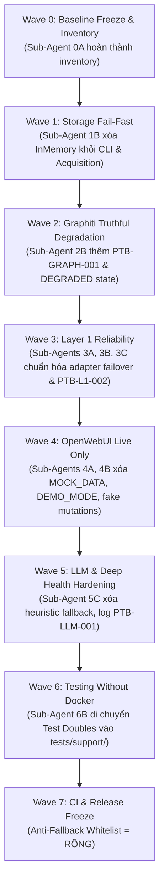

# Báo Cáo Kiểm Toán Runtime Fallback (Fallback Inventory)

> **Tài liệu kiểm toán mã nguồn theo chuẩn v1.2**  
> **Chịu trách nhiệm:** Sub-Agent 0A (Runtime Fallback Auditor)  
> **Căn cứ kế hoạch:** `docs/v1_2.md` và `implementation_plan_v1_2.md`  
> **Trạng thái:** Hoàn tất quét toàn bộ codebase (`scripts/`, `services/`, `packages/`, `integrations/`, `data/`, `tests/`)  
> **Ngày lập:** 2026-09-29  

---

## 1. TỔNG QUAN VÀ MỤC ĐÍCH KIỂM TOÁN

Trong kiến trúc v1.2 của **Personal Task Board (PTB)**, nguyên tắc cốt lõi là **"Fail-Fast & Truthful Degradation" (Tuyệt đối không fallback ngầm trong runtime production)**:
1. Nếu cơ sở dữ liệu authoritative (Neo4j) không khả dụng, hệ thống phải dừng ngay lập tức (`exit != 0`), ghi log lỗi `PTB-STORAGE-001`, tuyệt đối không tự động chuyển sang lưu tạm trong bộ nhớ (`InMemory*`).
2. Nếu LLM provider không khả dụng hoặc lỗi trích xuất, task phải được chuyển sang trạng thái `RETRY` có exponential backoff và log `PTB-LLM-001`, không được tự động silent fallback sang quy tắc heuristic.
3. Nếu semantic memory layer (Graphiti) lỗi hoặc offline, nghiệp vụ chính trên Neo4j vẫn phải thành công, đồng thời đánh dấu `graph_sync_status = RETRY/DEGRADED` và log `PTB-GRAPH-001`.
4. Giao diện OpenWebUI Board và các Tools/Functions tích hợp không được chứa dữ liệu giả lập (`MOCK_DATA`), không dùng cờ `DEMO_MODE`, không dùng `enable_mock_fallback`, và không dùng `setTimeout` để giả lập thao tác thành công (fake mutations).

Tài liệu này là bản **Inventory toàn diện**, phân loại mọi vị trí xuất hiện của các patterns bị cấm hoặc cần kiểm soát, đồng thời chỉ định cụ thể Wave và Sub-Agent chịu trách nhiệm xử lý.

---

## 2. TIÊU CHÍ PHÂN LOẠI 3 NHÓM

Mỗi phát hiện trong codebase được phân vào đúng một trong 3 nhóm sau:

| Nhóm | Ký hiệu | Định nghĩa & Tiêu chuẩn | Hướng xử lý |
| :--- | :---: | :--- | :--- |
| **PRODUCTION FALLBACK** | 🚨 **P-FALLBACK** | Các đoạn mã fallback ngầm, mock fallback, hoặc fake success nằm trong runtime mã nguồn sản phẩm (`scripts/`, `services/`, `packages/`, `integrations/`, `data/`). Làm sai lệch tính toàn vẹn của dữ liệu và che giấu sự cố hệ thống. | **Phải xóa bỏ hoàn toàn** tại Wave tương ứng (Wave 1, Wave 4, Wave 5). |
| **OPTIONAL DEGRADATION** | ⚠️ **OPT-DEGRADE** | Các đoạn xử lý suy giảm dịch vụ có chủ đích và có kiểm soát (như Graphiti semantic memory offline, OWA multi-version parsing, retry failover). Giữ lại luồng fallback nhưng **bắt buộc** bổ sung error logging có mã chuẩn (`PTB-*`) và hạ trạng thái sức khỏe sang `DEGRADED`. | **Giữ lại & gia cố**: Thêm `log_bug(...)`, hạ health state sang `DEGRADED`, đánh dấu retry. |
| **TEST DOUBLE** | 🧪 **TEST-DOUBLE** | Các lớp giả lập (`InMemory*`, mock extractors, test stubs) được sử dụng hợp lệ phục vụ kiểm thử đơn vị, kiểm thử tích hợp không cần Docker dưới `tests/`, `test_*.py`, hoặc `tests/support/`. | **Được phép giữ lại**, di chuyển tập trung về `tests/support/` ở Wave 6. |

---

## 3. THỐNG KÊ TỔNG HỢP KIỂM TOÁN

### 3.1. Phân bố theo Nhóm phân loại
- **PRODUCTION FALLBACK (Cần xóa bỏ)**: **25 vị trí chính** (bao gồm 108 điểm tham chiếu mã nguồn trong `scripts/ptb_cli.py`, `ptb_acquisition`, `llm_extractor.py`, `ptb_tools.py`, `ptb_board_action.py`, `ptb_board.html`).
- **OPTIONAL DEGRADATION (Cần bổ sung log & degraded health)**: **8 vị trí**.
- **TEST DOUBLE (Được phép trong phạm vi test)**: **15 vị trí** (nằm trong `tests/` và test suites của từng service).

### 3.2. Phân bố theo Pattern tìm kiếm

| Pattern | Tổng số phát hiện | Production Fallback | Optional Degradation | Test Double |
| :--- | :---: | :---: | :---: | :---: |
| `InMemory*` | 38 | 12 (CLI + Acquisition) | 0 | 26 (Tests + Support) |
| `MOCK_DATA` | 62 | 62 (OpenWebUI HTML/Data) | 0 | 0 |
| `DEMO_MODE` | 68 | 62 (OpenWebUI HTML/Data) | 0 | 6 (OpenWebUI Tests) |
| `enable_mock_fallback` | 35 | 35 (Tools & Actions) | 0 | 0 |
| `mock_mode` | 18 | 4 (`llm_extractor.py`) | 0 | 14 (`test_processing`, `test_worker`, `test_e2e`) |
| `fallback` / `graceful fallback` | 147 | 18 (CLI, LLM Extractor) | 8 (Graphiti, Interceptors, Adapters) | 121 (Docstrings, Tests, Logging) |
| `fake success` | 4 | 2 (`ptb_board.html`) | 0 | 2 (Static Guard) |
| `setTimeout` | 10 | 4 (`ptb_board.html` sync) | 0 | 6 (UI Toast auto-dismiss) |

---

## 4. BẢNG CHI TIẾT INVENTORY THEO TỪNG NHÓM

### 4.1. NHÓM 1: PRODUCTION FALLBACK (BẮT BUỘC LOẠI BỎ)

Các đoạn mã này vi phạm quy tắc Fail-Fast của kiến trúc v1.2, âm thầm thay thế dữ liệu thật bằng bộ nhớ tạm hoặc dữ liệu mẫu khi gặp sự cố.

| STT | Tệp tin | Vị trí dòng | Đoạn mã cụ thể | Ngữ cảnh & Vi phạm | Wave & Sub-Agent xử lý | Hành động khắc phục |
| :---: | :--- | :---: | :--- | :--- | :---: | :--- |
| **PF-01** | `scripts/ptb_cli.py` | 161–162 | `from ptb_acquisition.pipeline import InMemoryCheckpointRepository, InMemoryRawEventRepository` | Import test double trực tiếp vào supervisor production runtime. | **Wave 1** `Sub-Agent 1B` | Xóa hoàn toàn việc import `InMemory*` trong supervisor runtime. |
| **PF-02** | `scripts/ptb_cli.py` | 175–203 | `print(" [!] Neo4j không khả dụng, sử dụng In-Memory Repositories.")` `self.raw_event_repo = InMemoryRawEventRepository()` `self.checkpoint_repo = InMemoryCheckpointRepository()` | Trong `ProcessSupervisor.run()`, khi Neo4j connectivity check thất bại hoặc quăng exception, supervisor âm thầm fallback sang in-memory repo thay vì fail-fast. | **Wave 1** `Sub-Agent 1B` | Xóa fallback in-memory. Khi Neo4j down: ghi log `PTB-STORAGE-001`, đặt supervisor state `NOT_READY`, thoát với mã lỗi khác 0 (`exit != 0`). |
| **PF-03** | `scripts/ptb_cli.py` | 813–814 | `from ptb_acquisition.pipeline import InMemoryCheckpointRepository, InMemoryRawEventRepository` | Import `InMemory*` vào hàm `cmd_scan()`. | **Wave 1** `Sub-Agent 1B` | Xóa import `InMemory*`. |
| **PF-04** | `scripts/ptb_cli.py` | 834–840 | `logger.debug(f"Không thể kết nối Neo4j, fallback in-memory: {e}")` `raw_repo = InMemoryRawEventRepository()` `ckpt_repo = InMemoryCheckpointRepository()` | Trong lệnh `ptb scan`, nếu không kết nối được Neo4j thì âm thầm chạy với In-Memory repositories. | **Wave 1** `Sub-Agent 1B` | Xóa in-memory fallback trong `cmd_scan`. Nếu Neo4j down: in thông báo lỗi, log `PTB-STORAGE-001`, dừng lệnh. |
| **PF-05** | `services/acquisition/src/ptb_acquisition/pipeline.py` | 54–100 | `class InMemoryRawEventRepository:` `"""Kho lưu trữ RawEventRecord trong bộ nhớ (phục vụ testing và fallback)."""` | Khai báo lớp InMemory repository ngay trong module mã nguồn sản phẩm. | **Wave 1** `Sub-Agent 1B` & `Sub-Agent 6B` | Chuyển định nghĩa class này sang `tests/support/test_doubles.py`. Mã nguồn production không chứa class này. |
| **PF-06** | `services/acquisition/src/ptb_acquisition/pipeline.py` | 102–140 | `class InMemoryCheckpointRepository:` `"""Kho lưu trữ IngestionCheckpointRecord trong bộ nhớ (phục vụ testing và fallback)."""` | Khai báo lớp InMemory checkpoint repository ngay trong module mã nguồn sản phẩm. | **Wave 1** `Sub-Agent 1B` & `Sub-Agent 6B` | Chuyển định nghĩa class này sang `tests/support/test_doubles.py`. |
| **PF-07** | `services/acquisition/src/ptb_acquisition/__init__.py` | 16–17, 30–31 | `InMemoryCheckpointRepository, InMemoryRawEventRepository` `"InMemoryRawEventRepository", "InMemoryCheckpointRepository"` | Xuất khẩu `InMemory*` ra interface công khai của package `ptb_acquisition`. | **Wave 1** `Sub-Agent 1B` | Xóa `InMemory*` khỏi `__all__` và các câu lệnh import/export của package `ptb_acquisition`. |
| **PF-08** | `services/processing/src/ptb_processing/extractor/llm_extractor.py` | 100, 119, 241–249 | `mock_mode: bool = False` `if self.mock_mode:` `    extracted_schema = self._fallback_rule_based_extract(...)` | Cơ chế `mock_mode` tích hợp ngay bên trong lớp production `LLMStructuredExtractor`. | **Wave 5** `Sub-Agent 5C` | Loại bỏ tham số `mock_mode` khỏi production class. Việc mock extractor cho testing phải dùng subclass hoặc test double ở `tests/support/`. |
| **PF-09** | `services/processing/src/ptb_processing/extractor/llm_extractor.py` | 102, 121–125, 251–283 | `allow_heuristic_fallback: Optional[bool] = None` `os.getenv("PTB_ALLOW_HEURISTIC_FALLBACK", "false")` `if self.allow_heuristic_fallback:` `    extracted_schema = self._fallback_rule_based_extract(...)` | Khi không có `OPENAI_API_KEY` hoặc khi gọi OpenAI API lỗi, nếu bật `allow_heuristic_fallback` thì hệ thống âm thầm trích xuất bằng regex/rule-based. | **Wave 5** `Sub-Agent 5C` | Xóa bỏ hoàn toàn cờ `PTB_ALLOW_HEURISTIC_FALLBACK`. Khi LLM lỗi: log `PTB-LLM-001`, chuyển task sang trạng thái `RETRY` với exponential backoff, hạ processing subsystem sang `DEGRADED`. |
| **PF-10** | `integrations/openwebui/tools/ptb_tools.py` *(và file đồng bộ `data/openwebui/tools/ptb_tools.py`)* | 25–28 | `enable_mock_fallback: bool = Field(default=True, description="Tự động fallback về dữ liệu mẫu nếu Application Service chưa chạy")` | Cấu hình cho phép các OpenWebUI tools tự động trả về mock response khi Application Service không phản hồi. | **Wave 4** `Sub-Agent 4A` | Xóa bỏ trường valve `enable_mock_fallback`. |
| **PF-11** | `integrations/openwebui/tools/ptb_tools.py` *(và file đồng bộ `data/openwebui/tools/ptb_tools.py`)* | 65–140 | `if not data and self.valves.enable_mock_fallback:` `    data = { "summary_headline": ..., "top_tasks": [...] }` | `get_today_tasks` fallback về JSON mẫu tĩnh khi backend offline. | **Wave 4** `Sub-Agent 4A` | Xóa khối mock data. Trả về thông báo lỗi rõ ràng: `❌ Application Service không khả dụng`, log `PTB-OWUI-001`. |
| **PF-12** | `integrations/openwebui/tools/ptb_tools.py` *(và file đồng bộ `data/openwebui/tools/ptb_tools.py`)* | 155–175 | `if not data and self.valves.enable_mock_fallback:` `    data = [ { "id": "rev-cand-101", ... } ]` | `get_review_queue` fallback về review queue mẫu. | **Wave 4** `Sub-Agent 4A` | Xóa khối mock data; trả về thông báo lỗi kết nối. |
| **PF-13** | `integrations/openwebui/tools/ptb_tools.py` *(và file đồng bộ `data/openwebui/tools/ptb_tools.py`)* | 182–215 | `if not data and self.valves.enable_mock_fallback:` `    data = [ { "id": "task-unified-001", ... } ]` | `get_all_tasks` fallback về danh sách task mẫu. | **Wave 4** `Sub-Agent 4A` | Xóa khối mock data; trả về thông báo lỗi kết nối. |
| **PF-14** | `integrations/openwebui/tools/ptb_tools.py` *(và file đồng bộ `data/openwebui/tools/ptb_tools.py`)* | 228–232 | `if res or self.valves.enable_mock_fallback:` `    return f"Thành công: Đã phê duyệt..."` | `approve_candidate_task` trả về fake success khi backend lỗi nếu cờ `enable_mock_fallback` bật. | **Wave 4** `Sub-Agent 4B` | Xóa fake success. Chỉ trả về thành công khi API backend thực sự trả mã 2xx. |
| **PF-15** | `integrations/openwebui/tools/ptb_tools.py` *(và file đồng bộ `data/openwebui/tools/ptb_tools.py`)* | 238–242 | `if res or self.valves.enable_mock_fallback:` `    return f"Thành công: Đã bỏ qua..."` | `dismiss_candidate_task` trả về fake success khi backend lỗi. | **Wave 4** `Sub-Agent 4B` | Xóa fake success. |
| **PF-16** | `integrations/openwebui/tools/ptb_tools.py` *(và file đồng bộ `data/openwebui/tools/ptb_tools.py`)* | 255–259 | `if res or self.valves.enable_mock_fallback:` `    return f"Thành công: Đã cập nhật trạng thái..."` | `update_task_status` trả về fake success khi backend lỗi. | **Wave 4** `Sub-Agent 4B` | Xóa fake success. |
| **PF-17** | `integrations/openwebui/tools/ptb_tools.py` *(và file đồng bộ `data/openwebui/tools/ptb_tools.py`)* | 264–285 | `if not data and self.valves.enable_mock_fallback:` `    data = [ ... ]` | `get_waiting_on_me` fallback về danh sách người chờ giả lập. | **Wave 4** `Sub-Agent 4A` | Xóa khối mock data. |
| **PF-18** | `integrations/openwebui/tools/ptb_tools.py` *(và file đồng bộ `data/openwebui/tools/ptb_tools.py`)* | 299–320 | `if not data and self.valves.enable_mock_fallback:` `    data = [ ... ]` | `get_forgotten_commitments` fallback về cam kết bị quên giả lập. | **Wave 4** `Sub-Agent 4A` | Xóa khối mock data. |
| **PF-19** | `integrations/openwebui/tools/ptb_tools.py` *(và file đồng bộ `data/openwebui/tools/ptb_tools.py`)* | 331–355 | `if not data and self.valves.enable_mock_fallback:` `    data = { "decisions": [...], "lessons": [...] }` | `get_graphiti_decisions_lessons` fallback về mock decisions/lessons. | **Wave 4** `Sub-Agent 4A` | Xóa khối mock data. |
| **PF-20** | `integrations/openwebui/tools/ptb_tools.py` *(và file đồng bộ `data/openwebui/tools/ptb_tools.py`)* | 365–390 | `if not data and self.valves.enable_mock_fallback:` `    data = { "sources": [...] }` | `get_sources_health` fallback về danh sách nguồn giả lập. | **Wave 4** `Sub-Agent 4A` | Xóa khối mock data. |
| **PF-21** | `integrations/openwebui/functions/ptb_board_action.py` *(và file đồng bộ `data/openwebui/functions/ptb_board_action.py`)* | 29–32 | `enable_mock_fallback: bool = Field(default=True, description="Fallback to bundled mock response...")` | Valve cấu hình mock fallback trong OpenWebUI Action function. | **Wave 4** `Sub-Agent 4A` | Xóa bỏ trường valve `enable_mock_fallback`. |
| **PF-22** | `integrations/openwebui/functions/ptb_board_action.py` *(và file đồng bộ `data/openwebui/functions/ptb_board_action.py`)* | 179–183, 209, 216, 223 | `if not data and self.valves.enable_mock_fallback:` `    items = [...]` `if res or self.valves.enable_mock_fallback: ...` | Thao tác `review`, `approve`, `dismiss`, `today` fallback về mock hoặc fake success khi API chết. | **Wave 4** `Sub-Agents 4A & 4B` | Xóa bỏ mọi mock fallback và fake success; báo lỗi trực tiếp lên giao diện người dùng. |
| **PF-23** | `integrations/openwebui/board/ptb_board.html` *(và file đồng bộ `data/openwebui/board/ptb_board.html`)* | 1259, 1263 | `const DEMO_MODE = new URLSearchParams(window.location.search).has('demo') \|\| window.PTB_DEMO_MODE === true;` `CONFIG = { isMockMode: DEMO_MODE, ... }` | Cờ kích hoạt chế độ demo/mock trực tiếp trong runtime HTML. | **Wave 4** `Sub-Agent 4A` | Xóa hoàn toàn `DEMO_MODE` và cờ `isMockMode`. Mọi render phải phụ thuộc 100% vào dữ liệu sống từ REST API. |
| **PF-24** | `integrations/openwebui/board/ptb_board.html` *(và file đồng bộ `data/openwebui/board/ptb_board.html`)* | 1269–1520, 1680–1689, 1831, 1928, 2002, 2147, 2195, 2249, 2295, 2341 | `const MOCK_DATA = { today: ..., reviewQueue: ..., allTasks: ..., waiting: ..., forgotten: ..., decisions: ..., lessons: ..., sourcesHealth: ... }` `if (DEMO_MODE) return null; // Signals fallback to MOCK_DATA` `data = apiData \|\| (DEMO_MODE ? MOCK_DATA.today : null);` | Biến `MOCK_DATA` khổng lồ (250 dòng code) chứa dữ liệu tĩnh; cả 8 live view đều fallback sang `MOCK_DATA`. | **Wave 4** `Sub-Agent 4A` | Xóa bỏ toàn bộ biến `MOCK_DATA` và các biểu thức fallback. Khi API lỗi, hiển thị banner cảnh báo `APPLICATION SERVICE OFFLINE` (log `PTB-OWUI-001`). |
| **PF-25** | `integrations/openwebui/board/ptb_board.html` *(và file đồng bộ `data/openwebui/board/ptb_board.html`)* | 2400–2415, 2429–2455, 2470–2480, 2523–2545, 2550–2555, 2562, 2569 | Fake mutation và fake timeout success: `if (DEMO_MODE) { MOCK_DATA.allTasks.unshift(...); }` `function syncSingleSource(...) { setTimeout(() => showToast("Hoàn tất..."), 1000); }` `function syncAllSources() { setTimeout(() => showToast("Đã quét..."), 1200); }` | Người dùng click Approve, Dismiss, Status Change, Edit, Resolve, Sync: giao diện chỉ sửa biến local `MOCK_DATA` hoặc gọi `setTimeout` giả vờ đã đồng bộ thành công mà không gọi backend. | **Wave 4** `Sub-Agent 4B` | Xóa bỏ toàn bộ logic giả lập mutation. Mọi nút bấm phải phát HTTP POST/PATCH/DELETE tới REST API thật; nếu backend offline thì thông báo lỗi, không tự ý sửa đổi state giả. |

---

### 4.2. NHÓM 2: OPTIONAL DEGRADATION (CẦN GIỮ LẠI & BỔ SUNG LOG/HEALTH)

Các cơ chế này phục vụ khả năng chịu lỗi (fault tolerance) hợp lệ của hệ thống phân tán, nhưng cần được giám sát chặt chẽ: phải phát sinh mã lỗi chuẩn (`PTB-*`) và cập nhật health status sang `DEGRADED`.

| STT | Tệp tin | Vị trí dòng | Đoạn mã cụ thể | Ngữ cảnh nghiệp vụ | Rủi ro hiện tại | Wave & Sub-Agent gia cố | Hành động cần thực hiện |
| :---: | :--- | :---: | :--- | :--- | :--- | :---: | :--- |
| **OD-01** | `packages/graph_memory/src/ptb_graph_memory/adapter.py` | 14–25 | `try:` `    import graphiti_core` `except Exception as exc:` `    HAS_GRAPHITI_CORE = False` `    logger.info("Operating in graceful fallback mode.")` | Khởi tạo module Graphiti: Môi trường thiếu thư viện C-extension hoặc không cài `graphiti-core`. | Hiện chỉ ghi `logger.info`, supervisor và health check không biết Graphiti vắng mặt. | **Wave 2** `Sub-Agent 2B` | Bổ sung gọi `log_bug(code="PTB-GRAPH-001", subsystem="graphiti", severity="WARNING", ...)` và cập nhật trạng thái `GraphitiAdapter.health_state = SubsystemHealth.DEGRADED`. |
| **OD-02** | `packages/graph_memory/src/ptb_graph_memory/adapter.py` | 71–77 | `except Exception as e:` `    logger.warning("Graphiti-core initialization fallback: %s.", e)` `    self._graphiti = None` | Khởi tạo kết nối Graphiti với Neo4j thất bại. | Chỉ ghi warning log thông thường, không phát sự kiện lỗi chuẩn. | **Wave 2** `Sub-Agent 2B` | Gọi `log_bug(code="PTB-GRAPH-001", subsystem="graphiti", severity="ERROR", ...)`, đánh dấu subsystem Graphiti `DEGRADED`. Authoritative task trên Neo4j vẫn tiếp tục. |
| **OD-03** | `packages/graph_memory/src/ptb_graph_memory/adapter.py` | 98–100, 130–138 | `if not self.is_available: return None` `except Exception as exc:` `    logger.warning("Graphiti episode ingestion failed... Domain flow intact.")` `    return None` | `add_episode()` nuốt exception để bảo toàn luồng lưu trữ Neo4j. | Episode bị mất vĩnh viễn nếu không có hàng đợi retry. | **Wave 2** `Sub-Agent 2B` | Giữ nguyên việc không rollback domain, nhưng ghi `log_bug("PTB-GRAPH-001")`, chuyển node liên quan sang trạng thái `graph_sync_status = "RETRY"`, để `GraphMemorySyncWorker` đồng bộ lại sau. |
| **OD-04** | `services/acquisition/src/ptb_acquisition/adapters/shortcut_adapter.py` | 216–220 | `try:` `    res = await self._execute_request(f"/projects/{stream_id}/stories")` `except Exception as e:` `    logger.debug(f"...fallback search: {e}")` `    query = self._build_search_query(...)` | Khi endpoint lấy stories theo project ID thất bại, adapter chuyển sang dùng Search API toàn cục. | Log ở mức `debug`, không có thống kê số lần failover sang Search API. | **Wave 3** `Sub-Agents 3B & 3C` | Giữ logic fallback API. Nâng mức log lên `logger.warning`, nếu Search API cũng fail thì phát sinh `PTB-L1-002` và hạ health state của Shortcut adapter sang `DEGRADED`. |
| **OD-05** | `services/acquisition/src/ptb_acquisition/adapters/jira_adapter.py` | 288–294 | `try:` `    result = await self._execute_request("/rest/api/3/search", ...)` `except Exception as e:` `    # Fallback to GET /rest/api/2/search or log error` | Truy vấn Jira qua API v3 thất bại. | Hiện tại chỉ break vòng lặp sau khi log error, chưa có failover API v2 chuẩn xác hoặc cập nhật trạng thái nguồn. | **Wave 3** `Sub-Agents 3B & 3C` | Bổ sung fallback có kiểm soát sang Jira API v2 hoặc ghi nhận `PTB-L1-002`, hạ Jira source health sang `DEGRADED` thay vì giữ trạng thái healthy ảo. |
| **OD-06** | `services/acquisition/src/ptb_acquisition/playwright/outlook_interceptor.py` & `teams_interceptor.py` | 90–99 | `if self.pipeline is not None:` `    persisted = await self.pipeline.persist_raw_event(rec)` `elif self.queue is not None:` `    persisted = await self.queue.put(rec)` `else:` `    persisted = True` | Tính tương thích ngược giao diện của interceptor (hỗ trợ cả pipeline instance lẫn hàng đợi asyncio queue rời rạc). | Nếu cả pipeline và queue đều None thì `persisted = True` (chế độ standalone test) có thể gây mất dữ liệu ngầm nếu cấu hình sai. | **Wave 3** `Sub-Agent 3A` | Giữ tương thích interface, nhưng nếu trong production runtime mà không có pipeline lưu trữ Neo4j thì phải log `PTB-L1-002` và đánh dấu session health `DEGRADED`. |
| **OD-07** | `services/acquisition/src/ptb_acquisition/playwright/outlook_interceptor.py` | 148–151 | `# Fallback legacy ConversationItems` `for ci in conv.get("ConversationItems", []):` `    if isinstance(ci, dict): items.append(ci)` | Bóc tách payload OWA cũ (`ConversationItems`) khi không có `ItemUpdates`. | Tương thích giao thức phân tích cú pháp web client của Microsoft OWA. | **Wave 3** `Sub-Agent 3A` | Giữ nguyên (đây là schema evolution parsing hợp lệ). |
| **OD-08** | `services/processing/src/ptb_processing/identity/resolver.py` | 260–274, 357–366 | `if self.neo4j_client is None:` `    return self.resolve(...)` `# Fallback về in-memory logic` | Khi tra cứu danh tính qua Neo4j không thấy hoặc không truyền `neo4j_client`, tra cứu tiếp trong registry cấu hình local. | Trong môi trường production, nếu kết nối Neo4j bị ngắt giữa chừng thì việc âm thầm resolve bằng in-memory dict che giấu lỗi database. | **Wave 1** `Sub-Agent 1B` & `Sub-Agent 1D` | Nếu là lỗi mất kết nối Neo4j runtime: log `PTB-STORAGE-001`, hạ processing health sang `DEGRADED`. Nếu là tra cứu người dùng cấu hình tĩnh: ghi chú rõ ràng đây là secondary local identity cache. |

---

### 4.3. NHÓM 3: TEST DOUBLE (ĐƯỢC PHÉP TRONG THỰC THI KIỂM THỬ)

Các lớp và cờ sau đây phục vụ việc chạy test nhanh, độc lập, không phụ thuộc Docker (theo tiêu chuẩn Wave 6).

| STT | Tệp tin | Vị trí dòng | Đoạn mã cụ thể | Mục đích kiểm thử | Kế hoạch Wave 6 |
| :---: | :--- | :---: | :--- | :--- | :--- |
| **TD-01** | `tests/e2e/test_vertical_slice_e2e.py` | 59–141 | `class InMemoryRawEventRepository:` | Test double lưu trữ RawEvent cho bài test vertical slice E2E. | **Wave 6 (Sub-Agent 6B):** Chuyển vào `tests/support/test_doubles.py`. |
| **TD-02** | `tests/e2e/test_vertical_slice_e2e.py` | 143–288 | `class InMemoryTaskDomainRepository:` | Test double quản lý Task, Decision, Audit log cho vertical slice test. | **Wave 6 (Sub-Agent 6B):** Chuyển vào `tests/support/test_doubles.py`. |
| **TD-03** | `tests/e2e/test_vertical_slice_e2e.py` | 290–334 | `class InMemoryCheckpointRepository:` | Test double lưu trữ ingestion checkpoints cho vertical slice test. | **Wave 6 (Sub-Agent 6B):** Chuyển vào `tests/support/test_doubles.py`. |
| **TD-04** | `tests/e2e/test_vertical_slice_e2e.py` | 394, 600 | `LLMStructuredExtractor(mock_mode=True)` | Kích hoạt bộ trích xuất xác định cho test kịch bản E2E. | **Wave 6 (Sub-Agent 6B):** Dùng `FakeDeterministicLLMExtractor` trong `tests/support/`. |
| **TD-05** | `services/acquisition/tests/test_playwright_interceptor.py` | 10 | `from ptb_acquisition.pipeline import InMemoryRawEventRepository` | Import test repository cho unit test parser OWA. | Đổi đường dẫn import sang `tests.support` sau khi hoàn tất Wave 1 & 6. |
| **TD-06** | `services/acquisition/tests/test_adapters.py` | 30–31, 248, 295–296 | `InMemoryCheckpointRepository, InMemoryRawEventRepository` | Kiểm thử các adapter Git, Jira, Shortcut độc lập với Neo4j. | Đổi đường dẫn import sang `tests.support`. |
| **TD-07** | `services/acquisition/tests/test_extended_adapters.py` | 44–45, 446–447 | `InMemoryCheckpointRepository, InMemoryRawEventRepository` | Kiểm thử coding agent watchers (Cursor, Copilot, Windsurf...). | Đổi đường dẫn import sang `tests.support`. |
| **TD-08** | `services/processing/tests/test_processing.py` | 7, 313–314, 408, 601–602 | `LLMStructuredExtractor(mock_mode=True)` | Unit test cho processing pipeline và confidence classification. | Giữ nguyên trong test suite của `ptb_processing`. |
| **TD-09** | `services/processing/tests/test_worker.py` | 171, 265, 329, 364, 417, 506, 534, 594 | `LLMStructuredExtractor(mock_mode=True, allow_heuristic_fallback=...)` | Unit test kiểm chứng hành vi retry khi LLM lỗi (bài test non-silent retry). | Cập nhật lại test case ở Wave 5C khi xóa bỏ cờ heuristic fallback. |
| **TD-10** | `services/intelligence/tests/test_priority.py` | 237–238 | `def test_safe_fallback_on_missing_or_corrupt_yaml(tmp_path):` | Kiểm thử hành vi nạp cấu hình mặc định khi file YAML bị lỗi. | Giữ nguyên trong unit test. |
| **TD-11** | `packages/graph_memory/tests/test_graphiti.py` | 435–436 | `async def test_graphiti_adapter_offline_graceful_fallback():` | Kiểm thử việc `GraphitiAdapter` không quăng exception khi offline. | Cập nhật assertion để kiểm tra thêm việc phát sinh log `PTB-GRAPH-001` ở Wave 2B. |
| **TD-12** | `packages/contracts/tests/test_logging.py` | 203, 241 | `test_log_bug_with_empty_message_fallback_to_exc` | Kiểm thử hàm `log_bug` tự động lấy message từ Exception nếu trống. | Giữ nguyên trong contract tests. |
| **TD-13** | `services/mcp/tests/test_mcp_server.py` | 146, 152 | `"content": "Cần thêm timeout fallback"` | Chuỗi ký tự dữ liệu mẫu trong bài test Decision/Lesson. | Giữ nguyên (chuỗi text kiểm thử). |
| **TD-14** | `integrations/openwebui/tests/test_openwebui.py` | 5, 111–125 | `test_ptb_board_no_mock_fallback_and_demo_flag()` | Kiểm tra tĩnh artifact `ptb_board.html`. | **Wave 4:** Sửa test để assert rằng không còn bất kỳ chuỗi `MOCK_DATA` hay `DEMO_MODE` nào trong file HTML. |
| **TD-15** | `tests/test_anti_fallback_guard.py` | 1–427 | Toàn bộ tệp tin tĩnh bảo vệ anti-fallback (Wave 0). | Kiểm tra AST / Regex phát hiện vi phạm fallback trong production. | Giữ nguyên và cập nhật thu hẹp `TEMPORARY_WHITELIST` sau mỗi Wave hoàn tất. |

---

## 5. MA TRẬN HÀNH ĐỘNG THEO LỘ TRÌNH WAVE

### Chi tiết phân công thực hiện:

1. **Wave 1 — Storage Correctness & Fail-Fast Runtime**
   - **Sub-Agent 1B**:
     - Xóa toàn bộ logic fallback in-memory trong `scripts/ptb_cli.py` (`ProcessSupervisor.run` và `cmd_scan`).
     - Tích hợp `log_bug("PTB-STORAGE-001", "neo4j", "CRITICAL", ...)` khi mất kết nối Neo4j.
     - Xóa export `InMemory*` khỏi `services/acquisition/src/ptb_acquisition/__init__.py`.
     - Xóa Whitelist `scripts/ptb_cli.py` và `ptb_acquisition` trong `tests/test_anti_fallback_guard.py`.

2. **Wave 2 — Intelligence & Graphiti Sync**
   - **Sub-Agent 2B**:
     - Gia cố `GraphitiAdapter`: Thay vì chỉ ghi warning log, tích hợp `log_bug("PTB-GRAPH-001", ...)` và đặt trạng thái subsystem sang `DEGRADED`.
     - Đảm bảo task authoritative luôn hoàn tất trên Neo4j, đánh dấu `graph_sync_status = "RETRY"`.

3. **Wave 3 — Layer 1 Reliability & Adapter Supervisor**
   - **Sub-Agent 3A**: Lan truyền lỗi capture/persist `PTB-L1-002` trong `outlook_interceptor.py` và `teams_interceptor.py`.
   - **Sub-Agent 3B & 3C**: Bổ sung cơ chế giám sát degradation trong `shortcut_adapter.py` và `jira_adapter.py`, xóa bỏ trạng thái healthy giả.

4. **Wave 4 — OpenWebUI Live Only**
   - **Sub-Agent 4A**:
     - Xóa biến `MOCK_DATA` và cờ `DEMO_MODE` khỏi `integrations/openwebui/board/ptb_board.html` (và `data/openwebui/board/ptb_board.html`).
     - Xóa `enable_mock_fallback` khỏi `ptb_tools.py` và `ptb_board_action.py`.
     - Hiển thị banner lỗi trung thực `APPLICATION SERVICE OFFLINE` (log `PTB-OWUI-001`) khi backend offline.
   - **Sub-Agent 4B**:
     - Xóa bỏ các lệnh `setTimeout` giả mạo thành công trong `ptb_board.html`.
     - Chuyển toàn bộ các nút Approve, Dismiss, Status, Edit sang gọi REST endpoint thật.
     - Xóa Whitelist OpenWebUI trong `tests/test_anti_fallback_guard.py`.

5. **Wave 5 — Application, MCP & Health Hardening**
   - **Sub-Agent 5C**:
     - Xóa bỏ cờ `PTB_ALLOW_HEURISTIC_FALLBACK` và `mock_mode` trong `llm_extractor.py`.
     - Bổ sung lệnh `ptb doctor --deep`. Khi thiếu API key hoặc lỗi LLM: phát sinh `PTB-LLM-001`, chuyển task sang `RETRY` với exponential backoff.

6. **Wave 6 — Testing Without Docker**
   - **Sub-Agent 6B**:
     - Di chuyển các class `InMemoryRawEventRepository`, `InMemoryCheckpointRepository`, `InMemoryTaskDomainRepository` vào thư mục chuẩn `tests/support/test_doubles.py`.
     - Đảm bảo toàn bộ test suites (`pytest -m "not external_integration"`) vượt qua 100% bằng Test Doubles mà không phụ thuộc Docker.

7. **Wave 7 — Release Freeze & Gate Final**
   - `TEMPORARY_WHITELIST` trong `tests/test_anti_fallback_guard.py` phải **rỗng 100%**.
   - Mọi kiểm thử anti-fallback đều chạy ở chế độ nghiêm ngặt (Zero Fallback).

---

## 6. KẾT LUẬN CỦA AUDITOR (WAVE 0 GATE)

1. Bản kiểm toán `docs/fallback_inventory.md` đã hoàn tất, cung cấp địa chỉ chính xác (file, dòng, code snippet), bản chất kỹ thuật và kế hoạch xử lý cho **tất cả các điểm fallback ngầm** trong codebase.
2. Không có bất kỳ thay đổi nào làm ảnh hưởng đến business logic của production runtime trong Wave 0, tuân thủ nghiêm ngặt nguyên tắc **"Baseline Freeze"**.
3. Toàn bộ các phát hiện đã được ánh xạ và đồng bộ với test suite `tests/test_anti_fallback_guard.py` (Sub-Agent 0C) và hợp đồng lỗi `packages/contracts/src/ptb_contracts/logging.py` (Sub-Agent 0B).
4. **Đủ điều kiện đóng Gate Wave 0** và sẵn sàng mở **Wave 1** (Storage Correctness & Fail-Fast Runtime).
