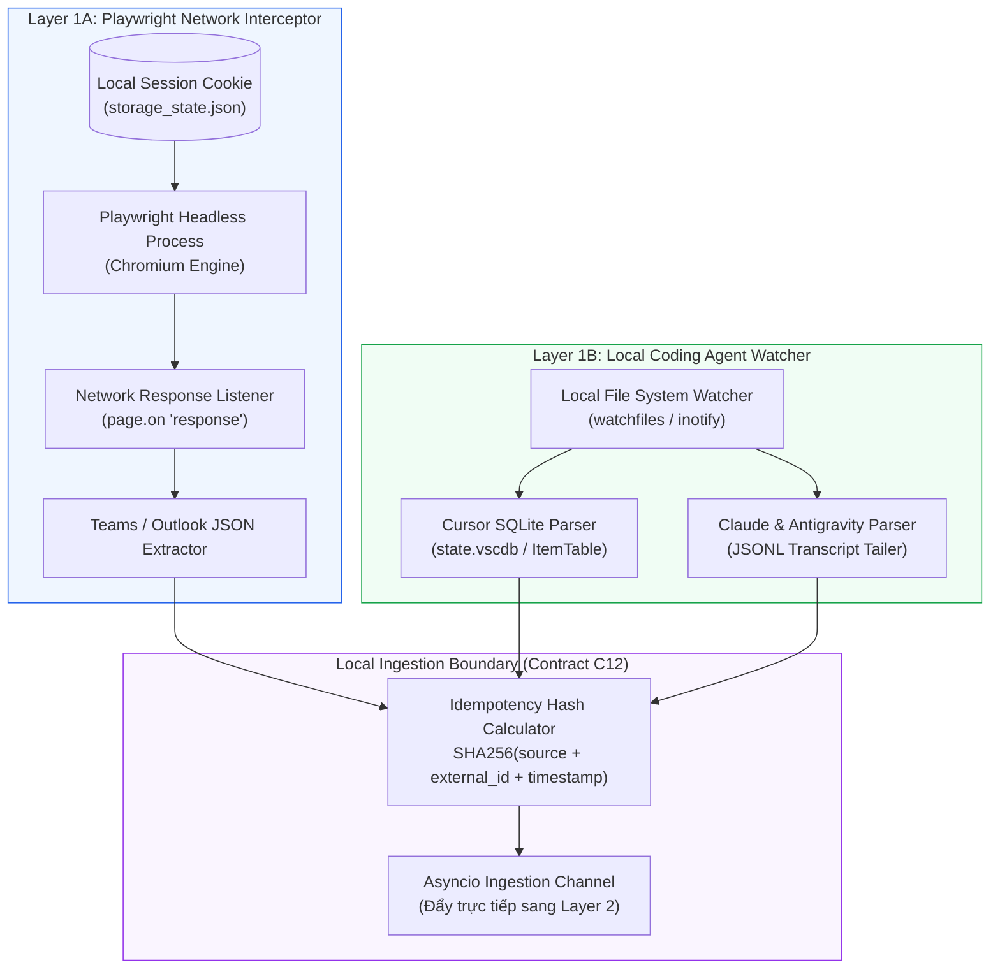

# Layer 1: Data Acquisition (Thu Thập & Trích Xuất Dữ Liệu Cục Bộ)

## 1. Trách Nhiệm Cốt Lõi Của Layer 1 (Local-First Edition)

Trong kiến trúc Local-First, Layer 1 chịu trách nhiệm thu thập toàn bộ dữ liệu thô từ các công cụ giao tiếp và môi trường lập trình của kỹ sư **ngay trên máy tính cá nhân (User Host)** mà không cần thông qua các API Cloud phức tạp hay rào cản phân quyền doanh nghiệp:

1. **Layer 1A: Browser Network Interception (Playwright)**:
   - Thu thập tin nhắn, cuộc hội thoại từ **Teams Web** và **Outlook Web**.
   - Cơ chế: Tái sử dụng session cookie của người dùng, dùng Playwright để "nghe lén" gói tin JSON nội bộ từ network responses (`page.on('response')`).
   - **Lợi ích chí mạng**: Không cần đăng ký Azure AD App, không cần quyền Quản trị viên (Admin Consent) của công ty hay khách hàng.
2. **Layer 1B: Local Coding Agent Session Watcher**:
   - Thu thập lịch sử chat, các quyết định kiến trúc và bài học sửa lỗi từ các Coding Agent lưu tại local:
     - **Cursor**: Quét file SQLite `state.vscdb`.
     - **Claude Code**: Quét các file transcript JSONL trong `~/.claude/`.
     - **Antigravity IDE**: Quét các file `transcript.jsonl` trong thư mục `brain/`.
3. **Idempotency & Chuẩn Hóa C12**:
   - Mọi sự kiện thu thập được đều được gán `idempotency_key` duy nhất để tránh xử lý trùng lặp và đóng gói thành `RawEventRecord` hoặc `RawAgentSessionRecord`.

---

## 2. Kiến Trúc Chi Tiết Layer 1



---

## 3. Layer 1A: Playwright Network Interceptor (Chi Tiết Kỹ Thuật)

### 3.1 Nguyên Lý Hoạt Động (Network Response Interception)
Khi người dùng truy cập Teams Web hoặc Outlook Web, giao diện web liên tục gọi các API nội bộ trả về JSON dạng cấu trúc:
- Teams: `/api/chats/.../messages`, `/api/v1/users/ME/conversations/...`
- Outlook: `/owa/service.svc?action=GetConversationItems`

Thay vì parse giao diện HTML dễ vỡ khi Teams đổi CSS, Playwright hook trực tiếp vào luồng phản hồi mạng:

```python
import json
from playwright.async_api import async_playwright, Response

async def handle_teams_response(response: Response, queue):
    url = response.url
    # Bắt đúng endpoint chứa tin nhắn chat
    if "api/chats" in url and "messages" in url and response.status == 200:
        try:
            payload = await response.json()
            messages = payload.get("messages", [])
            for msg in messages:
                # Đóng gói thành RawEventRecord
                raw_event = parse_teams_internal_json(msg)
                await queue.put(raw_event)
        except Exception as e:
            logger.warning(f"Lỗi đọc payload Teams: {e}")

async def start_teams_interceptor(storage_state_path: str, queue):
    async with async_playwright() as p:
        # Khởi chạy trình duyệt với session cookie đã đăng nhập
        browser = await p.chromium.launch(headless=True)
        context = await browser.new_context(storage_state=storage_state_path)
        page = await context.new_page()
        
        # Đăng ký listener bắt phản hồi mạng
        page.on("response", lambda resp: handle_teams_response(resp, queue))
        await page.goto("https://teams.microsoft.com")
        
        # Giữ kết nối hoạt động ngầm
        while True:
            await asyncio.sleep(60)
```

### 3.2 Cơ Chế Lưu Trữ Phiên (Session Management)
- Người dùng chạy lệnh `python -m services.acquisition.login` một lần duy nhất để mở trình duyệt có giao diện, hoàn tất đăng nhập (bao gồm 2FA/MFA).
- Playwright lưu trạng thái cookie và token vào file mã hoá `storage_state.json` cục bộ.
- Headless worker sử dụng file này để tự động kết nối lại mà không cần nhập mật khẩu.

---

## 4. Layer 1B: Local Coding Agent Log Watcher (Chi Tiết Kỹ Thuật)

### 4.1 Thu Thập Từ Cursor AI (`state.vscdb`)
- **Vị trí**:
  - macOS: `~/Library/Application Support/Cursor/User/workspaceStorage/<workspace_id>/state.vscdb`
  - Linux/Windows: Đường dẫn tương ứng trong AppData / config.
- **Cơ chế**: Cursor lưu toàn bộ lịch sử Composer/Chat vào database SQLite.
- **Truy vấn**:
  ```python
  import sqlite3
  import json

  def extract_cursor_chats(db_path: str):
      conn = sqlite3.connect(f"file:{db_path}?mode=ro", uri=True)
      cursor = conn.cursor()
      cursor.execute("SELECT value FROM ItemTable WHERE key = 'workbench.panel.aichat.chatdata'")
      row = cursor.fetchone()
      if row:
          chat_data = json.loads(row[0])
          return chat_data.get("tabs", [])
  ```

### 4.2 Thu Thập Từ Claude Code & Antigravity IDE
- **Claude Code**: Đọc các file JSONL transcript trong thư mục `~/.claude/projects/`.
- **Antigravity IDE**: Đọc file `transcript.jsonl` từ thư mục `<appDataDir>/brain/<conversation-id>/.system_generated/logs/`.
- **Nội dung trích xuất**:
  - Các turn mà User yêu cầu task kỹ thuật (e.g. `"Fix bug token refresh"`, `"Refactor schema"`).
  - Các turn mà Agent đưa ra quyết định kiến trúc (e.g. `"Sử dụng Neo4j thay vì Postgres vì..."`).
  - Các bài học sửa lỗi (Lessons Learned) sau khi chạy test thất bại và sửa thành công.

---

## 5. Cơ Chế Idempotency & Hàng Đợi (Queueing)

Để đảm bảo không bị trùng lặp dữ liệu khi quét lại các file log hay bắt lại gói tin mạng:

$$IdempotencyKey = \text{SHA256}(\text{source\_type} + \text{external\_id} + \text{content\_hash})$$

- Tiến trình kiểm tra trong bộ đệm hoặc Neo4j: Nếu `idempotency_key` đã tồn tại $\rightarrow$ Bỏ qua.
- Nếu mới $\rightarrow$ Chuyển qua kênh `asyncio.Queue` cho Layer 2 Ingestion Service xử lý ngay lập tức.

---

## 6. Kiểm Thử Độc Lập Layer 1

1. **Test Layer 1A**: Sử dụng file mock JSON của gói tin Teams (`packages/contracts/mocks/l1_raw_teams_message.json`) đưa trực tiếp vào hàm `handle_teams_response`.
2. **Test Layer 1B**: Tạo file SQLite giả lập của Cursor và file JSONL mẫu để kiểm tra độ chính xác của bộ trích xuất log.
