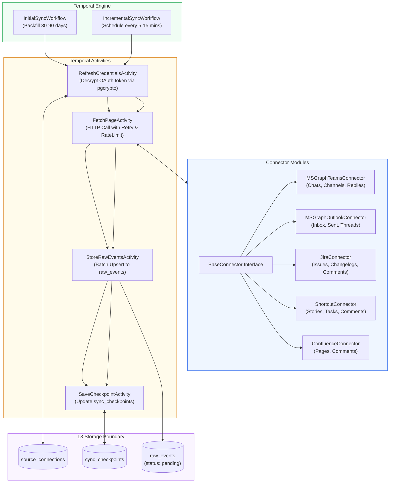

# Layer 1: Data Acquisition (Thu Thập & Đồng Bộ Dữ Liệu)

## 1. Trách Nhiệm Cốt Lõi Của Layer 1

Layer 1 chịu trách nhiệm kết nối, thu thập và lưu trữ toàn bộ dữ liệu thô từ các nền tảng giao tiếp và quản lý công việc vào hệ thống một cách bền bỉ (durable), không mất mát dữ liệu, có khả năng phục hồi sau lỗi và hỗ trợ mở rộng cho nhiều tenant.

**Các nhiệm vụ chính:**
1. **Quản lý kết nối đa nguồn (Multi-source Connectors)**: Microsoft Graph API (Teams chats/channels, Outlook emails), Jira REST API, Shortcut API, Confluence API.
2. **Điều phối bền bỉ qua Temporal (Durable Orchestration)**:
   - *Initial Sync Workflow*: Quét lùi lịch sử (Backfill) từ 30 đến 90 ngày cho các nguồn mới kết nối.
   - *Incremental Sync Workflow*: Chạy định kỳ mỗi 5 đến 15 phút để lấy dữ liệu thay đổi (delta/new events).
3. **Idempotency & Lưu trữ bất biến (Immutable Raw Storage)**: Đảm bảo không ghi trùng lặp dữ liệu và lưu nguyên vẹn payload gốc vào bảng `raw_events` trong Supabase.
4. **Quản lý Checkpoint & Giới hạn tốc độ (Checkpointing & Rate Limiting)**: Lưu vị trí phân trang (paging token, delta token) sau từng trang dữ liệu; tự động retry với exponential backoff khi gặp HTTP 429.

---

## 2. Kiến Trúc Chi Tiết Layer 1



---

## 3. Thiết Kế Connector (Connector Architecture)

### 3.1 BaseConnector Interface

Mọi connector đều kế thừa từ một interface chuẩn trong Python:

```python
from abc import ABC, abstractmethod
from typing import AsyncGenerator, Dict, Any, Optional
from pydantic import BaseModel

class FetchBatchResult(BaseModel):
    items: list[Dict[str, Any]]
    next_page_token: Optional[str]
    delta_token: Optional[str]
    has_more: bool

class BaseConnector(ABC):
    def __init__(self, connection_config: Dict[str, Any]):
        self.config = connection_config

    @abstractmethod
    async def test_connection(self) -> bool:
        """Kiểm tra quyền truy cập và tính hợp lệ của token."""
        pass

    @abstractmethod
    async def fetch_backfill(
        self, 
        start_time: str, 
        page_token: Optional[str] = None
    ) -> FetchBatchResult:
        """Lấy dữ liệu lịch sử trong khoảng thời gian xác định."""
        pass

    @abstractmethod
    async def fetch_incremental(
        self, 
        checkpoint_token: Optional[str] = None
    ) -> FetchBatchResult:
        """Lấy dữ liệu phát sinh mới nhất kể từ checkpoint gần nhất."""
        pass
```

### 3.2 Microsoft Graph Connector (Đa Tenant)
- **Teams Messages**:
  - Endpoint: `GET /chats/{chat-id}/messages` hoặc `GET /teams/{team-id}/channels/{channel-id}/messages/delta`.
  - Hỗ trợ phân rã HTML body: Tin nhắn có quote (`<blockquote>`), mention (`<at>`), và đính kèm attachment link.
  - Phân tách tenant: Header request gắn token tương ứng với tenant ID (`fpt.com` vs tenant khách hàng).
- **Outlook Emails**:
  - Endpoint: `GET /me/mailFolders/inbox/messages/delta`.
  - Chỉ lấy metadata, subject, body text, người gửi, CC, và danh sách người nhận.

### 3.3 Jira & Shortcut Connectors
- **Jira REST API v3**:
  - Endpoint: `POST /rest/api/3/search` với JQL: `updated >= -15m` hoặc `assignee = currentUser() OR text ~ "cuong"`.
  - Lấy đầy đủ fields: `summary`, `status`, `assignee`, `reporter`, `comment`, `duedate`.
- **Shortcut API v3**:
  - Endpoint: `GET /api/v3/stories/search` và `GET /api/v3/stories/{story-id}/comments`.

---

## 4. Thiết Kế Temporal Workflows

Temporal đóng vai trò đảm bảo quá trình đồng bộ không bao giờ bị đứt gãy giữa chừng:

### 4.1 InitialSyncWorkflow (Backfill 30-90 Ngày)
1. **Nhận input**: `connection_id`, `lookback_days` (mặc định 30 ngày, tối đa 90 ngày).
2. **Khởi tạo Checkpoint**: Ghi nhận `status = 'in_progress'` trong `sync_checkpoints`.
3. **Phân trang lặp (Pagination Loop)**:
   - Gọi Activity `FetchPageActivity` với `page_token`.
   - Với mỗi trang (ví dụ: 50 tin nhắn):
     - Tính `idempotency_key` cho từng item.
     - Gọi Activity `StoreRawEventsActivity` ghi vào `raw_events` với `processing_status = 'pending'`.
     - Gọi Activity `SaveCheckpointActivity` lưu lại `next_page_token`.
4. **Hoàn thành**: Cập nhật `sync_checkpoints` với `last_successful_sync_at = now()`, `status = 'healthy'`.

### 4.2 IncrementalSyncWorkflow (Chạy Định Kỳ)
1. **Lịch trình**: Được cấu hình bằng Temporal Schedule (`*/10 * * * *` - 10 phút/lần).
2. **Nạp Checkpoint**: Đọc `delta_token` hoặc `last_event_timestamp` từ database.
3. **Gọi Delta API**: Lấy các item mới hoặc vừa cập nhật.
4. **Ghi Raw Event**:
   - Nếu event đã tồn tại cùng `idempotency_key` $\rightarrow$ Bỏ qua (Skip).
   - Nếu event có nội dung sửa đổi $\rightarrow$ Tạo bản ghi raw event mới với version mới.
5. **Cập nhật Checkpoint**: Ghi lại `delta_token` mới nhất.

---

## 5. Schema & Idempotency trong Cơ Sở Dữ Liệu

### 5.1 Thuật Toán Tính Idempotency Key
Để tránh ghi trùng khi Temporal retry:
```
idempotency_key = SHA256(
    tenant_id + ":" + 
    source_type + ":" + 
    external_id + ":" + 
    sha256(raw_content_payload)
)
```

### 5.2 Bảng `raw_events` (PostgreSQL DDL)

```sql
CREATE TABLE raw_events (
    id UUID PRIMARY KEY DEFAULT gen_random_uuid(),
    tenant_id VARCHAR(100) NOT NULL,
    source_type VARCHAR(50) NOT NULL,
    external_id VARCHAR(255) NOT NULL,
    parent_external_id VARCHAR(255),
    idempotency_key VARCHAR(64) UNIQUE NOT NULL,
    
    event_timestamp TIMESTAMPTZ NOT NULL,
    author_external_id VARCHAR(255) NOT NULL,
    author_display_name VARCHAR(255),
    conversation_or_project_id VARCHAR(255) NOT NULL,
    deep_link TEXT,
    
    raw_payload JSONB NOT NULL,
    
    processing_status VARCHAR(30) DEFAULT 'pending' 
        CHECK (processing_status IN ('pending', 'processing', 'processed', 'failed', 'skipped')),
    retry_count INT DEFAULT 0,
    last_error TEXT,
    
    created_at TIMESTAMPTZ DEFAULT clock_timestamp()
);

-- Indexes tối ưu hóa việc truy vấn của Layer 2 Worker
CREATE INDEX idx_raw_events_pending ON raw_events (created_at ASC) 
WHERE processing_status = 'pending';

CREATE INDEX idx_raw_events_lookup ON raw_events (tenant_id, source_type, external_id);
```

### 5.3 Quản Lý Token & Credentials (`source_connections`)
Mã hóa bảo vệ OAuth token bằng `pgcrypto`:

```sql
CREATE EXTENSION IF NOT EXISTS pgcrypto;

CREATE TABLE source_connections (
    id UUID PRIMARY KEY DEFAULT gen_random_uuid(),
    user_id UUID NOT NULL,
    tenant_id VARCHAR(100) NOT NULL,
    source_type VARCHAR(50) NOT NULL,
    auth_type VARCHAR(30) NOT NULL, -- 'oauth2', 'api_token'
    
    -- Lưu trữ access_token và refresh_token dưới dạng mã hóa
    encrypted_credentials BYTEA NOT NULL,
    token_expires_at TIMESTAMPTZ,
    
    is_active BOOLEAN DEFAULT TRUE,
    created_at TIMESTAMPTZ DEFAULT clock_timestamp(),
    updated_at TIMESTAMPTZ DEFAULT clock_timestamp(),
    
    UNIQUE(user_id, tenant_id, source_type)
);
```

---

## 6. Xử Lý Lỗi, Backpressure & Dead-Letter

1. **HTTP 429 (Rate Limited)**:
   - Connector đọc header `Retry-After`.
   - Temporal Activity ném `ApplicationError(retryable=True, backoff_seconds=...)`.
2. **Token Expired (HTTP 401)**:
   - Activity `RefreshCredentialsActivity` tự động dùng refresh_token để lấy access_token mới và cập nhật vào `source_connections`.
3. **Dead-Letter / Poison Message**:
   - Nếu một raw event bị lỗi cú pháp payload không thể parse sau 5 lần retry, Temporal đánh dấu `status = 'failed'` kèm `last_error` trong `raw_events` và bắn alert về Coverage Dashboard. Quá trình sync các items tiếp theo vẫn tiếp tục.

---

## 7. Quy Trình Test Độc Lập Layer 1

Layer 1 có thể kiểm thử độc lập 100% không cần các layer khác:
1. **Mock Source API Server**: Sử dụng `httpx_mock` hoặc `WireMock` giả lập API response của Microsoft Graph và Jira.
2. **Temporal Test Environment**: Sử dụng `temporalio.testing.WorkflowEnvironment` trong Python để chạy test toàn bộ vòng đời của `InitialSyncWorkflow` và `IncrementalSyncWorkflow` cục bộ.
3. **Database Assertion**: Kiểm tra dữ liệu được chèn vào bảng `raw_events` có đúng chuẩn `RawEventRecord` đã quy định trong `packages/contracts`.
