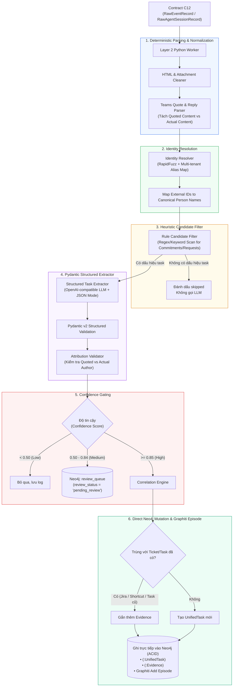

# Layer 2: Data Processing (Tiến Trình Xử Lý & Trích Xuất Dữ Liệu Thuần Python)

## 1. Trách Nhiệm Cốt Lõi Của Layer 2

Layer 2 là **trung tâm phân tích ngữ nghĩa và trích xuất thực thể** chạy cục bộ dưới dạng một tiến trình Python gọn nhẹ (Pure Python Ingestion Worker). Tầng này tiếp nhận các sự kiện thô từ Layer 1 (tin nhắn Teams/Outlook bắt được qua Playwright, các turn chat của Coding Agents) và chuyển hóa chúng thành các thực thể có cấu trúc: **Cam kết (Commitments)**, **Yêu cầu (Requests)**, **Quyết định (Decisions)**, **Công việc hợp nhất (Unified Tasks)** và **Bằng chứng (Evidence)**.

### Mục Tiêu Bất Biến
1. **Bảo vệ Attribution (Tính quy gán chính xác)**: Tuyệt đối không để AI hallucinate việc người khác yêu cầu thành việc của mình hoặc ngược lại.
2. **Không Framework Cồng Kềnh**: Loại bỏ hoàn toàn `langgraph` để giảm bớt sự trừu tượng không cần thiết. Toàn bộ logic chạy tuần tự, dễ debug, dễ trace bằng Python thuần và Pydantic v2.
3. **Tiết Kiệm Chi Phí & Tối Ưu Tốc Độ**: Lọc bỏ 70-80% tin nhắn phi tác vụ bằng bộ lọc Heuristic trước khi gọi LLM.

---

## 2. Kiến Trúc Chi Tiết Pipeline Xử Lý Layer 2



---

## 3. Deterministic Parsers: Bóc Tách Quote & Reply

Đây là chốt chặn quan trọng nhất để ngăn chặn hallucination về Attribution.

### 3.1 Cấu Trúc HTML Của Teams
Teams thường bọc nội dung trích dẫn trong thẻ `<blockquote itemprop="reply">` hoặc `<blockquote itemscope="" itemtype="http://schema.skype.com/Reply">`:

```html
<div>
  <blockquote itemscope="" itemtype="http://schema.skype.com/Reply" itemid="1726567000">
    <strong itemprop="author">Nguyen Van Huy</strong>: Can you check why deployment failed?
  </blockquote>
  <p>Để em check nhé.</p>
</div>
```

### 3.2 Bộ Parser Chuẩn Xác: `TeamsQuoteReplyParser`

```python
from bs4 import BeautifulSoup
from pydantic import BaseModel
from typing import Optional

class ParsedMessageContent(BaseModel):
    is_quote_reply: bool
    quoted_author_raw: Optional[str] = None
    quoted_content_text: Optional[str] = None
    actual_content_text: str

class TeamsQuoteReplyParser:
    @staticmethod
    def parse(html_body: str) -> ParsedMessageContent:
        soup = BeautifulSoup(html_body, "lxml")
        
        # Tìm blockquote theo cấu trúc Teams/Skype reply
        blockquote = soup.find(["blockquote"], attrs={"itemtype": lambda v: v and "Reply" in v})
        if not blockquote:
            blockquote = soup.find("blockquote")
            
        if not blockquote:
            return ParsedMessageContent(
                is_quote_reply=False,
                actual_content_text=soup.get_text(separator=" ").strip()
            )
            
        # Tách quoted author và content
        author_tag = blockquote.find(["strong", "b"]) or blockquote.find(attrs={"itemprop": "author"})
        quoted_author = author_tag.get_text().strip().rstrip(":") if author_tag else None
        
        quoted_text = blockquote.get_text(separator=" ").strip()
        if quoted_author and quoted_text.startswith(quoted_author):
            quoted_text = quoted_text[len(quoted_author):].lstrip(": ")
            
        # Xóa blockquote để trích xuất actual content
        blockquote.decompose()
        actual_text = soup.get_text(separator=" ").strip()
        
        return ParsedMessageContent(
            is_quote_reply=True,
            quoted_author_raw=quoted_author,
            quoted_content_text=quoted_text,
            actual_content_text=actual_text
        )
```

---

## 4. Heuristic Candidate Filter (Bộ Lọc Tiết Kiệm Chi Phí LLM)

Trước khi gọi mô hình ngôn ngữ lớn (LLM), hệ thống kiểm tra qua bộ lọc Regex để loại bỏ hơn 70% tin nhắn chào hỏi, cảm ơn:

```python
import re

COMMITMENT_PATTERNS = [
    r"(?i)\b(để em|để anh|em sẽ|anh sẽ|mình sẽ|on it|i'll check|i will|let me|sẽ gửi|sẽ xong)\b",
    r"(?i)\b(before|trước)\s+\d{1,2}(h|:|h\d{2}|pm|am)\b",
    r"(?i)\b(check|kiểm tra|review|fix|sửa|deploy|merge|pull)\b"
]

REQUEST_PATTERNS = [
    r"(?i)\b(nhờ em|nhờ anh|can you|could you|please check|hỗ trợ|update giúp|cho anh xin)\b"
]

def is_potential_task_candidate(text: str) -> bool:
    for pattern in COMMITMENT_PATTERNS + REQUEST_PATTERNS:
        if re.search(pattern, text):
            return True
    return False
```

---

## 5. Pydantic Structured Extractor & Attribution Validator

Thay vì sử dụng framework LangGraph cồng kềnh, Layer 2 sử dụng lời gọi API trực tiếp với Structured Output:

### 5.1 Lời Gọi Trích Xuất Cấu Trúc
```python
import httpx
from ptb_contracts.l2_processing import UnifiedTaskCandidate

EXTRACTION_PROMPT = """
Bạn là chuyên gia trích xuất cam kết và nhiệm vụ công việc.
QUY TẮC BẤT BIẾN:
1. Nếu có quote_reply, người trong quote là REQUESTER.
2. Người viết actual_content là OWNER nếu họ hứa nhận việc (ví dụ: 'Để em check').
3. Trích xuất đúng nguyên văn bằng chứng vào snippet.
4. Trả về đúng định dạng JSON tuân thủ schema.
"""

async def extract_task_candidate(client: httpx.AsyncClient, parsed_msg: ParsedMessageContent) -> UnifiedTaskCandidate:
    response = await client.post(
        "http://localhost:11434/v1/chat/completions", # Hoặc OpenAI-compatible endpoint
        json={
            "model": "qwen2.5:7b",
            "messages": [
                {"role": "system", "content": EXTRACTION_PROMPT},
                {"role": "user", "content": f"Quoted Author: {parsed_msg.quoted_author_raw}\nQuoted Content: {parsed_msg.quoted_content_text}\nActual Author: Cuong\nActual Content: {parsed_msg.actual_content_text}"}
            ],
            "response_format": {"type": "json_object"}
        }
    )
    raw_json = response.json()["choices"][0]["message"]["content"]
    return UnifiedTaskCandidate.model_validate_json(raw_json)
```

### 5.2 Attribution Validator Node
Kiểm tra chéo kết quả của LLM:
- Nếu `actual_content` là `"Để em làm"` và người nói là `Cuong` nhưng LLM gán `owner = Huy` $\rightarrow$ Validator tự động sửa lại `owner = Cuong` hoặc hạ confidence xuống 0.3 để đẩy vào Review Queue.

---

## 6. Ghi Trực Tiếp Vào Neo4j (Single-Store Direct Mutation)

Sau khi qua Confidence Gate, dữ liệu được ghi thẳng vào **Neo4j Local**:

```cypher
// 1. Tạo hoặc cập nhật Node UnifiedTask
MERGE (t:UnifiedTask {id: $task.id})
SET t.title = $task.title,
    t.description = $task.description,
    t.status = $task.status,
    t.priority_score = $task.priority_score,
    t.review_status = $task.review_status,
    t.due_date = datetime($task.due_date),
    t.updated_at = datetime()

// 2. Nối quan hệ với người chịu trách nhiệm
WITH t
MATCH (p:Person {canonical_name: $task.owner_name})
MERGE (p)-[:ASSIGNED_TO]->(t)

// 3. Nối Evidence
WITH t
UNWIND $task.evidences AS ev
MERGE (e:Evidence {id: ev.id})
SET e.snippet = ev.snippet, e.confidence = ev.confidence, e.timestamp = datetime(ev.timestamp)
MERGE (t)-[:HAS_EVIDENCE]->(e);
```

Đồng thời, nội dung văn bản được nạp vào **Graphiti-core** (`client.add_episode(...)`) để xây dựng đồ thị tri thức ngữ nghĩa theo thời gian.
