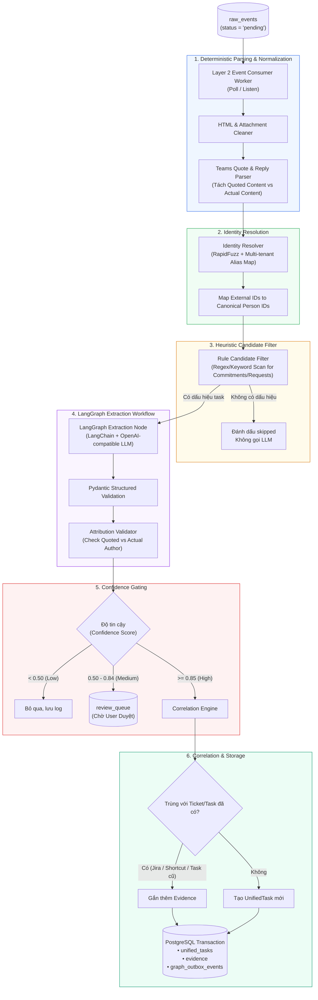
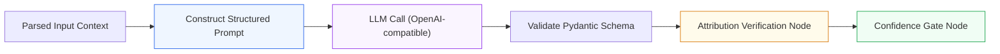

# Layer 2: Data Processing (Xử Lý & Trích Xuất Dữ Liệu)

## 1. Trách Nhiệm Cốt Lõi Của Layer 2

Layer 2 là trái tim xử lý ngữ nghĩa của hệ thống. Tầng này nhận dữ liệu từ bảng `raw_events` của Layer 1, chuyển đổi văn bản phi cấu trúc (tin nhắn chat, email, ticket comments) thành các thực thể có cấu trúc: **Cam kết (Commitments)**, **Yêu cầu (Requests)**, **Công việc hợp nhất (Unified Tasks)** và **Bằng chứng (Evidence)**.

**Mục tiêu tối thượng**: **Bảo vệ Attribution (Tính quy gán chính xác)**. Tuyệt đối không để xảy ra tình trạng người khác giao việc/hỏi việc mà hệ thống lại nhận diện là việc của mình hoặc ngược lại.

---

## 2. Kiến Trúc Chi Tiết Pipeline Xử Lý Layer 2



---

## 3. Deterministic Parsers: Xử Lý Quote & Reply Của Teams

Đây là bước tiền xử lý bắt buộc trước khi đưa vào LLM để ngăn chặn hallucination về attribution.

### 3.1 Cấu Trúc HTML Đặc Trưng Của Microsoft Teams
Teams thường bọc nội dung trích dẫn trong thẻ `<blockquote itemprop="reply">` hoặc `<blockquote itemscope="" itemtype="http://schema.skype.com/Reply">`:

```html
<div>
  <blockquote itemscope="" itemtype="http://schema.skype.com/Reply" itemid="1726567000">
    <strong itemprop="author">Nguyen Van Huy</strong>: Can you check why deployment failed?
  </blockquote>
  <p>Để em check nhé.</p>
</div>
```

### 3.2 Bộ Parser Chuẩn Xác: `TeamsQuoteReplyParser`

```python
from bs4 import BeautifulSoup
from pydantic import BaseModel
from typing import Optional

class ParsedMessageContent(BaseModel):
    is_quote_reply: bool
    quoted_author_raw: Optional[str] = None
    quoted_content_text: Optional[str] = None
    actual_content_text: str

class TeamsQuoteReplyParser:
    @staticmethod
    def parse(html_body: str) -> ParsedMessageContent:
        soup = BeautifulSoup(html_body, "lxml")
        
        # Tìm blockquote theo cấu trúc Teams/Skype reply
        blockquote = soup.find(["blockquote"], attrs={"itemtype": lambda v: v and "Reply" in v})
        if not blockquote:
            blockquote = soup.find("blockquote")
            
        if not blockquote:
            # Không có quote, toàn bộ là nội dung người gửi hiện tại
            return ParsedMessageContent(
                is_quote_reply=False,
                actual_content_text=soup.get_text(separator=" ").strip()
            )
            
        # Tách quoted author và content
        author_tag = blockquote.find(["strong", "b"]) or blockquote.find(attrs={"itemprop": "author"})
        quoted_author = author_tag.get_text().strip().rstrip(":") if author_tag else None
        
        # Lấy text trong quote
        quoted_text = blockquote.get_text(separator=" ").strip()
        if quoted_author and quoted_text.startswith(quoted_author):
            quoted_text = quoted_text[len(quoted_author):].lstrip(": ")
            
        # Xóa blockquote khỏi cây DOM để lấy actual content
        blockquote.decompose()
        actual_text = soup.get_text(separator=" ").strip()
        
        return ParsedMessageContent(
            is_quote_reply=True,
            quoted_author_raw=quoted_author,
            quoted_content_text=quoted_text,
            actual_content_text=actual_text
        )
```

---

## 4. Identity Resolution (Ánh Xạ Định Danh Đa Nguồn)

Một người dùng trong môi trường doanh nghiệp thường sở hữu nhiều tài khoản khác nhau:
- `cuongdq@fpt.com` (Teams FPT internal)
- `cuong.dam@client-tenant.com` (Teams client guest)
- `cuong.dam_partner` (Jira Cloud account ID)
- `cuongdam` (Shortcut username)

### 4.1 Cơ Chế Mapping
1. **Rule-based Table (`source_identities`)**: Bảng tra cứu ánh xạ cứng giữa `(source_type, tenant_id, external_id)` $\rightarrow$ `canonical_person_id`.
2. **Fuzzy Matching Fallback (RapidFuzz)**: Khi gặp một author mới chưa có trong danh bạ, hệ thống so khớp `author_display_name` với danh sách canonical people với ngưỡng token-sort ratio $\ge 90\%$.
3. **User Confirmation**: Nếu độ tương đồng từ 70% - 89%, hệ thống đề xuất vào mục Mapping Review thay vì tự động gán.

---

## 5. Rule Candidate Filter (Bộ Lọc Heuristic Tiết Kiệm Chi Phí)

Trước khi gửi tin nhắn sang LLM, hệ thống chạy qua một bộ lọc biểu thức chính quy (Regex) và từ khóa để loại bỏ hơn 80% tin nhắn tán gẫu thông thường (như: *"ok", "cảm ơn", "chào buổi sáng", emojis*):

```python
import re

COMMITMENT_PATTERNS = [
    r"(?i)\b(để em|để anh|em sẽ|anh sẽ|mình sẽ|on it|i'll check|i will|let me|sẽ gửi|sẽ xong)\b",
    r"(?i)\b(before|trước)\s+\d{1,2}(h|:|h\d{2}|pm|am)\b",
    r"(?i)\b(check|kiểm tra|review|fix|sửa|deploy|merge|pull)\b"
]

REQUEST_PATTERNS = [
    r"(?i)\b(nhờ em|nhờ anh|can you|could you|please check|hỗ trợ|update giúp|cho anh xin)\b"
]

def is_potential_task_candidate(text: str) -> bool:
    for pattern in COMMITMENT_PATTERNS + REQUEST_PATTERNS:
        if re.search(pattern, text):
            return True
    return False
```

---

## 6. LangGraph Extraction Workflow & Attribution Validator

Nếu tin nhắn vượt qua bộ lọc heuristic, nó được đưa vào `LangGraph Extraction Workflow`:



### 6.1 Structured Extraction Prompt (LangChain)

```yaml
System Prompt:
  "Bạn là chuyên gia phân tích cam kết và nghĩa vụ công việc cá nhân.
  Nhiệm vụ: Phân tích hội thoại và trích xuất cam kết (commitment) hoặc yêu cầu (request).
  
  QUY TẮC BẤT BIẾN:
  1. Nếu có trích dẫn (quote), người được trích dẫn là REQUESTER hoặc người đặt câu hỏi.
  2. Người viết nội dung thực tế (actual content) là OWNER nếu họ chủ động hứa (ví dụ: 'Để em check').
  3. Tuyệt đối không gán task cho người nói nếu họ chỉ trả lời từ chối hoặc chuyển tiếp việc cho người thứ 3.
  4. Phải trích xuất nguyên văn bằng chứng (evidence snippet)."
```

### 6.2 Attribution Validator Node
Validator kiểm tra logic chéo:
- Nếu `actual_content` là `"Để em check nhé"` và `actual_author` là Cuong $\rightarrow$ Owner phải là Cuong.
- Nếu `quoted_content` là câu hỏi từ Huy $\rightarrow$ Requester phải là Huy.
- Nếu LLM gán `owner = Huy` $\rightarrow$ Validator bắt lỗi, giảm confidence xuống 0.2 và chuyển vào Review Queue.

---

## 7. Correlation Engine (Khớp Nối Hội Thoại Với Ticket)

Khi một cam kết trong Teams được trích xuất (ví dụ: *"Để em check lỗi deployment"*):
1. **Direct Ticket Mention**: Nếu trong tin nhắn có chứa mã ticket (`OPS-88`, `SC-1204`) $\rightarrow$ Khớp nối trực tiếp với Ticket tương ứng trong Supabase.
2. **Project & Requester Matching**: Tìm các ticket mở trong project `OPS` do `Huy` tạo trong vòng 48h qua có nội dung liên quan đến `"deployment"`.
3. **Semantic Similarity (pgvector/Graphiti)**: So khớp vector embedding của cam kết với các ticket đang active.
4. **Quyết định**:
   - Độ tương đồng $\ge 0.90 \rightarrow$ Gắn Teams message làm **Evidence** mới cho Unified Task của ticket Jira/Shortcut.
   - Độ tương đồng từ $0.70 - 0.89 \rightarrow$ Đánh dấu quan hệ `POTENTIALLY_RELATED` để người dùng xác nhận trên UI.
   - Độ tương đồng $< 0.70 \rightarrow$ Tạo một `UnifiedTask` độc lập nguồn gốc từ hội thoại.

---

## 8. Transactional Outbox Pattern Cho Layer 3

Để đảm bảo Supabase là nguồn sự thật tuyệt đối và tránh tình trạng treo hệ thống nếu Graphiti/Neo4j gặp sự cố, Layer 2 áp dụng Transactional Outbox:

```sql
BEGIN;

-- 1. Lưu hoặc cập nhật unified_task
INSERT INTO unified_tasks (id, title, status, owner_id, requester_id, confidence)
VALUES ('task-001', 'Kiểm tra lỗi deployment', 'open', 'cuong-canonical-id', 'huy-canonical-id', 0.96)
ON CONFLICT (id) DO UPDATE SET updated_at = clock_timestamp();

-- 2. Lưu bằng chứng
INSERT INTO evidence (id, task_id, raw_event_id, snippet, confidence)
VALUES ('ev-001', 'task-001', 'raw-908-teams-fpt', 'Để em check nhé.', 0.96);

-- 3. Ghi sự kiện vào Transactional Outbox cho Neo4j / Graphiti
INSERT INTO graph_outbox_events (
    aggregate_type, aggregate_id, action, node_label, edge_type, 
    source_canonical_id, target_canonical_id, payload
) VALUES (
    'Task', 'task-001', 'upsert_edge', 'Task', 'COMMITTED_TO',
    'cuong-canonical-id', 'task-001', '{"evidence_id": "ev-001", "confidence": 0.96}'
);

-- 4. Đánh dấu raw_event đã xử lý
UPDATE raw_events SET processing_status = 'processed' WHERE id = 'raw-908-teams-fpt';

COMMIT;
```

---

## 9. Quy Trình Test Độc Lập Layer 2

Layer 2 được kiểm thử độc lập hoàn toàn thông qua:
1. **Mock Raw Events Fixture**: Đọc file `packages/contracts/mocks/l1_raw_teams_message.json` trực tiếp mà không cần Layer 1.
2. **Deterministic Parser Tests**: Bộ 20 test case kiểm thử các định dạng HTML quote phức tạp nhất của Teams (nested quotes, replies không có author tag, rich text mentions).
3. **Mock LLM Responses**: Sử dụng `langchain_core.language_models.fake` để test workflow LangGraph và Attribution Validator mà không tốn chi phí gọi LLM thật.
