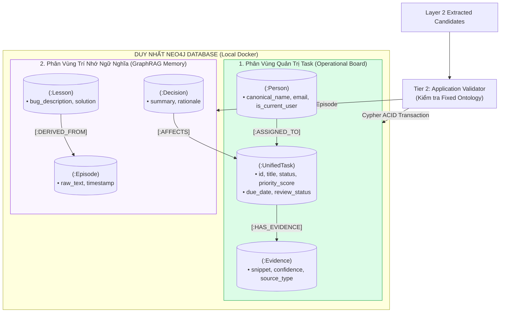
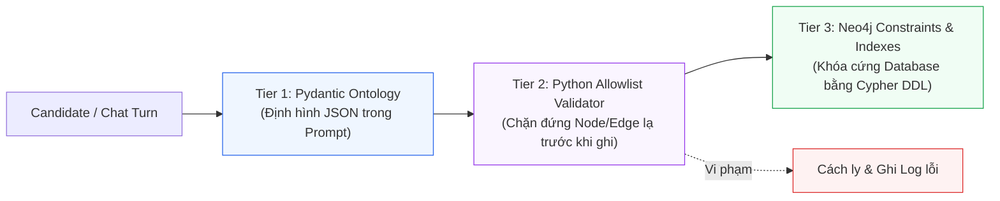

# Layer 3: Single-Store Neo4j & Graphiti Memory (Lưu Trữ Đơn Nhất & Trí Nhớ Đồ Thị)

## 1. Trách Nhiệm Cốt Lõi Của Layer 3 (Single-Store Edition)

Trong thiết kế Local-First tinh gọn, Layer 3 **loại bỏ hoàn toàn PostgreSQL / Supabase và cơ chế đồng bộ Outbox phức tạp**. Thay vào đó, toàn bộ dữ liệu được hợp nhất vào **Duy nhất một cơ sở dữ liệu đồ thị Neo4j (Single-Store Architecture)** chạy cục bộ qua Docker:

1. **Quản Lý Bảng Công Việc (Operational Task Board - ACID)**:
   - Lưu trữ các Node công việc (`:UnifiedTask`), người dùng (`:Person`), cam kết (`:Commitment`), bằng chứng (`:Evidence`).
   - Cập nhật trạng thái công việc (`TODO`, `IN_PROGRESS`, `DONE`) bằng **Cypher Mutations tất định**, bảo đảm tính đúng đắn và kiểm soát 100% như SQL.
2. **Trí Nhớ Ngữ Nghĩa & Quan Hệ Thời Gian (Temporal GraphRAG via Graphiti)**:
   - Lưu trữ ngữ cảnh sâu sắc từ các cuộc hội thoại: ai đã hứa gì với ai, quyết định kiến trúc nào đã được chốt (`:Decision`), bài học sửa bug nào đã được ghi nhận (`:Lesson`).
   - Quản lý các sự kiện theo dòng thời gian (`valid_at`, `invalid_at`), không bao giờ xóa cứng (Append-Only / Soft Invalidation).
3. **Bảo Vệ Đồ Thị 3 Tầng (3-Tier Guardrails)**:
   - Ngăn chặn LLM tạo nhầm schema lạ làm hỏng đồ thị.

---

## 2. Kiến Trúc Lưu Trữ Đơn Nhất (Single-Store Architecture)



---

## 3. Cấu Trúc Đồ Thị Cố Định (Fixed Domain Ontology)

Hệ thống khóa cứng đồ thị Neo4j với **11 Node Labels** và **13 Relationship Types** để đảm bảo tính nhất quán tuyệt đối:

### 3.1 Danh Mục 11 Node Labels

| Node Label | Thuộc tính chính (Properties) | Ý nghĩa nghiệp vụ |
| :--- | :--- | :--- |
| `:UnifiedTask` | `id`, `title`, `description`, `status`, `priority_score`, `due_date`, `review_status` | Đơn vị công việc trung tâm của Task Board. |
| `:Person` | `canonical_name`, `email`, `is_current_user`, `created_at` | Danh bạ người dùng đã chuẩn hóa danh tính. |
| `:SourceIdentity` | `external_id`, `tenant_id`, `source_type`, `display_name` | Tài khoản ngoại vi (Teams ID, Jira username...). |
| `:Commitment` | `id`, `text`, `promised_at`, `deadline`, `is_fulfilled` | Lời hứa/cam kết cụ thể được phát hiện trong chat. |
| `:Evidence` | `id`, `snippet`, `source_type`, `confidence`, `timestamp`, `url` | Trích đoạn bằng chứng chứng minh sự tồn tại của task. |
| `:Project` | `project_key`, `name`, `status` | Dự án liên quan (e.g. `OPS`, `CORE_API`). |
| `:Customer` | `customer_id`, `name`, `tier` | Khách hàng hoặc đối tác doanh nghiệp. |
| `:Tenant` | `tenant_id`, `organization_name` | Không gian làm việc (Teams Tenant nội bộ hoặc khách hàng). |
| `:Decision` | `id`, `summary`, `rationale`, `decided_at` | Quyết định kiến trúc/kỹ thuật đã được chốt. |
| `:Lesson` | `id`, `bug_description`, `solution_notes` | Bài học kinh nghiệm sửa lỗi sau các phiên code. |
| `:Incident` | `id`, `title`, `severity`, `occurred_at` | Sự cố phát sinh trong dự án. |

### 3.2 Danh Mục 13 Relationship Types & Ràng Buộc Kết Nối

```
(:Person)-[:HAS_IDENTITY]->(:SourceIdentity)
(:Person)-[:ASSIGNED_TO]->(:UnifiedTask)
(:Person)-[:REQUESTED]->(:UnifiedTask)
(:Person)-[:COMMITTED_TO]->(:UnifiedTask)
(:UnifiedTask)-[:BELONGS_TO]->(:Project)
(:UnifiedTask)-[:HAS_EVIDENCE]->(:Evidence)
(:UnifiedTask)-[:BLOCKED_BY]->(:UnifiedTask)
(:Person)-[:WAITING_FOR]->(:Person)
(:Decision)-[:AFFECTS]->(:Project | :UnifiedTask)
(:Lesson)-[:DERIVED_FROM]->(:Incident | :UnifiedTask)
(:Decision)-[:SUPERSEDES]->(:Decision)
(:UnifiedTask)-[:RELATED_TO]->(:UnifiedTask)
```

---

## 4. Ba Tầng Bảo Vệ Schema (3-Tier Guardrails)



### 4.1 Tier 2: Python Allowlist Validator (`validator.py`)
Mã nguồn Python độc lập kiểm tra mọi Node và Edge trước khi gửi lệnh Cypher đến Neo4j. Nếu LLM tự ý sinh Node label lạ như `:BugReport` hay quan hệ `:DEPENDS_ON`, validator sẽ tự động chặn và ném ngoại lệ.

### 4.2 Tier 3: Neo4j Constraints & Indexes (Cypher DDL)
Đã được định nghĩa trong `packages/database/neo4j/migrations/001_constraints.cypher`:

```cypher
// Ràng buộc tính duy nhất (Uniqueness Constraints)
CREATE CONSTRAINT c_unified_task_id IF NOT EXISTS FOR (t:UnifiedTask) REQUIRE t.id IS UNIQUE;
CREATE CONSTRAINT c_person_email IF NOT EXISTS FOR (p:Person) REQUIRE p.email IS UNIQUE;
CREATE CONSTRAINT c_evidence_id IF NOT EXISTS FOR (e:Evidence) REQUIRE e.id IS UNIQUE;
CREATE CONSTRAINT c_project_key IF NOT EXISTS FOR (pr:Project) REQUIRE pr.project_key IS UNIQUE;
CREATE CONSTRAINT c_decision_id IF NOT EXISTS FOR (d:Decision) REQUIRE d.id IS UNIQUE;

// Indexes phục vụ lọc nhanh trên Task Board
CREATE INDEX idx_task_status_priority IF NOT EXISTS FOR (t:UnifiedTask) ON (t.status, t.priority_score);
CREATE INDEX idx_task_due_date IF NOT EXISTS FOR (t:UnifiedTask) ON (t.due_date);
CREATE INDEX idx_task_review_status IF NOT EXISTS FOR (t:UnifiedTask) ON (t.review_status);
```

---

## 5. Cơ Chế Quản Lý Vòng Đời Task (State Machine Bằng Cypher)

Độ chính xác của Task Board được đảm bảo bằng các truy vấn Cypher tất định thay vì để LLM tự suy diễn:

### 5.1 Cập Nhật Trạng Thái Task (`update_task_status`)
```cypher
MATCH (t:UnifiedTask {id: $task_id})
SET t.status = $new_status,
    t.updated_at = datetime()
RETURN t.id AS task_id, t.status AS status;
```

### 5.2 Duyệt Task Từ Hàng Đợi (`approve_review_queue_task`)
```cypher
MATCH (t:UnifiedTask {id: $task_id})
WHERE t.review_status = 'pending_review'
SET t.review_status = 'auto_approved',
    t.status = 'TODO',
    t.updated_at = datetime()
RETURN t.id, t.title;
```

---

## 6. Cơ Chế Bất Biến & Quan Hệ Thời Gian (Temporal Memory)

Graphiti duy trì tính chất lịch sử thời gian (Temporal Facts):
- **Không bao giờ xóa cứng (Zero Hard-Delete)**: Khi một quan hệ không còn hiệu lực (ví dụ: Task A không còn bị chặn bởi Task B), hệ thống cập nhật thuộc tính `invalid_at`:
  ```cypher
  MATCH (a:UnifiedTask {id: $task_a})-[r:BLOCKED_BY]->(b:UnifiedTask {id: $task_b})
  WHERE r.invalid_at IS NULL
  SET r.invalid_at = datetime()
  ```
- **Truy vấn điểm thời gian (Point-in-time Query)**: Cho phép tái hiện lại toàn bộ mạng lưới công việc tại bất kỳ thời điểm nào trong quá khứ phục vụ báo cáo hoặc kiểm tra hồi quy.
