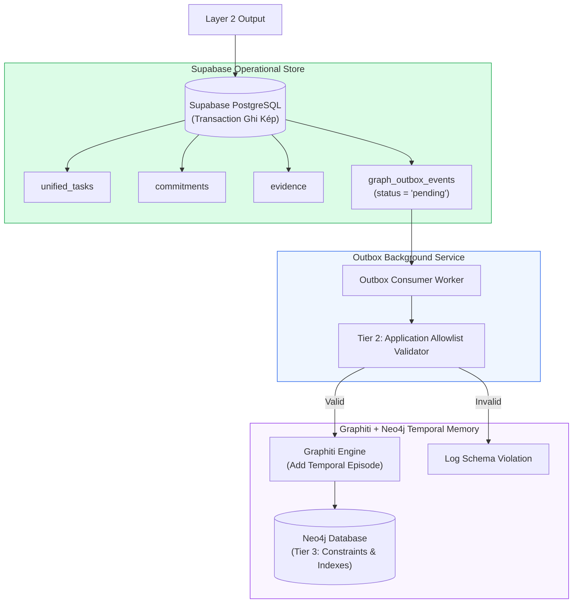
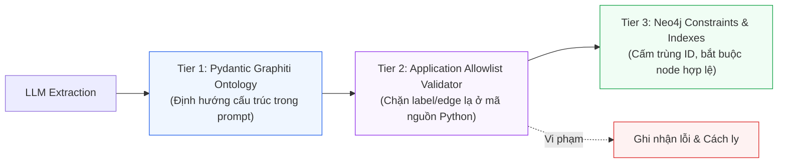

# Layer 3: Operational Store & GraphRAG Memory (Lưu Trữ Hoạt Động & Bộ Nhớ Đồ Thị)

## 1. Trách Nhiệm Cốt Lõi Của Layer 3

Layer 3 là nền tảng dữ liệu kép (Dual-Storage Architecture) của toàn bộ hệ thống:
1. **Supabase PostgreSQL (Operational Source of Truth)**: Chịu trách nhiệm lưu trữ trạng thái chính thức, có tính nhất quán ACID, quản lý phân quyền (RLS), lưu trữ danh sách task, cam kết, bằng chứng và hàng đợi duyệt (review queue).
2. **Graphiti + Neo4j (Temporal GraphRAG Memory)**: Chịu trách nhiệm lưu trữ mạng lưới quan hệ nghiệp vụ, ngữ cảnh thời gian (Temporal Facts), các quyết định kỹ thuật (Decisions), bài học kinh nghiệm (Lessons Learned), và phục vụ truy xuất lai (Hybrid Retrieval: Vector + Keyword + Graph Traversal).

---

## 2. Kiến Trúc Kép & Luồng Outbox



---

## 3. Thiết Kế Cơ Sở Dữ Liệu Hoạt Động (Supabase PostgreSQL DDL)

Toàn bộ các bảng nghiệp vụ được tổ chức chặt chẽ, hỗ trợ soft-delete và audit trail:

### 3.1 Bảng Thực Thể Người & Định Danh (`people`, `source_identities`)

```sql
-- Danh bạ người chuẩn hóa (Canonical Person)
CREATE TABLE people (
    id UUID PRIMARY KEY DEFAULT gen_random_uuid(),
    workspace_id UUID NOT NULL,
    canonical_name VARCHAR(255) NOT NULL,
    primary_email VARCHAR(255) UNIQUE NOT NULL,
    avatar_url TEXT,
    is_current_user BOOLEAN DEFAULT FALSE,
    created_at TIMESTAMPTZ DEFAULT clock_timestamp()
);

-- Ánh xạ các tài khoản từ các tenant/hệ thống khác nhau về một người
CREATE TABLE source_identities (
    id UUID PRIMARY KEY DEFAULT gen_random_uuid(),
    person_id UUID NOT NULL REFERENCES people(id) ON DELETE CASCADE,
    tenant_id VARCHAR(100) NOT NULL,
    source_type VARCHAR(50) NOT NULL,
    external_id VARCHAR(255) NOT NULL,
    external_username VARCHAR(255),
    external_display_name VARCHAR(255),
    created_at TIMESTAMPTZ DEFAULT clock_timestamp(),
    UNIQUE(tenant_id, source_type, external_id)
);
```

### 3.2 Bảng Task, Cam Kết & Bằng Chứng (`unified_tasks`, `commitments`, `evidence`)

```sql
-- Bảng công việc hợp nhất
CREATE TABLE unified_tasks (
    id UUID PRIMARY KEY DEFAULT gen_random_uuid(),
    workspace_id UUID NOT NULL,
    title TEXT NOT NULL,
    description TEXT,
    status VARCHAR(30) DEFAULT 'open' 
        CHECK (status IN ('open', 'in_progress', 'likely_done', 'done', 'blocked', 'dismissed')),
    
    owner_id UUID NOT NULL REFERENCES people(id),
    requester_id UUID REFERENCES people(id),
    project_key VARCHAR(100),
    customer_id VARCHAR(100),
    
    due_date TIMESTAMPTZ,
    explicit_deadline BOOLEAN DEFAULT FALSE,
    
    extraction_confidence FLOAT NOT NULL DEFAULT 1.0,
    review_status VARCHAR(30) DEFAULT 'auto_approved'
        CHECK (review_status IN ('auto_approved', 'pending_review', 'rejected', 'user_created')),
    
    created_at TIMESTAMPTZ DEFAULT clock_timestamp(),
    updated_at TIMESTAMPTZ DEFAULT clock_timestamp()
);

-- Bảng cam kết cụ thể
CREATE TABLE commitments (
    id UUID PRIMARY KEY DEFAULT gen_random_uuid(),
    task_id UUID NOT NULL REFERENCES unified_tasks(id) ON DELETE CASCADE,
    promiser_id UUID NOT NULL REFERENCES people(id),
    promisee_id UUID NOT NULL REFERENCES people(id),
    commitment_text TEXT NOT NULL,
    promised_at TIMESTAMPTZ NOT NULL,
    deadline TIMESTAMPTZ,
    is_fulfilled BOOLEAN DEFAULT FALSE,
    fulfilled_at TIMESTAMPTZ,
    created_at TIMESTAMPTZ DEFAULT clock_timestamp()
);

-- Bảng bằng chứng (Evidence) gắn với Task
CREATE TABLE evidence (
    id UUID PRIMARY KEY DEFAULT gen_random_uuid(),
    task_id UUID NOT NULL REFERENCES unified_tasks(id) ON DELETE CASCADE,
    raw_event_id UUID REFERENCES raw_events(id),
    evidence_type VARCHAR(50) NOT NULL, -- 'chat_commitment', 'jira_ticket', 'email_thread'
    source_type VARCHAR(50) NOT NULL,
    author_id UUID REFERENCES people(id),
    snippet TEXT NOT NULL,
    external_url TEXT,
    confidence FLOAT NOT NULL,
    extraction_version VARCHAR(50) DEFAULT 'v1.0',
    created_at TIMESTAMPTZ DEFAULT clock_timestamp()
);

-- Bảng Transactional Outbox đồng bộ sang Neo4j
CREATE TABLE graph_outbox_events (
    id UUID PRIMARY KEY DEFAULT gen_random_uuid(),
    aggregate_type VARCHAR(50) NOT NULL, -- 'Task', 'Person', 'Decision'
    aggregate_id VARCHAR(100) NOT NULL,
    action VARCHAR(50) NOT NULL, -- 'upsert_node', 'upsert_edge', 'invalidate_edge'
    node_label VARCHAR(100),
    edge_type VARCHAR(100),
    source_canonical_id VARCHAR(100),
    target_canonical_id VARCHAR(100),
    payload JSONB NOT NULL,
    status VARCHAR(30) DEFAULT 'pending' CHECK (status IN ('pending', 'processing', 'completed', 'failed')),
    retry_count INT DEFAULT 0,
    last_error TEXT,
    created_at TIMESTAMPTZ DEFAULT clock_timestamp(),
    processed_at TIMESTAMPTZ
);

CREATE INDEX idx_outbox_pending ON graph_outbox_events (created_at ASC) WHERE status = 'pending';
```

---

## 4. Neo4j Fixed Domain Ontology (Ontology Đồ Thị Cố Định)

Để tránh tình trạng LLM tự sinh schema hỗn loạn, đồ thị Neo4j được khóa cứng với **11 Node Types** và **13 Relationship Types**:

### 4.1 Danh Mục 11 Node Types

```mermaid
classDiagram
    class Person {
        string canonical_id
        string name
        string email
    }
    class SourceIdentity {
        string external_id
        string tenant_id
        string source_type
    }
    class Task {
        string task_id
        string title
        string status
    }
    class Project {
        string project_key
        string name
    }
    class Customer {
        string customer_id
        string name
    }
    class Tenant {
        string tenant_id
        string org_name
    }
    class SourceItem {
        string item_id
        string url
        string source_type
    }
    class Decision {
        string decision_id
        string summary
        string rationale
    }
    class Lesson {
        string lesson_id
        string description
        string solution
    }
    class Document {
        string doc_id
        string title
    }
    class Incident {
        string incident_id
        string severity
    }
```



### 4.2 Danh Mục 13 Relationship Types & Ma Trận Kết Nối

| Relationship | Source Node | Target Node | Ý nghĩa nghiệp vụ |
| --- | --- | --- | --- |
| `HAS_IDENTITY` | `Person` | `SourceIdentity` | Một người sở hữu danh tính ngoại vi này |
| `OWNS` | `Person` | `Task` | Người chịu trách nhiệm thực thi task |
| `REQUESTED` | `Person` | `Task` | Người đề nghị/yêu cầu task |
| `COMMITTED_TO` | `Person` | `Task` | Người chủ động cam kết làm task |
| `BELONGS_TO` | `Task` | `Project` | Task thuộc về dự án nào |
| `TRACKED_BY` | `Task` | `SourceItem` | Task được quản lý bởi ticket Jira/Shortcut nào |
| `SUPPORTED_BY` | `Task` | `SourceItem` | Task được chứng minh bởi tin nhắn/email nào |
| `BLOCKED_BY` | `Task` | `Task` hoặc `SourceItem` | Task này đang bị chặn bởi việc khác |
| `WAITING_FOR` | `Person` hoặc `Task` | `Person` | Đang chờ phản hồi từ người nào |
| `AFFECTS` | `Decision` | `Project` hoặc `Task` | Quyết định này tác động đến dự án/task |
| `DERIVED_FROM` | `Lesson` | `Incident` | Bài học kinh nghiệm rút ra từ sự cố |
| `SUPERSEDES` | `Decision` | `Decision` | Quyết định mới thay thế quyết định cũ |
| `RELATED_TO` | `Task` | `Task` | Hai task có liên quan ngữ cảnh với nhau |

---

## 5. Ba Lớp Bảo Vệ Schema (3-Tier Schema Guardrails)



### 5.1 Tier 2: Application Allowlist Validator
Mọi bản ghi từ outbox trước khi nạp vào Neo4j phải đi qua validator bằng code Python:

```python
ALLOWED_NODES = {
    "Person", "SourceIdentity", "Task", "Project", "Customer", 
    "Tenant", "SourceItem", "Decision", "Lesson", "Document", "Incident"
}

ALLOWED_EDGES = {
    "HAS_IDENTITY": ("Person", "SourceIdentity"),
    "OWNS": ("Person", "Task"),
    "REQUESTED": ("Person", "Task"),
    "COMMITTED_TO": ("Person", "Task"),
    "BELONGS_TO": ("Task", "Project"),
    "TRACKED_BY": ("Task", "SourceItem"),
    "SUPPORTED_BY": ("Task", "SourceItem"),
    "BLOCKED_BY": ("Task", ("Task", "SourceItem")),
    "WAITING_FOR": (("Person", "Task"), "Person"),
    "AFFECTS": ("Decision", ("Project", "Task")),
    "DERIVED_FROM": ("Lesson", "Incident"),
    "SUPERSEDES": ("Decision", "Decision"),
    "RELATED_TO": ("Task", "Task")
}

def validate_graph_edge(edge_type: str, source_label: str, target_label: str):
    if edge_type not in ALLOWED_EDGES:
        raise ValueError(f"Quan hệ không hợp lệ: {edge_type}")
    expected_src, expected_dst = ALLOWED_EDGES[edge_type]
    
    # Kiểm tra source & target label
    if isinstance(expected_src, tuple) and source_label not in expected_src:
        raise ValueError(f"Source label {source_label} không hợp lệ cho edge {edge_type}")
    elif isinstance(expected_src, str) and source_label != expected_src:
        raise ValueError(f"Source label {source_label} không hợp lệ cho edge {edge_type}")
```

### 5.2 Tier 3: Neo4j Constraints (Cypher DDL)

```cypher
// 1. Uniqueness Constraints
CREATE CONSTRAINT c_person_id IF NOT EXISTS FOR (p:Person) REQUIRE p.canonical_id IS UNIQUE;
CREATE CONSTRAINT c_task_id IF NOT EXISTS FOR (t:Task) REQUIRE t.task_id IS UNIQUE;
CREATE CONSTRAINT c_project_key IF NOT EXISTS FOR (pr:Project) REQUIRE pr.project_key IS UNIQUE;
CREATE CONSTRAINT c_source_item IF NOT EXISTS FOR (s:SourceItem) REQUIRE s.item_id IS UNIQUE;
CREATE CONSTRAINT c_decision_id IF NOT EXISTS FOR (d:Decision) REQUIRE d.decision_id IS UNIQUE;

// 2. Indexes cho truy vấn nhanh
CREATE INDEX idx_task_status IF NOT EXISTS FOR (t:Task) ON (t.status);
CREATE INDEX idx_person_email IF NOT EXISTS FOR (p:Person) ON (p.email);
```

---

## 6. Vòng Đời Temporal Facts Trong Graphiti

Graphiti duy trì tính chất lịch sử thời gian (Temporal Facts):
- **Không bao giờ Hard-Delete**: Khi một task chuyển trạng thái hoặc quan hệ bị thay thế (ví dụ: Task không còn bị chặn bởi Task B), hệ thống không dùng lệnh `DELETE`. Thay vào đó, edge cũ được cập nhật:
  ```cypher
  MATCH (a:Task {task_id: $task_a})-[r:BLOCKED_BY]->(b:Task {task_id: $task_b})
  WHERE r.invalid_at IS NULL
  SET r.invalid_at = datetime()
  ```
- **Truy vấn Point-in-time**: Cho phép AI tái hiện lại trạng thái của hệ thống tại bất kỳ thời điểm nào trong quá khứ: *"Vào ngày 10/09, tôi đang bị block bởi những việc gì?"*.

---

## 7. Quy Trình Test Độc Lập Layer 3

1. **Supabase Local Testing**: Khởi chạy Supabase CLI (`supabase start`), áp dụng các file SQL migration và chạy unit test kiểm tra ràng buộc khóa ngoại, RLS và triggers.
2. **Neo4j Testcontainers**: Sử dụng `testcontainers-neo4j` trong Python để khởi tạo một instance Neo4j cô lập, chạy script tạo constraint và nạp thử dữ liệu đồ thị theo đúng allowlist.
3. **Outbox Worker Verification**: Đưa mock outbox event vào bảng `graph_outbox_events` và kiểm tra worker có nạp chính xác các node/edge vào Neo4j hay không.
