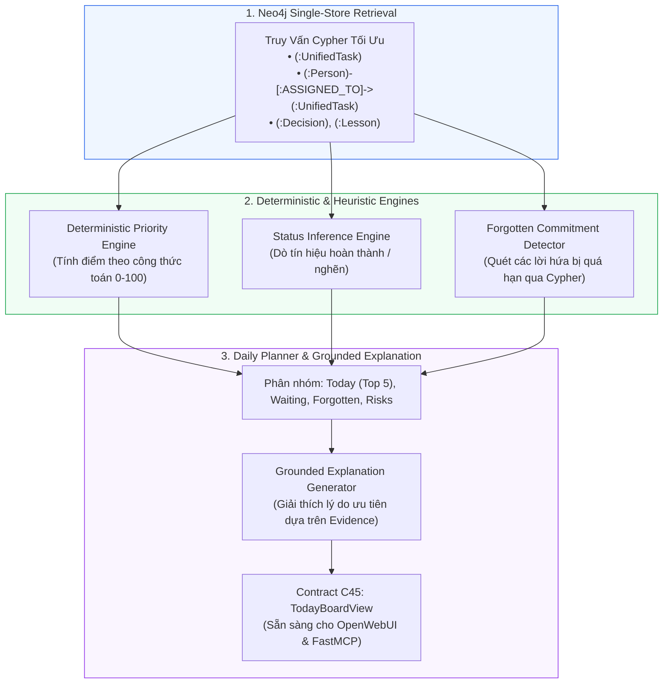
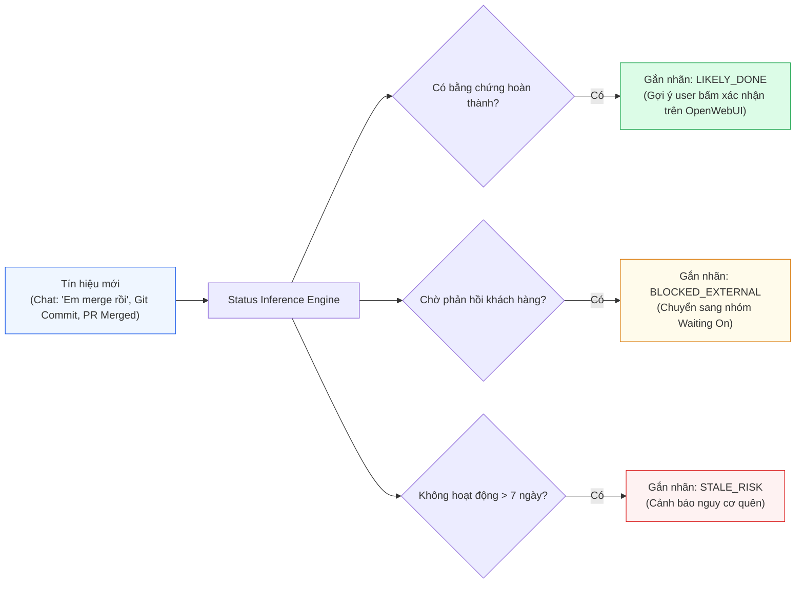

# Layer 4: Intelligence (Trí Tuệ Tính Toán & Suy Luận Tất Định)

## 1. Trách Nhiệm Cốt Lõi Của Layer 4

Layer 4 là **bộ não phân tích và tính toán** của **Personal Task Board**. Tầng này kết hợp dữ liệu bảng công việc từ Neo4j với mạng lưới ngữ cảnh tri thức Graphiti để:
1. **Chấm điểm ưu tiên tất định (Deterministic Priority Scoring)**: Sử dụng công thức toán học có trọng số thay vì phó mặc cho LLM phỏng đoán ngẫu nhiên.
2. **Suy luận trạng thái & phát hiện bất thường (Status & Anomaly Inference)**: Nhận diện task có khả năng đã xong (`LIKELY_DONE`), task đang bị nghẽn (`BLOCKED`), hoặc bị bỏ quên (`STALE`) mà không tự ý đổi trạng thái.
3. **Phát hiện cam kết bị lãng quên (Forgotten Commitment Detection)**: Lọc các lời hứa trong chat đã lâu chưa cập nhật hoặc có người đang giục.
4. **Lập kế hoạch làm việc ngày (Daily Planner & Morning Briefing)**: Cung cấp dữ liệu đã xếp hạng và tóm tắt có bằng chứng (Grounded Explanation) trực tiếp cho OpenWebUI và các Coding Agent.
5. **Truy xuất tri thức kỹ thuật (Knowledge RAG)**: Trả lời nhanh các quyết định kiến trúc và bài học sửa lỗi từ các phiên code trước.

---

## 2. Kiến Trúc Chi Tiết Layer 4



---

## 3. Công Thức Chấm Điểm Ưu Tiên Tất Định (Priority Engine Formula)

Điểm ưu tiên của một công việc được tính toán bằng mã nguồn Python rõ ràng, có thể kiểm chứng và giải thích được, tránh hiện tượng "hộp đen" của AI:

$$PriorityScore = \min\left(100, \max\left(0, \sum (Weights \times Signals) - Penalties\right)\right)$$

### 3.1 Bảng Trọng Số & Tín Hiệu Chi Tiết

| Thành phần tín hiệu | Ký hiệu | Trọng số ($W$) | Cách tính chi tiết |
| :--- | :--- | :--- | :--- |
| **Khoảng cách Deadline** | $S_{deadline}$ | **30 điểm** | - Quá hạn: 30 điểm.<br/>- Đến hạn hôm nay ($< 24h$): 25 điểm.<br/>- Đến hạn trong 48h: 18 điểm.<br/>- Đến hạn trong tuần: 10 điểm.<br/>- Không có deadline: 2 điểm. |
| **Ảnh hưởng Khách hàng** | $S_{customer}$ | **20 điểm** | - Task gắn với dự án khách hàng quan trọng: 20 điểm.<br/>- Khách hàng đang chờ phản hồi trực tiếp: +5 điểm. |
| **Ảnh hưởng Production** | $S_{prod}$ | **20 điểm** | - Chứa từ khóa/nhãn: `prod`, `incident`, `hotfix`, `down`: 20 điểm.<br/>- Ticket có severity High/Critical: 15 điểm. |
| **Cam kết Rõ ràng** | $S_{commit}$ | **15 điểm** | - Cam kết đích danh người dùng (`owner == current_user`): 15 điểm.<br/>- Có hẹn giờ cụ thể (`"trước 3h chiều"`): +5 điểm. |
| **Thời gian Người khác Chờ** | $S_{waiting}$ | **15 điểm** | - Đang có $\ge 1$ người bị block bởi task này: 10 điểm + 2 điểm/ngày chờ. |
| **Tuổi thọ Công việc** | $S_{stale}$ | **10 điểm** | - Task mở $> 5$ ngày không có hoạt động mới: 10 điểm (chống bỏ quên). |
| **Trừ điểm: Độ bất định** | $P_{uncertain}$ | **-20 điểm** | - Trừ điểm nếu `confidence < 0.85` (-10 điểm).<br/>- Trừ điểm nếu chưa rõ người yêu cầu (-5 điểm). |

### 3.2 Mã Nguồn Python Tính Toán: `PriorityCalculator`

```python
from datetime import datetime, timezone
from typing import Dict, Any

class PriorityCalculator:
    @staticmethod
    def calculate(task: Dict[str, Any]) -> Dict[str, Any]:
        now = datetime.now(timezone.utc)
        score = 0.0
        breakdown = {}

        # 1. Deadline Proximity
        due_date = task.get("due_date")
        if due_date:
            hours_left = (due_date - now).total_seconds() / 3600.0
            if hours_left < 0:
                dl_score = 30.0 # Quá hạn
            elif hours_left <= 24:
                dl_score = 25.0
            elif hours_left <= 48:
                dl_score = 18.0
            else:
                dl_score = 8.0
        else:
            dl_score = 2.0
        score += dl_score
        breakdown["deadline_score"] = dl_score

        # 2. Customer & Production Impact
        cust_score = 20.0 if task.get("is_customer_project") else 0.0
        prod_score = 20.0 if task.get("is_production_issue") else 0.0
        score += cust_score + prod_score
        breakdown["customer_score"] = cust_score
        breakdown["production_score"] = prod_score

        # 3. Explicit Commitment
        commit_score = 15.0 if task.get("has_explicit_commitment") else 0.0
        score += commit_score
        breakdown["commitment_score"] = commit_score

        # 4. Blockers & People Waiting
        blocked_count = len(task.get("dependent_people", []))
        block_score = min(15.0, blocked_count * 5.0)
        score += block_score
        breakdown["blocker_score"] = block_score

        # 5. Uncertainty Penalty
        confidence = task.get("extraction_confidence", 1.0)
        penalty = (1.0 - confidence) * 25.0
        score = max(0.0, score - penalty)
        breakdown["uncertainty_penalty"] = penalty

        breakdown["total_score"] = round(min(100.0, score), 1)
        return breakdown
```

---

## 4. Suy Luận Trạng Thái & Anomaly (Status Inference)

Hệ thống liên tục kiểm tra các tín hiệu mới từ Neo4j để cập nhật nhận định:



> [!CAUTION]
> **Quy tắc an toàn**: Không bao giờ tự động cập nhật `status = 'DONE'` trong Neo4j chỉ dựa vào suy luận AI. Luôn giữ ở mức `LIKELY_DONE` và chờ người dùng bấm xác nhận thông qua OpenWebUI Tool.

---

## 5. Forgotten Commitment Detector (Bộ Dò Cam Kết Bị Quên)

Sử dụng Cypher Query quét các cam kết thỏa mãn:
1. `(p:Person {is_current_user: true})-[:COMMITTED_TO]->(t:UnifiedTask)`
2. `t.status IN ['TODO', 'IN_PROGRESS']`
3. Cam kết phát sinh cách đây $\ge 3$ ngày mà không có cập nhật mới.

```cypher
MATCH (p:Person {is_current_user: true})-[:COMMITTED_TO]->(t:UnifiedTask)
WHERE t.status IN ['TODO', 'IN_PROGRESS']
  AND t.updated_at <= datetime() - duration('P3D')
OPTIONAL MATCH (t)-[:HAS_EVIDENCE]->(e:Evidence)
RETURN t.id AS task_id, t.title AS title, t.updated_at AS last_updated, collect(e.snippet)[0] AS snippet
ORDER BY t.updated_at ASC;
```

---

## 6. Daily Planner & Grounded Explanation (Phục Vụ OpenWebUI)

Khi người dùng mở OpenWebUI vào đầu ngày và hỏi: *"Hôm nay tôi cần làm gì?"*, tiến trình Daily Planner thực thi:
1. Lấy danh sách task active từ Neo4j.
2. Chạy `PriorityCalculator` để sắp xếp Top 5 việc quan trọng nhất.
3. Sinh câu giải thích ngắn gọn dựa trên Evidence (Grounded Explanation) bằng LLM.
4. Trả kết quả về OpenWebUI dưới dạng Interactive Markdown Table hoặc Artifacts.
