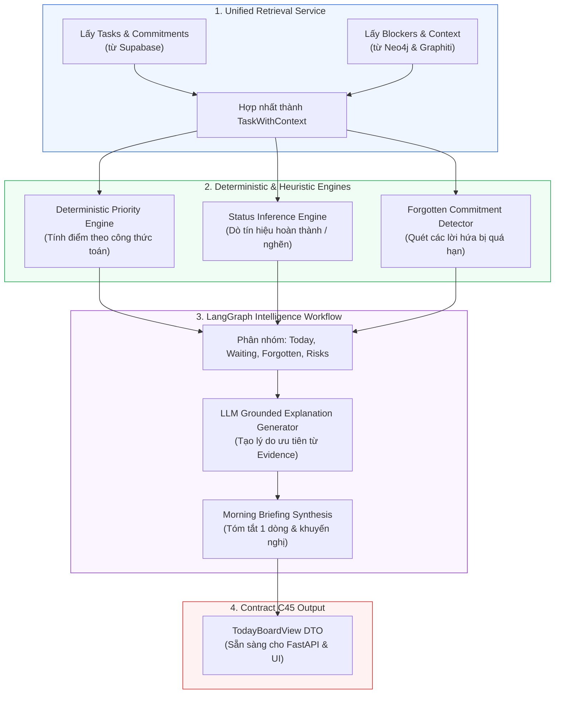
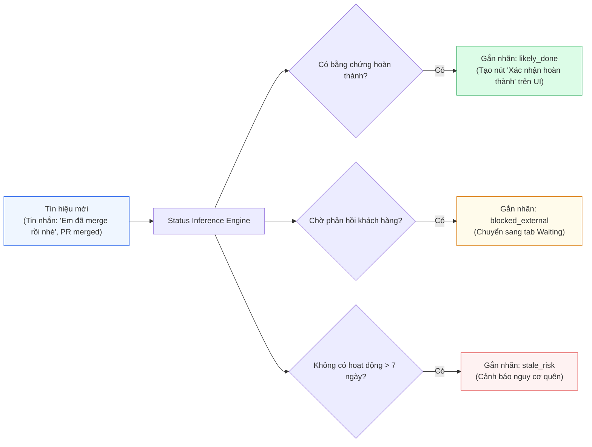

# Layer 4: Intelligence (Trí Tuệ Nhân Tạo & Lập Kế Hoạch)

## 1. Trách Nhiệm Cốt Lõi Của Layer 4

Layer 4 là bộ não phân tích và suy luận của **Personal Task Board**. Tầng này kết hợp dữ liệu hoạt động chính xác từ Supabase với bộ nhớ ngữ cảnh quan hệ từ Graphiti/Neo4j để:
1. **Chấm điểm ưu tiên tất định (Deterministic Priority Scoring)**: Sử dụng công thức toán học có trọng số thay vì để LLM tự phỏng đoán thứ tự ngẫu nhiên.
2. **Suy luận trạng thái & phát hiện bất thường (Status & Anomaly Inference)**: Nhận diện task có khả năng đã xong (`likely_done`), task đang bị nghẽn (`blocked`), hoặc bị lãng quên (`stale`) mà không tự ý đóng task.
3. **Phát hiện cam kết bị lãng quên (Forgotten Commitment Detection)**: Lọc ra các việc đã hứa nhưng lâu chưa cập nhật hoặc người yêu cầu đang giục phản hồi.
4. **Lập kế hoạch làm việc ngày (Daily Planner)**: Sử dụng LangGraph kết hợp với LLM để tạo bản tóm tắt đầu ngày (Morning Briefing) và giải thích lý do ưu tiên dựa trên bằng chứng xác thực (Grounded Explanation).
5. **Truy xuất tri thức dự án (Knowledge RAG)**: Trả lời các câu hỏi về quyết định kỹ thuật trong quá khứ và bài học kinh nghiệm khi gặp sự cố tương tự.

---

## 2. Kiến Trúc Chi Tiết Layer 4



---

## 3. Công Thức Chấm Điểm Ưu Tiên Tất Định (Priority Engine Formula)

Điểm ưu tiên của một công việc được tính toán bằng mã nguồn Python rõ ràng, có thể kiểm chứng và giải thích được, tránh hiện tượng "hộp đen" của AI:

$$PriorityScore = \min\left(100, \max\left(0, \sum (Weights \times Signals) - Penalties\right)\right)$$

### 3.1 Bảng Trọng Số & Tín Hiệu Chi Tiết

| Thành phần tín hiệu | Ký hiệu | Trọng số ($W$) | Cách tính chi tiết |
| --- | --- | --- | --- |
| **Khoảng cách Deadline** | $S_{deadline}$ | **30 điểm** | - Quá hạn: 30 điểm.<br/>- Đến hạn hôm nay ($< 24h$): 25 điểm.<br/>- Đến hạn trong 48h: 18 điểm.<br/>- Đến hạn trong tuần: 10 điểm.<br/>- Không có deadline: 2 điểm. |
| **Ảnh hưởng Khách hàng** | $S_{customer}$ | **20 điểm** | - Task gắn với dự án khách hàng quan trọng: 20 điểm.<br/>- Khách hàng đang chờ phản hồi trực tiếp: +5 điểm. |
| **Ảnh hưởng Production** | $S_{prod}$ | **20 điểm** | - Chứa từ khóa/nhãn: `prod`, `incident`, `hotfix`, `down`: 20 điểm.<br/>- Ticket có severity High/Critical: 15 điểm. |
| **Cam kết Rõ ràng** | $S_{commit}$ | **15 điểm** | - Cam kết đích danh người dùng (`owner == current_user`): 15 điểm.<br/>- Có hẹn giờ cụ thể (`"trước 3h chiều"`): +5 điểm. |
| **Thời gian Người khác Chờ** | $S_{waiting}$ | **15 điểm** | - Đang có $\ge 1$ người bị block bởi task này: 10 điểm + 2 điểm/ngày chờ. |
| **Tuổi thọ Công việc** | $S_{stale}$ | **10 điểm** | - Task mở $> 5$ ngày không có hoạt động mới: 10 điểm (chống bỏ quên). |
| **Trừ điểm: Độ bất định** | $P_{uncertain}$ | **-20 điểm** | - Trừ điểm nếu `extraction_confidence < 0.85` (-10 điểm).<br/>- Trừ điểm nếu chưa rõ người yêu cầu (-5 điểm). |

### 3.2 Mã Triển Khai: `PriorityCalculator`

```python
from datetime import datetime, timezone
from typing import Dict, Any

class PriorityCalculator:
    @staticmethod
    def calculate(task_context: Dict[str, Any]) -> Dict[str, Any]:
        now = datetime.now(timezone.utc)
        score = 0.0
        breakdown = {}

        # 1. Deadline Proximity
        due_date = task_context.get("due_date")
        if due_date:
            hours_left = (due_date - now).total_seconds() / 3600.0
            if hours_left < 0:
                dl_score = 30.0 # Quá hạn
            elif hours_left <= 24:
                dl_score = 25.0
            elif hours_left <= 48:
                dl_score = 18.0
            else:
                dl_score = 8.0
        else:
            dl_score = 2.0
        score += dl_score
        breakdown["deadline_score"] = dl_score

        # 2. Customer & Production Impact
        cust_score = 20.0 if task_context.get("is_customer_project") else 0.0
        prod_score = 20.0 if task_context.get("is_production_issue") else 0.0
        score += cust_score + prod_score
        breakdown["customer_score"] = cust_score
        breakdown["production_score"] = prod_score

        # 3. Explicit Commitment
        commit_score = 15.0 if task_context.get("has_explicit_commitment") else 0.0
        score += commit_score
        breakdown["commitment_score"] = commit_score

        # 4. Blockers & People Waiting
        blocked_count = len(task_context.get("dependent_people", []))
        block_score = min(15.0, blocked_count * 5.0)
        score += block_score
        breakdown["blocker_score"] = block_score

        # 5. Uncertainty Penalty
        confidence = task_context.get("extraction_confidence", 1.0)
        penalty = (1.0 - confidence) * 25.0
        score = max(0.0, score - penalty)
        breakdown["uncertainty_penalty"] = penalty

        breakdown["total_score"] = round(min(100.0, score), 1)
        return breakdown
```

---

## 4. Suy Luận Trạng Thái & Anomaly (Status Inference)

Hệ thống liên tục đối chiếu các tín hiệu mới (từ tin nhắn chat, pull request, Jira comment) để cập nhật nhận định trạng thái:



> [!CAUTION]
> **Quy tắc an toàn**: Không bao giờ tự động chuyển trạng thái `status = 'done'` trong Supabase chỉ dựa vào suy luận. Luôn giữ ở mức `likely_done` và yêu cầu một click xác nhận từ người dùng.

---

## 5. Forgotten Commitment Detector (Bộ Dò Cam Kết Quên)

Thuật toán quét các cam kết thỏa mãn đồng thời các điều kiện:
1. `promiser_id == current_user` (Chính bạn là người đã hứa).
2. `is_fulfilled == false` (Chưa có bằng chứng hoàn thành).
3. Thời gian cam kết đã trôi qua $\ge 3$ ngày.
4. Trong vòng 48 giờ qua không có bất kỳ tin nhắn, comment hay commit nào liên quan đến task này.
5. *(Điểm cảnh báo cao)*: Người được hứa (`promisee`) vừa gửi tin nhắn mới hỏi thăm: *"Huy ơi task này sao rồi?"*.

---

## 6. Daily Planner & LangGraph Intelligence Workflow

Mỗi buổi sáng hoặc khi người dùng mở Today Board, LangGraph điều phối workflow tạo kế hoạch:

```python
# Cấu trúc Workflow LangGraph Intelligence
from langgraph.graph import StateGraph, END

class IntelligenceState(dict):
    user_id: str
    raw_tasks: list
    scored_tasks: list
    forgotten_items: list
    today_plan: dict

def node_retrieve_context(state: IntelligenceState):
    # Lấy dữ liệu từ L3 (Supabase + Neo4j)
    return {"raw_tasks": fetch_user_active_tasks(state["user_id"])}

def node_calculate_priorities(state: IntelligenceState):
    scored = [PriorityCalculator.calculate(t) for t in state["raw_tasks"]]
    return {"scored_tasks": sorted(scored, key=lambda x: x["total_score"], reverse=True)}

def node_generate_grounded_explanation(state: IntelligenceState):
    top_tasks = state["scored_tasks"][:5]
    # Gọi OpenAI-compatible LLM với prompt yêu cầu giải thích dựa trên evidence
    prompt = build_explanation_prompt(top_tasks)
    explanation = llm.invoke(prompt)
    return {"today_plan": build_today_view(top_tasks, explanation)}

workflow = StateGraph(IntelligenceState)
workflow.add_node("retrieve", node_retrieve_context)
workflow.add_node("score", node_calculate_priorities)
workflow.add_node("explain", node_generate_grounded_explanation)

workflow.set_entry_point("retrieve")
workflow.add_edge("retrieve", "score")
workflow.add_edge("score", "explain")
workflow.add_edge("explain", END)

intelligence_app = workflow.compile()
```

---

## 7. Knowledge RAG (Truy Vấn Quyết Định & Bài Học)

Sử dụng hybrid retrieval từ Graphiti + Neo4j để trả lời các câu hỏi tình huống:
- **Câu hỏi**: *"Trước đây dự án Customer A đã thống nhất cơ chế xác thực nào?"*
- **Truy vấn Đồ thị**:
  ```cypher
  MATCH (c:Customer {name: 'Customer A'})<-[:FOR_CUSTOMER]-(p:Project)
        <-[:AFFECTS]-(d:Decision)
  WHERE d.topic CONTAINS 'authentication' AND d.invalid_at IS NULL
  RETURN d.summary, d.rationale, d.created_at
  ```
- Kết quả được LLM tổng hợp thành câu trả lời ngắn gọn kèm link đến tài liệu/tin nhắn thảo luận gốc.

---

## 8. Quy Trình Test Độc Lập Layer 4

1. **Deterministic Test Cases**: Kiểm thử unit test cho `PriorityCalculator` với các bộ dữ liệu biên (quá hạn 1 giờ, sát hạn 23 giờ, không có deadline, confidence thấp) để đảm bảo điểm số luôn nằm trong đoạn $[0, 100]$.
2. **Mock L3 Fixtures**: Nạp danh sách `TaskWithContext` giả lập từ `packages/contracts/mocks/l3_tasks_with_context.json` để chạy thử toàn bộ LangGraph workflow mà không cần kết nối cơ sở dữ liệu thật.
3. **LLM Output Evaluator**: Đảm bảo giải thích của LLM không bịa đặt thêm deadline hay requester ngoài những gì có trong context được cung cấp.
