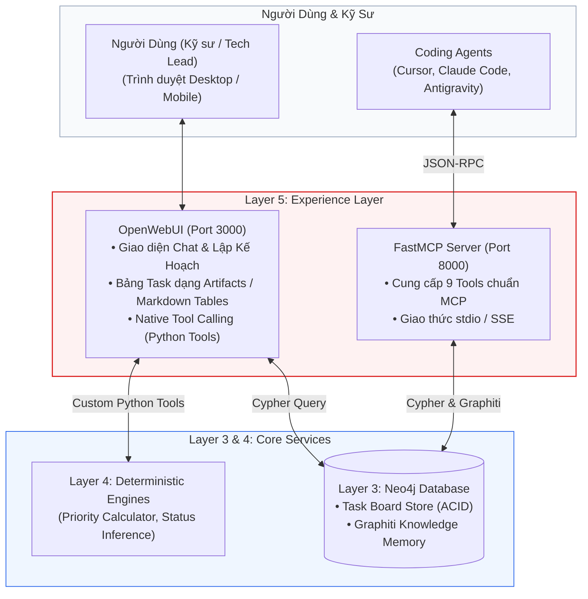

# Layer 5: Experience (Giao Diện OpenWebUI & FastMCP Server)

## 1. Trách Nhiệm Cốt Lõi Của Layer 5 (OpenWebUI Edition)

Trong kiến trúc Local-First tinh gọn, Layer 5 **loại bỏ hoàn toàn việc xây dựng Web Application từ đầu bằng Next.js**. Thay vào đó, toàn bộ trải nghiệm người dùng và kết nối công cụ được giao cho **OpenWebUI** và **FastMCP Server**:

1. **OpenWebUI (Giao Diện Chính Cho Người Dùng)**:
   - Chạy cục bộ bằng Docker, sở hữu đầy đủ tính năng: Chatbot đa năng, Streaming Markdown, Artifacts tương tác, Chuyển đổi Model linh hoạt (Ollama, vLLM, OpenAI format), Hỗ trợ Mobile Web Responsive.
   - Hoạt động như một **Trợ lý Công việc Cá nhân**: Cho phép người dùng trò chuyện, xem kế hoạch ngày (Morning Briefing), duyệt Review Queue, và cập nhật trạng thái Task trực tiếp qua các **Custom Tools / Action Functions**.
2. **FastMCP Server (Giao Tiếp Cho Các Coding Agent)**:
   - Cung cấp bộ 9 công cụ chuẩn Model Context Protocol (MCP) kết nối trực tiếp với Neo4j để các Coding Agent (Cursor, Claude Code, Antigravity) đọc ngữ cảnh task, bằng chứng chat, quyết định kiến trúc và bài học sửa lỗi.

---

## 2. Kiến Trúc Tương Tác Layer 5



---

## 3. Tích Hợp OpenWebUI (Giao Diện Điều Khiển Chính)

### 3.1 Các Cách Thức Hiển Thị Task Board Trên OpenWebUI
1. **Interactive Markdown Tables**:
   - Khi người dùng hỏi: *"Hôm nay tôi cần làm gì?"*
   - Tool `get_today_tasks` trả về bảng Markdown có định dạng rõ ràng: Điểm ưu tiên, Tiêu đề, Hạn chót, Bằng chứng (`Snippet`), và Người yêu cầu.
2. **OpenWebUI Artifacts / HTML Components**:
   - OpenWebUI hỗ trợ cơ chế Artifacts (tương tự Claude Artifacts), cho phép render một mini Task Board / Kanban View dạng web tương tác ngay bên cạnh khung chat.
3. **Action Buttons / Slash Commands**:
   - Người dùng có thể bấm các nút tác vụ nhanh: `[Mark Done #task_123]`, `[Approve Candidate #cand_456]`.

### 3.2 Bộ OpenWebUI Custom Tools (Python Native Functions)

OpenWebUI cho phép nhúng trực tiếp các hàm Python làm Tools:

```python
"""
title: Personal Task Board Tools for OpenWebUI
description: Bộ công cụ truy xuất và cập nhật Task Board trực tiếp từ Neo4j
author: Antigravity
version: 1.0.0
"""

import os
from neo4j import GraphDatabase
from typing import Optional

class Tools:
    def __init__(self):
        self.uri = os.getenv("NEO4J_URI", "bolt://localhost:7687")
        self.auth = (os.getenv("NEO4J_USER", "neo4j"), os.getenv("NEO4J_PASSWORD", "password123"))

    def get_today_tasks(self, limit: int = 5) -> str:
        """
        Lấy danh sách các công việc ưu tiên cao nhất hôm nay kèm bằng chứng và lý do điểm số.
        :param limit: Số lượng task tối đa cần lấy (mặc định 5).
        """
        with GraphDatabase.driver(self.uri, auth=self.auth) as driver:
            with driver.session() as session:
                query = """
                MATCH (t:UnifiedTask)
                WHERE t.status IN ['TODO', 'IN_PROGRESS'] AND t.review_status = 'auto_approved'
                OPTIONAL MATCH (p:Person)-[:ASSIGNED_TO]->(t)
                OPTIONAL MATCH (t)-[:HAS_EVIDENCE]->(e:Evidence)
                RETURN t.id AS id, t.title AS title, t.status AS status, 
                       t.priority_score AS priority, t.due_date AS deadline,
                       p.canonical_name AS owner, collect(e.snippet)[0] AS evidence
                ORDER BY t.priority_score DESC
                LIMIT $limit
                """
                records = session.run(query, limit=limit)
                results = []
                for r in records:
                    results.append(
                        f"### [{r['priority']}/100] {r['title']}\n"
                        f"- **ID**: `{r['id']}` | **Status**: `{r['status']}` | **Owner**: {r['owner']}\n"
                        f"- **Deadline**: {r['deadline']}\n"
                        f"- **Bằng chứng**: *\"{r['evidence']}\"*\n"
                    )
                return "\n".join(results) if results else "Hôm nay không có task nào đang chờ xử lý!"

    def update_task_status(self, task_id: str, new_status: str) -> str:
        """
        Cập nhật trạng thái của một task (TODO, IN_PROGRESS, DONE, BLOCKED).
        :param task_id: UUID của task cần cập nhật.
        :param new_status: Trạng thái mới.
        """
        with GraphDatabase.driver(self.uri, auth=self.auth) as driver:
            with driver.session() as session:
                query = """
                MATCH (t:UnifiedTask {id: $task_id})
                SET t.status = $new_status, t.updated_at = datetime()
                RETURN t.id AS id, t.title AS title, t.status AS status
                """
                record = session.run(query, task_id=task_id, new_status=new_status).single()
                if record:
                    return f"✅ Đã cập nhật task `{record['title']}` sang trạng thái **{record['status']}**."
                return f"❌ Không tìm thấy task với ID `{task_id}`."

    def get_review_queue(self) -> str:
        """
        Lấy danh sách các task AI trích xuất có độ tin cậy trung bình đang chờ người dùng phê duyệt.
        """
        with GraphDatabase.driver(self.uri, auth=self.auth) as driver:
            with driver.session() as session:
                query = """
                MATCH (t:UnifiedTask {review_status: 'pending_review'})
                OPTIONAL MATCH (t)-[:HAS_EVIDENCE]->(e:Evidence)
                RETURN t.id AS id, t.title AS title, collect(e.snippet)[0] AS snippet
                LIMIT 10
                """
                records = session.run(query)
                lines = []
                for r in records:
                    lines.append(f"- **ID**: `{r['id']}`: {r['title']} (Trích đoạn: *\"{r['snippet']}\"*)")
                return "\n".join(lines) if lines else "Hàng đợi duyệt hiện đang trống!"
```

---

## 4. FastMCP Server Cho Coding Agents

Cung cấp 9 công cụ chuẩn hóa cho Cursor, Claude Code, Antigravity:

```python
from mcp.server.fastmcp import FastMCP
from neo4j import GraphDatabase
import os

mcp = FastMCP("Personal Task Board Agent MCP")
driver = GraphDatabase.driver(
    os.getenv("NEO4J_URI", "bolt://localhost:7687"),
    auth=(os.getenv("NEO4J_USER", "neo4j"), os.getenv("NEO4J_PASSWORD", "password123"))
)

@mcp.tool()
def get_task_context(task_id: str) -> dict:
    """Lấy chi tiết task, bằng chứng chat, và các quyết định kỹ thuật liên quan từ Neo4j."""
    with driver.session() as session:
        query = """
        MATCH (t:UnifiedTask {id: $task_id})
        OPTIONAL MATCH (t)-[:HAS_EVIDENCE]->(e:Evidence)
        OPTIONAL MATCH (d:Decision)-[:AFFECTS]->(t)
        RETURN t, collect(e) AS evidences, collect(d) AS decisions
        """
        record = session.run(query, task_id=task_id).single()
        return dict(record) if record else {"error": "Task not found"}

@mcp.tool()
def search_lessons_learned(error_or_topic: str) -> list:
    """Tìm kiếm bài học sửa lỗi từ các phiên code trước trong Neo4j / Graphiti."""
    with driver.session() as session:
        query = """
        MATCH (l:Lesson)
        WHERE l.bug_description CONTAINS $keyword OR l.solution_notes CONTAINS $keyword
        RETURN l.id AS id, l.bug_description AS bug, l.solution_notes AS solution
        LIMIT 5
        """
        records = session.run(query, keyword=error_or_topic)
        return [dict(r) for r in records]
```

---

## 5. Quy Trình Kiểm Thử Độc Lập Layer 5

1. **Kiểm thử OpenWebUI Tools**: Đăng ký file Python Tools vào OpenWebUI qua mục Admin Settings -> Tools, chạy thử các lệnh hỏi đáp và cập nhật trạng thái.
2. **Kiểm thử FastMCP Server**: Sử dụng MCP Inspector (`npx @modelcontextprotocol/inspector`) kết nối với `http://localhost:8000/sse` để kiểm tra khả năng thực thi và tính đúng đắn của 9 MCP Tools.
