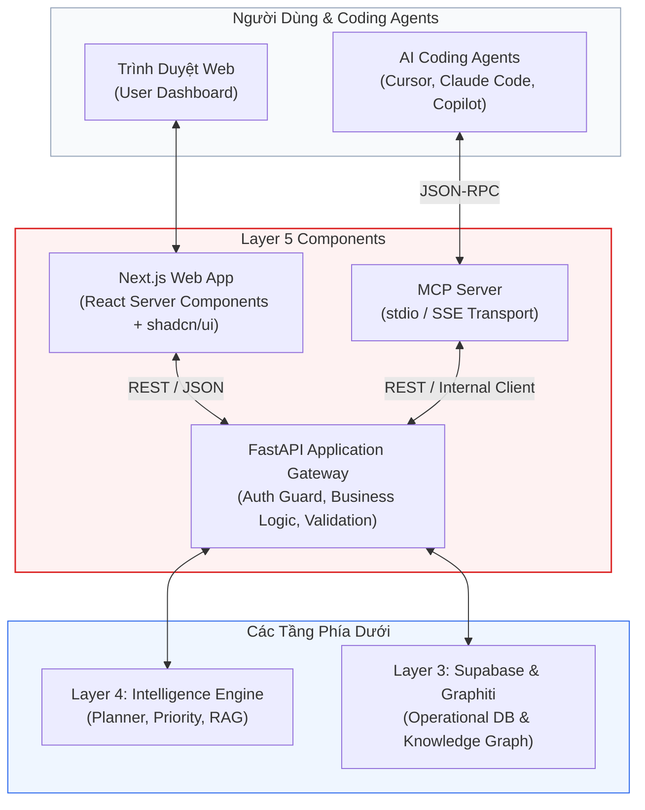
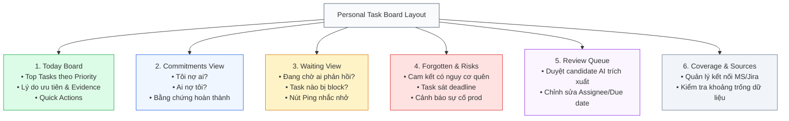

# Layer 5: Experience (Giao Diện & Tương Tác: FastAPI, Web UI & MCP)

## 1. Trách Nhiệm Cốt Lõi Của Layer 5

Layer 5 là tầng trải nghiệm người dùng và giao tiếp máy (Human & Machine Interfaces) của **Personal Task Board**. Tầng này cung cấp:
1. **FastAPI Application Service**: Cổng API Gateway duy nhất quản lý toàn bộ business logic, bảo mật xác thực (Supabase Auth JWT), kiểm soát phân quyền và điều phối tương tác giữa các tầng.
2. **Next.js Web Application**: Bảng điều khiển công việc cá nhân hiện đại, trực quan, hỗ trợ chế độ tối (Dark Mode), hiển thị rõ ràng bằng chứng (`evidence-backed`), danh sách việc cần làm hôm nay, việc đang chờ và cam kết có nguy cơ bị lãng quên.
3. **Model Context Protocol (MCP) Server**: Giao diện tiêu chuẩn cho các AI coding agent (Cursor, Claude Code, GitHub Copilot) truy xuất ngữ cảnh task, quyết định kiến trúc và bài học kinh nghiệm trực tiếp từ IDE của lập trình viên.

---

## 2. Kiến Trúc Chi Tiết Layer 5



> [!IMPORTANT]
> **Quy tắc bất biến về ranh giới**: Cả Next.js Web App và MCP Server **tuyệt đối không được kết nối trực tiếp** vào PostgreSQL hay Neo4j. Mọi thao tác bắt buộc phải đi qua FastAPI Application Gateway.

---

## 3. FastAPI Application Service (API Gateway)

FastAPI đóng vai trò trung tâm điều phối với các endpoint chuẩn hóa:

### 3.1 Danh Mục REST API Endpoints Chính

| Phương thức | Đường dẫn Endpoint | Mục đích & Trách nhiệm | Schema DTO |
| --- | --- | --- | --- |
| `GET` | `/api/v1/board/today` | Lấy toàn bộ dữ liệu bảng công việc ngày (Top tasks, Waiting, Forgotten, Risks). | `TodayBoardView` |
| `GET` | `/api/v1/tasks` | Danh sách công việc hợp nhất (Hỗ trợ lọc theo `status`, `project`, `owner`). | `List[UnifiedTaskCandidate]` |
| `GET` | `/api/v1/tasks/{id}/context` | Chi tiết một task kèm bằng chứng chat/ticket, quan hệ đồ thị và blockers. | `TaskWithContext` |
| `POST` | `/api/v1/tasks/{id}/confirm-complete` | Người dùng xác nhận hoàn thành một task (Chuyển `status = 'done'`). | `TaskActionResponse` |
| `GET` | `/api/v1/commitments/forgotten` | Danh sách cam kết quá hạn hoặc lâu không có tiến triển. | `List[ForgottenCommitmentItem]` |
| `GET` | `/api/v1/review-queue` | Danh sách trích xuất có confidence trung bình ($0.50 - 0.84$) chờ người dùng duyệt. | `List[ReviewQueueItem]` |
| `POST` | `/api/v1/review-queue/{id}/approve` | Chấp thuận biến candidate thành task chính thức. | `ReviewActionResponse` |
| `POST` | `/api/v1/review-queue/{id}/reject` | Từ chối và loại bỏ candidate. | `ReviewActionResponse` |
| `GET` | `/api/v1/coverage` | Trạng thái sức khỏe đồng bộ của các tenant và nguồn kết nối. | `CoverageStatusResponse` |
| `POST` | `/api/v1/knowledge/search` | Truy vấn quyết định kỹ thuật và bài học kinh nghiệm từ đồ thị. | `KnowledgeSearchResponse` |

### 3.2 Cơ Chế Xác Thực & Phân Quyền (Auth Guard Middleware)
FastAPI xác thực người dùng thông qua Bearer JWT Token do Supabase Auth cấp phát. Mọi truy vấn database nội bộ đều được gán `workspace_id` tương ứng với user session.

---

## 4. Next.js Web Application (Bảng Điều Khiển Cá Nhân)

Ứng dụng web được xây dựng với Next.js 14+ (App Router), TailwindCSS và thư viện thành phần shadcn/ui.

### 4.1 Bố Cục Các Màn Hình Chức Năng (Views)



### 4.2 Thiết Kế Chi Tiết Từng View

1. **Today Board**:
   - **Thẻ Tóm Tắt (Headline)**: Tóm tắt 1 dòng tình hình hôm nay (Ví dụ: *"Hôm nay có 3 task ưu tiên cao, trong đó 1 lỗi production cần giải quyết trước 2h chiều"*).
   - **Task Cards**: Hiển thị tiêu đề, huy hiệu điểm ưu tiên (`Score Pill`, ví dụ: `92/100`), nhãn dự án (`OPS-88`), người yêu cầu (`Huy`), trích đoạn bằng chứng (`"Để em check nhé"`), và nút hành động nhanh.
2. **Review Queue (Hàng Đợi Duyệt)**:
   - Giao diện dạng so sánh trực quan (Diff View): Hiển thị tin nhắn trích dẫn (`Quoted Content`), câu trả lời (`Actual Content`), thực thể AI đề xuất (`Owner: Cuong, Requester: Huy`).
   - Ba nút hành động rõ ràng: `Chấp thuận (Approve)`, `Chỉnh sửa (Edit)`, `Từ chối (Reject)`.
3. **Coverage Dashboard**:
   - Hiển thị danh sách nguồn: *Teams FPT internal (Healthy - Synced 2m ago)*, *Teams Customer Tenant (Warning - Permission token expired)*.
   - Giúp người dùng luôn biết rõ hệ thống có đang bao quát đủ 100% dữ liệu hay không.

---

## 5. Model Context Protocol (MCP) Server Cho Coding Agents

MCP Server cho phép các AI agent trong IDE (như Cursor, Claude Code) tương tác với Personal Task Board một cách an toàn.

### 5.1 Kiến Trúc MCP Server
- **Giao thức**: Chuẩn Model Context Protocol của Anthropic (vận hành qua `stdio` cho local agent hoặc `SSE` cho remote).
- **Nguyên tắc an toàn (Guardrails)**:
  - **Read-Only / Draft-Only**: Agent chỉ có thể đọc dữ liệu ngữ cảnh hoặc tạo bản nháp đề xuất.
  - **Không tự ý đóng task**: Agent có thể gọi `suggest_task_completion`, tạo một đề xuất kèm link PR, nhưng trạng thái task chỉ chuyển sang Done khi lập trình viên click xác nhận trên UI.

### 5.2 Chi Tiết 9 Công Cụ Chuẩn Hóa (Standard Tools)

```python
# Ví dụ triển khai MCP Tool trong services/mcp/server.py
from mcp.server.fastmcp import FastMCP
import httpx

mcp = FastMCP("Personal Task Board Assistant")
API_BASE_URL = "http://localhost:8000/api/v1"

@mcp.tool()
async def get_today_tasks(limit: int = 5) -> str:
    """Lấy danh sách các công việc ưu tiên nhất hôm nay kèm bằng chứng và lý do."""
    async with httpx.AsyncClient() as client:
        res = await client.get(f"{API_BASE_URL}/board/today")
        data = res.json()
        top_tasks = data.get("top_tasks", [])[:limit]
        return format_tasks_for_agent(top_tasks)

@mcp.tool()
async def get_task_context(task_id: str) -> str:
    """Lấy toàn bộ bằng chứng, người yêu cầu, quyết định kiến trúc và blocker liên quan đến task."""
    async with httpx.AsyncClient() as client:
        res = await client.get(f"{API_BASE_URL}/tasks/{task_id}/context")
        return format_context_for_agent(res.json())

@mcp.tool()
async def search_decisions(query: str) -> str:
    """Tìm kiếm các quyết định kỹ thuật / kiến trúc đã được thống nhất trong quá khứ."""
    async with httpx.AsyncClient() as client:
        res = await client.post(f"{API_BASE_URL}/knowledge/search", json={"query": query, "type": "decision"})
        return format_decisions_for_agent(res.json())
```

---

## 6. Quy Trình Test Độc Lập Layer 5

1. **FastAPI Contract Testing**:
   - Sử dụng `httpx.AsyncClient` và `pytest` để kiểm tra tính toàn vẹn của các endpoint.
   - Sử dụng mock service layer để trả về dữ liệu mẫu `TodayBoardView` từ `packages/contracts/mocks/l4_today_board.json`.
2. **Next.js UI Component Testing**:
   - Sử dụng Jest và React Testing Library kết hợp với Mock Service Worker (MSW) để giả lập toàn bộ API của FastAPI.
   - Kiểm tra khả năng render của Today Board, Review Queue và Coverage Dashboard mà không cần backend chạy thật.
3. **MCP Inspector Verification**:
   - Chạy công cụ `@modelcontextprotocol/inspector` để kiểm tra schema JSON và kết quả trả về của 9 công cụ MCP.
