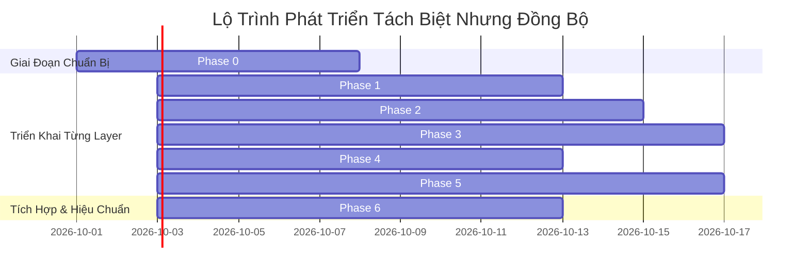

# Lộ Trình Triển Khai Mới: Layer-by-Layer Synchronization (Phase Roadmap)

## 1. Triết Lý Thiết Kế Lộ Trình Mới

Trước đây, lộ trình trong [Proposal.md](file:///Volumes/WorkSpace/Project/Personal_Task_Board/docs/Proposal.md) được tiếp cận theo mô hình **Lát cắt xuyên suốt từ trong ra ngoài (Inside-Out Vertical Slices)**:
- Phase 1: Foundation (Một chút DB + Một chút Connector + Một chút UI)
- Phase 2: Core Value (Parsing + Extraction)
- Phase 3: Unified Task Board (Correlation + UI)
- Phase 4: Temporal GraphRAG
- Phase 5: Intelligence
- Phase 6: Agent Access (MCP)

**Hạn chế của mô hình cũ:** Các tầng bị phụ thuộc chéo (coupling), rất khó phát triển song song hoặc kiểm thử độc lập một tầng nếu các tầng liên quan chưa hoàn thành.

**Mô hình tái cấu trúc: Layer-by-Layer Isolation & Contract-First Synchronization**:
Thay vì phát triển chắp vá qua nhiều tầng cùng lúc, hệ thống sẽ:
1. **Khóa cứng toàn bộ Interface & Data Contracts ở Phase 0** kèm theo bộ dữ liệu giả lập (Mock Fixtures).
2. **Triển khai từng Layer hoàn chỉnh và độc lập** (Layer 3 $\rightarrow$ Layer 1 $\rightarrow$ Layer 2 $\rightarrow$ Layer 4 $\rightarrow$ Layer 5).
3. **Đồng bộ hóa 100% nhờ tuân thủ Contract**: Bất kỳ Layer nào cũng có thể dev và pass toàn bộ unit/integration test cục bộ bằng mock fixtures.
4. **Ghép nối toàn diện ở Phase 6**: Kết nối các tầng đã hoàn thiện thành một sản phẩm hoàn chỉnh mà không gặp bất kỳ xung đột nào về schema hay dữ liệu.

---

## 2. Tổng Quan 7 Phase Triển Khai

---

## 3. Chi Tiết Từng Phase

---

### Phase 0: Cross-Layer Contracts & Synchronization Backbone

- **Mục tiêu**: Xây dựng bộ hợp đồng dữ liệu chuẩn hóa, khởi tạo Monorepo và bộ sinh dữ liệu giả lập (Mock Fixtures) cho toàn bộ hệ thống.
- **Thời lượng dự kiến**: 1 tuần.
- **Sản phẩm bàn giao**:
  1. Cấu trúc Monorepo (`packages/`, `services/`, `apps/`, `docs/`).
  2. Gói `packages/contracts`:
     - Pydantic models cho toàn bộ hợp đồng C12, C23, C34, C45, C5Ext.
     - TypeScript DTOs tương ứng cho Next.js Web App.
  3. Bộ Mock Fixtures (`packages/contracts/mocks/`):
     - `l1_raw_teams_message.json`, `l1_raw_jira_issue.json`.
     - `l2_extracted_candidates.json`.
     - `l3_graph_neighborhood.json`.
     - `l4_today_board_view.json`.
  4. Contract Test Suite kiểm tra tính tương thích giữa Python và TypeScript schemas.
- **Điều kiện hoàn thành (Exit Criteria)**: Mọi mô hình dữ liệu được biên dịch thành công, test kiểm thử serialization/deserialization đạt 100%.

---

### Phase 1: Layer 3 – Operational Store & GraphRAG Memory

- **Mục tiêu**: Thiết lập nền tảng lưu trữ kép (Supabase PostgreSQL + Neo4j Graphiti) và kiểm soát tính toàn vẹn của ontology.
- **Thời lượng dự kiến**: 1.5 tuần.
- **Sản phẩm bàn giao**:
  1. `packages/database/supabase`:
     - File SQL migration tạo 15 bảng nghiệp vụ (`raw_events`, `people`, `source_identities`, `unified_tasks`, `commitments`, `evidence`, `graph_outbox_events`,...).
     - Kích hoạt RLS, trigger tự động cập nhật `updated_at` và mã hóa `pgcrypto`.
  2. `packages/database/neo4j`:
     - Cypher scripts thiết lập Constraints và Indexes cho 11 Node Types và 13 Edge Types.
  3. Mã nguồn `Tier 2 Application Allowlist Validator` bằng Python.
  4. Background Service: `Outbox Consumer Worker` đọc `graph_outbox_events` nạp vào Graphiti/Neo4j.
- **Phương thức Test Độc Lập**: Sử dụng mock outbox events từ Phase 0 để xác minh tính toàn vẹn của đồ thị trong Neo4j mà không cần Layer 2.

---

### Phase 2: Layer 1 – Data Acquisition (Durable Ingestion)

- **Mục tiêu**: Xây dựng hệ thống thu thập dữ liệu bất đồng bộ, bền bỉ qua Temporal Workflows.
- **Thời lượng dự kiến**: 1.5 - 2 tuần.
- **Sản phẩm bàn giao**:
  1. Module Connectors (`services/acquisition/src/connectors/`):
     - `MSGraphTeamsConnector` (hỗ trợ đa tenant).
     - `MSGraphOutlookConnector`.
     - `JiraConnector` & `ShortcutConnector`.
  2. Temporal Workflows & Activities:
     - `InitialSyncWorkflow` (backfill 30-90 ngày, phân trang, lưu checkpoint).
     - `IncrementalSyncWorkflow` (chạy định kỳ 5-15 phút, tính toán idempotency key).
     - Quản lý token, refresh OAuth token tự động.
  3. Ghi dữ liệu vào bảng `raw_events` với trạng thái `pending`.
- **Phương thức Test Độc Lập**: Giả lập source API bằng WireMock/httpx_mock, chạy Temporal Workflow trong môi trường test cục bộ, xác minh dữ liệu ghi vào `raw_events` khớp với schema Contract C12.

---

### Phase 3: Layer 2 – Data Processing (Parsing & AI Extraction)

- **Mục tiêu**: Biến tin nhắn hội thoại và ticket thành cam kết có cấu trúc, bảo vệ tuyệt đối tính quy gán (Attribution).
- **Thời lượng dự kiến**: 2 tuần.
- **Sản phẩm bàn giao**:
  1. Deterministic Parsers: `TeamsQuoteReplyParser` (tách riêng `quoted_content` và `actual_content`).
  2. `IdentityResolver`: Cơ chế ánh xạ tài khoản đa tenant về `CanonicalPerson` (Rule-based + RapidFuzz).
  3. `RuleCandidateFilter`: Bộ lọc heuristic từ khóa/regex tiết kiệm chi phí LLM.
  4. `LangGraph Extraction Workflow`: Prompt trích xuất có cấu trúc, tích hợp LLM OpenAI-compatible, Attribution Validator.
  5. `ConfidenceGate` ($<0.50$ loại bỏ, $0.50-0.84$ review queue, $\ge 0.85$ auto-approve).
  6. `CorrelationEngine`: Khớp nối chat commitment với ticket Jira/Shortcut.
  7. Worker đọc `raw_events` và ghi transaction kép vào `unified_tasks` + `graph_outbox_events`.
- **Phương thức Test Độc Lập**: Đọc trực tiếp các file JSON mock raw events từ Phase 0, chạy qua parser và LangGraph, xác nhận kết quả đầu ra khớp với Contract C23.

---

### Phase 4: Layer 4 – Intelligence Engine (Reasoning & Planning)

- **Mục tiêu**: Xây dựng bộ não tính toán ưu tiên tất định và lập kế hoạch ngày thông minh.
- **Thời lượng dự kiến**: 1.5 tuần.
- **Sản phẩm bàn giao**:
  1. `UnifiedRetrievalService`: Truy vấn kết hợp giữa Supabase và Graphiti/Neo4j.
  2. `PriorityCalculator`: Thuật toán chấm điểm ưu tiên tất định theo công thức toán học $[0, 100]$.
  3. `StatusInferenceEngine`: Suy luận trạng thái `likely_done`, `blocked`, `stale` mà không tự ý đóng task.
  4. `ForgottenCommitmentDetector`: Phát hiện các cam kết quá hạn hoặc bị giục phản hồi.
  5. `DailyPlanner`: LangGraph workflow tổng hợp Morning Briefing và sinh Grounded Explanation qua LLM.
  6. `KnowledgeRAGService`: Truy vấn quyết định kỹ thuật và bài học kinh nghiệm.
- **Phương thức Test Độc Lập**: Sử dụng mock database & graph records từ Phase 0, chạy unit test kiểm tra công thức điểm ưu tiên và độ chính xác của giải thích LLM.

---

### Phase 5: Layer 5 – Experience (FastAPI, Web UI & MCP)

- **Mục tiêu**: Xây dựng toàn bộ giao diện tương tác người dùng (Web UI) và giao diện lập trình cho AI agent (MCP).
- **Thời lượng dự kiến**: 2 tuần.
- **Sản phẩm bàn giao**:
  1. `services/api` (FastAPI Application Service):
     - Triển khai đầy đủ các REST endpoints theo Contract C45 và C5Ext.
     - Xác thực JWT Supabase Auth, middleware phân quyền workspace.
  2. `apps/web` (Next.js 14+ App Router):
     - Giao diện Today Board (Headline, Task Cards, Priority Pills, Evidence snippets).
     - Giao diện Commitments (Tôi nợ ai / Ai nợ tôi).
     - Giao diện Waiting & Forgotten.
     - Giao diện Review Queue (Diff inspection duyệt candidate).
     - Giao diện Coverage Dashboard (Trạng thái sync của từng tenant).
  3. `apps/mcp` (MCP Server):
     - Triển khai 9 công cụ MCP chuẩn hóa (`get_today_tasks`, `get_task_context`,...).
     - Tuân thủ guardrails: Read-only và đề xuất hoàn thành, cấm tự ý write-back.
- **Phương thức Test Độc Lập**: Web UI và MCP server được kiểm thử hoàn chỉnh với Mock FastAPI responses dựa trên hợp đồng OpenAPI từ Phase 0.

---

### Phase 6: Layer Integration, E2E Verification & System Tuning

- **Mục tiêu**: Ghép nối tất cả các Layer thành sản phẩm hoàn chỉnh, chạy backfill thực tế và hiệu chuẩn.
- **Thời lượng dự kiến**: 1.5 tuần.
- **Sản phẩm bàn giao**:
  1. Kích hoạt toàn bộ dòng dữ liệu End-to-End:
     $$\text{MS Graph / Jira} \xrightarrow{\text{L1}} \text{raw\_events} \xrightarrow{\text{L2}} \text{Supabase + Outbox} \xrightarrow{\text{L3}} \text{Neo4j} \xrightarrow{\text{L4}} \text{Planner} \xrightarrow{\text{L5}} \text{Web UI / MCP}$$
  2. Thực hiện Initial Sync 30 ngày trên tenant Teams và Shortcut thật của người dùng.
  3. Đánh giá chất lượng thực tế:
     - Độ chính xác quy gán (Attribution Precision) $\ge 95\%$.
     - Tỷ lệ tin nhắn lọc đúng qua Heuristic Filter $\ge 80\%$.
     - Đánh giá tính hợp lý của điểm ưu tiên trên Today Board.
  4. Tinh chỉnh trọng số chấm điểm và ngưỡng Confidence Gate dựa trên phản hồi của người dùng.

---

## 4. Bảng Ma Trận Độc Lập & Đồng Bộ Khi Triển Khai

| Layer | Có thể dev độc lập không? | Dữ liệu Mock sử dụng | Hợp đồng bảo vệ (Contract) | Rủi ro bị chặn bởi layer khác |
| --- | :---: | --- | --- | :---: |
| **Layer 1: Acquisition** | **Có** | Mock HTTP response từ MS Graph / Jira | Contract C12 (`raw_events`) | Không có (Hoàn toàn độc lập) |
| **Layer 2: Processing** | **Có** | Mock raw events JSON từ Phase 0 | Contract C12 (In), C23 (Out) | Không có (Dùng mock raw events) |
| **Layer 3: Store & Memory** | **Có** | Mock outbox events từ Phase 0 | Contract C23, Fixed Ontology | Không có (Khởi tạo DDL độc lập) |
| **Layer 4: Intelligence** | **Có** | Mock tasks & graph neighborhood từ Phase 0 | Contract C34 (In), C45 (Out) | Không có (Dùng mock store context) |
| **Layer 5: Experience** | **Có** | Mock FastAPI JSON responses từ Phase 0 | Contract C45, C5Ext (MCP) | Không có (Dùng mock API/MSW) |
